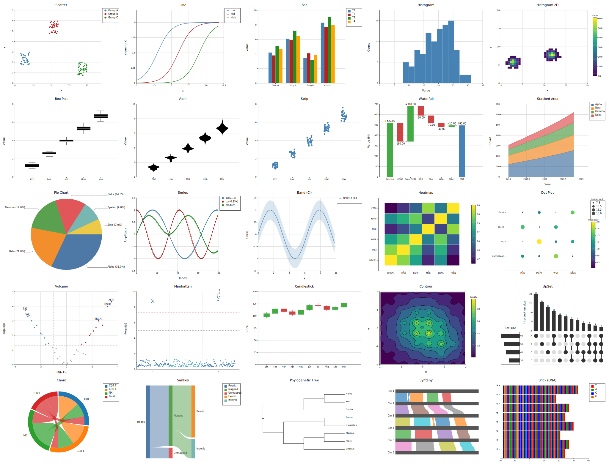

# kuva

[](https://github.com/Psy-Fer/kuva/actions/workflows/ci.yml)
[](https://opensource.org/licenses/MIT)
[](https://crates.io/crates/kuva)
[](https://docs.rs/kuva)
[](https://crates.io/crates/kuva)

A scientific plotting library in Rust. 25 plot types, SVG output, optional PNG/PDF backends, and a CLI binary that renders plots directly from the shell — including in the terminal itself.




---

## Quick start

### Install the CLI

```bash
# From crates.io
cargo install kuva --features cli

# From source (SVG only)
cargo build --release --bin kuva --features cli

# From source (all backends)
cargo build --release --bin kuva --features cli,full
```

### Use as a library

Add to `Cargo.toml`:

```toml
[dependencies]
kuva = "0.1"

# Optional backends
kuva = { version = "0.1", features = ["png"] }   # PNG output
kuva = { version = "0.1", features = ["pdf"] }   # PDF output
kuva = { version = "0.1", features = ["full"] }  # PNG + PDF
```

Then in Rust:

```rust
use kuva::prelude::*;

let plot = ScatterPlot::new()
    .with_data(vec![(1.0_f64, 2.0), (3.0, 5.0), (5.0, 4.0)])
    .with_color("steelblue")
    .with_legend("samples");

let plots: Vec<Plot> = vec![plot.into()];
let layout = Layout::auto_from_plots(&plots)
    .with_title("My Plot")
    .with_x_label("X")
    .with_y_label("Y");

let svg = render_to_svg(plots, layout);
std::fs::write("my_plot.svg", svg).unwrap();
```

### Use the CLI

```bash
# Scatter plot to SVG
kuva scatter data.tsv --x x --y y -o plot.svg

# Volcano plot, label top 20 genes
kuva volcano gene_stats.tsv --name-col gene --x-col log2fc --y-col pvalue --top-n 20

# Box plot rendered directly in the terminal
kuva box samples.tsv --group-col group --value-col expression --terminal
```

Input is auto-detected TSV or CSV. Columns are selectable by name or 0-based index. Pipe from stdin by omitting the file argument. Output defaults to SVG on stdout; use `-o file.svg/png/pdf` to write a file.

---

## Documentation

Full documentation — plot type reference, API guide, CLI flag reference, themes, palettes, and benchmarks — is at **[psy-fer.github.io/kuva](https://psy-fer.github.io/kuva)**.

---

## Development note

kuva was initially built by hand, with a working library and several plot types
already in place before AI tooling was introduced. From that point, development was
heavily assisted by Claude (Anthropic) — accelerating the addition of new plot types,
the CLI binary, tests, and documentation. The architecture, domain knowledge, and
direction remain the author's own; Claude was used as an accelerant, not an author.

*This disclaimer was written by Claude as an honest assessment of its own role in the project.*

## License

MIT
