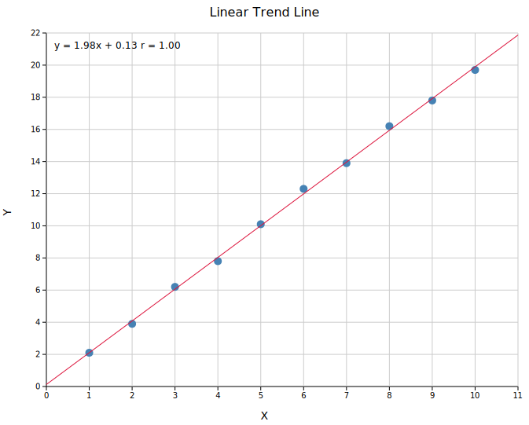
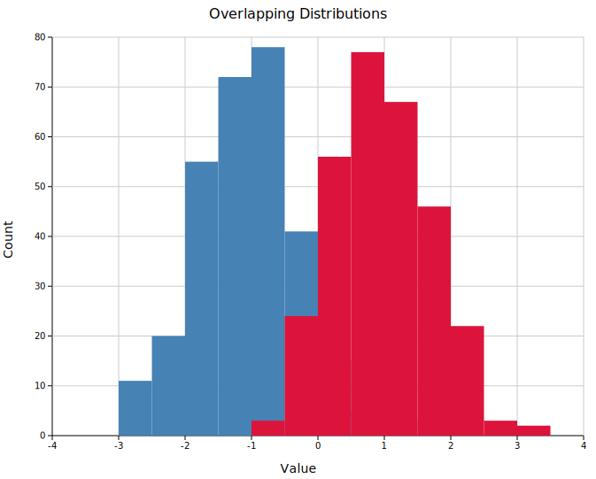
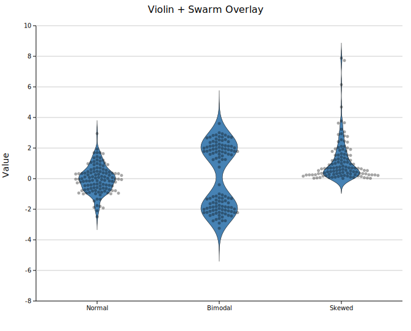
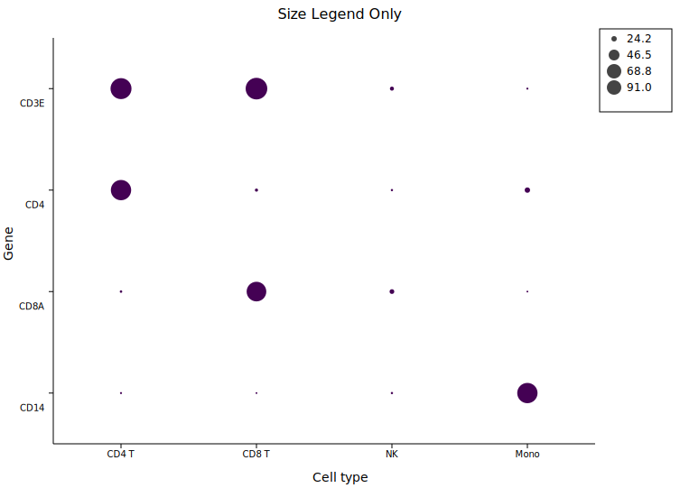
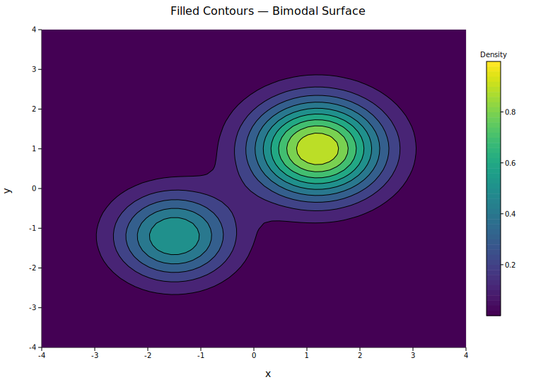
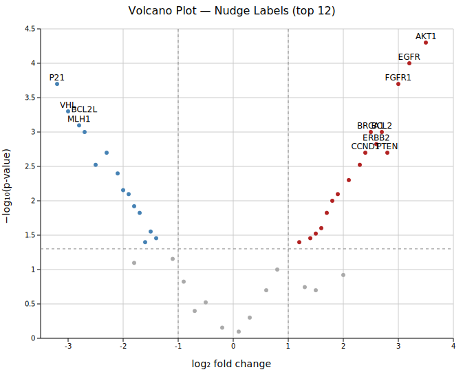
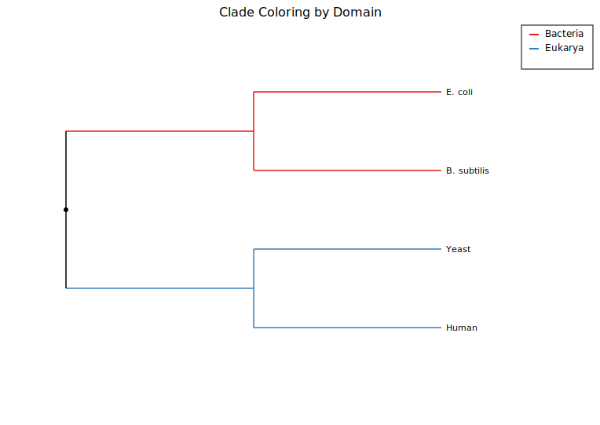
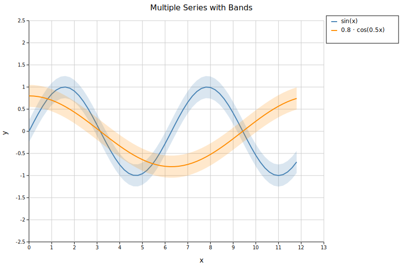
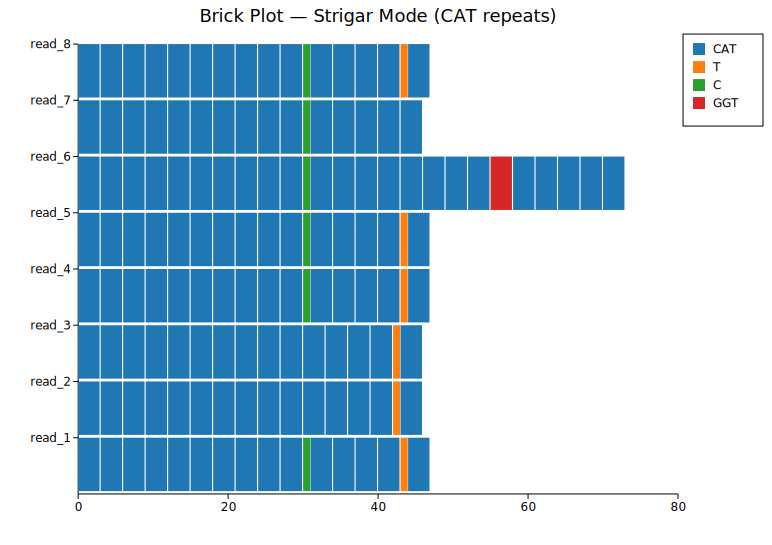

# Gallery

A quick overview of every plot type. Click any image to go to the full documentation page.

<a href="./plots/scatter.html">

Scatter Plot

x/y points with optional trend line, error bars, and variable size.

</a>

<a href="./plots/line.html">

Line Plot

Connected series with solid, dashed, dotted, and dash-dot styles.

</a>

<a href="./plots/bar.html">

Bar Chart

Categorical bars — grouped, stacked, and single-series.

</a>

<a href="./plots/histogram.html">

Histogram

Distribution of a numeric column with configurable bins and normalisation.

</a>

<a href="./plots/histogram2d.html">

2D Histogram

Joint density of two numeric columns with colourmap and optional correlation.

</a>

<a href="./plots/boxplot.html">

Box Plot

Median, IQR, and whiskers per group — with optional strip or swarm overlay.

</a>

<a href="./plots/violin.html">

Violin Plot

KDE density mirrored per group, with configurable bandwidth and swarm overlay.

</a>

<a href="./plots/strip.html">

Strip Plot

Individual points jittered or swarmed by group; composes with box/violin.

</a>

<a href="./plots/pie.html">

Pie Chart

Pie or donut chart with inside, outside, or legend-only labels.

</a>

<a href="./plots/heatmap.html">

Heatmap

Matrix of values with colourmap, optional cell labels, and row/col clustering.

</a>

<a href="./plots/dotplot.html">

Dot Plot

Size and colour encoding on a categorical grid — common in single-cell analysis.

</a>

<a href="./plots/contour.html">

Contour Plot

Filled or line contours from gridded or scattered x/y/z data via IDW interpolation.

</a>

<a href="./plots/stacked_area.html">

Stacked Area Plot

Stacked time-series with absolute or 100%-normalised mode.

</a>

<a href="./plots/waterfall.html">

Waterfall Chart

Running total with positive/negative deltas, connectors, and value labels.

</a>

<a href="./plots/candlestick.html">

Candlestick Chart

OHLC bars with optional volume panel and datetime axis.

</a>

<a href="./plots/volcano.html">

Volcano Plot

log₂FC vs −log₁₀(p) with threshold lines and top-N gene labels.

</a>

<a href="./plots/manhattan.html">

Manhattan Plot

GWAS p-values across chromosomes with genome-wide threshold and gene labels.

</a>

<a href="./plots/upset.html">

UpSet Plot

Set intersection sizes as a bar chart with a membership matrix below.

</a>

<a href="./plots/chord.html">

Chord Diagram

Pairwise flows between N groups as arc segments and Bézier ribbons.

</a>

<a href="./plots/sankey.html">

Sankey Diagram

Multi-stage flow with tapered Bézier links and source/gradient colouring.

</a>

<a href="./plots/phylo.html">

Phylogenetic Tree

Newick, edge-list, distance-matrix, or linkage input; rectangular, slanted, or circular layout.

</a>

<a href="./plots/synteny.html">

Synteny Plot

Genome synteny ribbons between sequences with forward and inverted blocks.

</a>

<a href="./plots/band.html">

Band Plot

Shaded confidence or credible interval bands, standalone or attached to a line/scatter.

</a>

<a href="./plots/series.html">

Series Plot

Multiple named data series on one canvas with per-series line and marker styles.

</a>

<a href="./plots/brick.html">

Brick Plot

Read-level alignment bricks with per-base colouring and STRIGAR string support.

</a>

