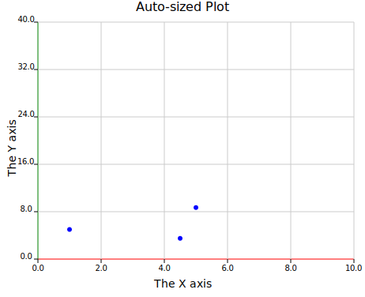

# Origins

Before kuva had axes, themes, or 25 plot types, it had three blue circles. (It was also called `visus` back then)

*The first output: three hardcoded circles, no background, no axes.*

The very first proof-of-concept was just three blue dots on a transparent 500×500 canvas.
No coordinate system, no margins, no layout. Just enough to confirm that the SVG pipeline
worked end-to-end.

The next milestone was getting the library to automatically compute a layout from data:
- margins
- tick marks
- grid lines
- axis labels

all derived from the data bounds with no manual positioning.

*The first auto-sized plot: real ticks and labels computed from data.*

`scatter_autosized.svg` was the moment the coordinate mapping started making sense. Data values mapped to
pixel positions, axes drawn automatically, tick intervals chosen from the data range. The red
x-axis and green y-axis are relics of the earliest rendering code, colour-coded for debugging.
That was the first plot that felt like a real plot. The rush I felt when this plot first rendered...wow.

Everything since has been built on that foundation.

## Before LLM assistance

The first Claude Code session was opened on 20 February 2026, just to run `/init` and
generate a `CLAUDE.md` file. At that point the library already had **11 plot types**, all
written from scratch:

`ScatterPlot`, `LinePlot`, `BarPlot`, `Histogram`, `Histogram2D`, `BoxPlot`, `ViolinPlot`,
`PiePlot`, `SeriesPlot`, `Heatmap`, `BrickPlot`

(Technically 10 compiled. `BrickPlot` had a syntax error on day one, because I was still figuring out STRIGAR processing from bladerunner, an STR calling tool I wrote)

The 14 plot types added with AI assistance:
`BandPlot`, `WaterfallPlot`, `StripPlot`, `VolcanoPlot`, `ManhattanPlot`, `DotPlot`,
`UpSetPlot`, `StackedAreaPlot`, `CandlestickPlot`, `ContourPlot`, `ChordPlot`, `SankeyPlot`,
`PhyloTree`, `SyntenyPlot`

The architecture, the rendering pipeline, the builder pattern API, and the core plotting
logic were all designed and written before any LLM was involved.

## On using LLM assistance

I want to be honest about this, because I think the discourse around AI and software is often
dishonest in one direction or the other.

I am perfectly capable of writing everything in this library myself. I've been doing
bioinformatics software development for years. The architecture here (the pipeline, the
builder pattern, the primitive-based renderer) is all mine. I designed it, and I would
have made the same design choices with or without an LLM. The deep domain knowledge of what
a bioinformatician actually needs from a plotting library, the aesthetics, the decisions
about which plot types to include and how their APIs should feel. None of that came from an LLM.

What LLM assistance changed was *pace*. Going from 11 plot types to 25, adding a full CLI,
a terminal backend, a documentation book, smoke tests, and integration tests, all in roughly
a week, that would have taken me much longer alone. Not because I couldn't do it, but because
translating a clear mental model into working, tested code takes time, and that's where the
acceleration is real.

It isn't a one-way process either. The LLM gets things wrong, proposes approaches that don't
fit the existing code, or misses the intent entirely. Every feature required my involvement at
every step: reviewing, redirecting, and often rejecting what was produced. A good example is
the x-axis label positioning in the terminal backend. Getting tick labels to sit correctly in
braille character cells, snapping to the right row, spacing correctly across different
terminal heights, went through several wrong approaches before landing on the solution that
actually works. That kind of problem requires someone who understands both what the output
should look like and why a given implementation is producing the wrong result. The LLMs can generate
absolute shit sometimes, and it's up to us to decide what is correct, and take responsibility for any of the output.

The honest summary: this is my library, reflecting my vision and expertise. The LLM is a
fast, capable collaborator that I direct. I would not be publishing this so soon without that
acceleration, but the work is mine. Your opinion of this may differ, and that's fine. But I really don't care
and kuva exists, rather than not. That's all the validation I need.
