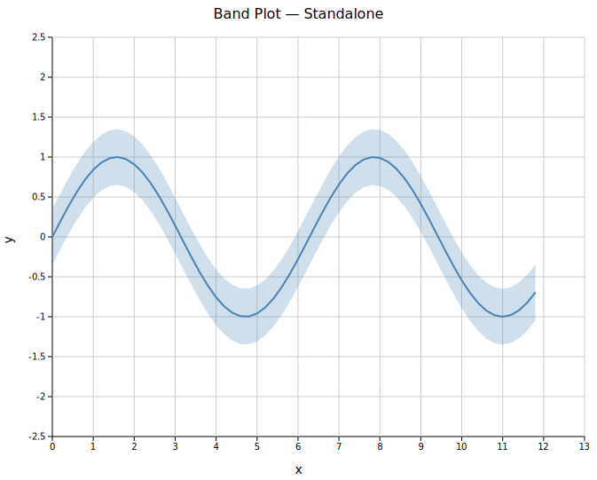
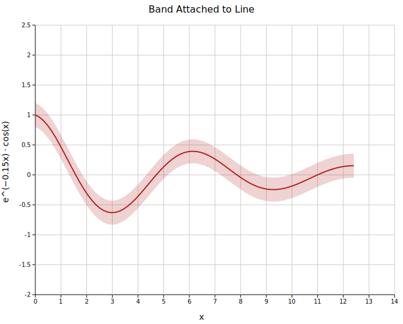

# Band Plot

A band plot fills the region between two y-curves over a shared x-axis. It is used to display **confidence intervals**, prediction bands, IQR envelopes, or any shaded range around a central estimate.

**Import path:** `visus::plot::BandPlot`

---

## Standalone band

`BandPlot::new(x, y_lower, y_upper)` creates a filled area independently. Pair it with a `LinePlot` or `ScatterPlot` by placing both in the same `plots` vector — the band is drawn behind the line.

```rust,no_run
use visus::plot::{BandPlot, LinePlot};
use visus::backend::svg::SvgBackend;
use visus::render::render::render_multiple;
use visus::render::layout::Layout;
use visus::render::plots::Plot;

let x: Vec<f64> = (0..60).map(|i| i as f64 * 0.2).collect();
let y: Vec<f64> = x.iter().map(|&v| v.sin()).collect();
let lower: Vec<f64> = y.iter().map(|&v| v - 0.35).collect();
let upper: Vec<f64> = y.iter().map(|&v| v + 0.35).collect();

let band = BandPlot::new(x.clone(), lower, upper)
    .with_color("steelblue")
    .with_opacity(0.25);

let line = LinePlot::new()
    .with_data(x.iter().copied().zip(y.iter().copied()))
    .with_color("steelblue");

// Band must come before the line so it renders behind it
let plots = vec![Plot::Band(band), Plot::Line(line)];
let layout = Layout::auto_from_plots(&plots)
    .with_title("Band Plot — Standalone")
    .with_x_label("x")
    .with_y_label("y");

let svg = SvgBackend.render_scene(&render_multiple(plots, layout));
std::fs::write("band.svg", svg).unwrap();
```



The band fills between `y_lower` and `y_upper`. Placing `Plot::Band` before `Plot::Line` in the vector ensures it is drawn first and appears behind the line.

---

## Band attached to a line

`LinePlot::with_band(y_lower, y_upper)` is a one-call shorthand. It creates the `BandPlot` internally, using the line's x positions and inheriting its color automatically.

```rust,no_run
use visus::plot::LinePlot;
# use visus::render::plots::Plot;

let line = LinePlot::new()
    .with_data(x.iter().copied().zip(y.iter().copied()))
    .with_color("firebrick")
    .with_band(lower, upper);  // band color = "firebrick", opacity = 0.2

let plots = vec![Plot::Line(line)];
```



The band is always rendered behind the line. No ordering in the `plots` vector is needed.

---

## Band attached to a scatter plot

`ScatterPlot::with_band(y_lower, y_upper)` works identically: the band inherits the scatter color and renders behind the points.

```rust,no_run
use visus::plot::ScatterPlot;
# use visus::render::plots::Plot;

let scatter = ScatterPlot::new()
    .with_data(x.iter().copied().zip(y.iter().copied()))
    .with_color("seagreen")
    .with_band(lower, upper);

let plots = vec![Plot::Scatter(scatter)];
```


---

## Multiple series with bands

Each `LinePlot` carries its own independent band. Combine all series in one `plots` vector — they share the same axes automatically.

```rust,no_run
use visus::plot::LinePlot;
# use visus::render::plots::Plot;

let line1 = LinePlot::new()
    .with_data(x.iter().copied().zip(y1.iter().copied()))
    .with_color("steelblue")
    .with_band(y1.iter().map(|&v| v - 0.25), y1.iter().map(|&v| v + 0.25))
    .with_legend("sin(x)");

let line2 = LinePlot::new()
    .with_data(x.iter().copied().zip(y2.iter().copied()))
    .with_color("darkorange")
    .with_band(y2.iter().map(|&v| v - 0.25), y2.iter().map(|&v| v + 0.25))
    .with_legend("0.8 · cos(0.5x)");

let plots = vec![Plot::Line(line1), Plot::Line(line2)];
```


---

## Opacity

`.with_opacity(f)` sets the fill transparency. The default `0.2` is deliberately light so that overlapping bands and the underlying line remain readable.

| Opacity | Effect |
|---------|--------|
| `0.1`–`0.2` | Light; line and overlapping bands visible **(default `0.2`)** |
| `0.3`–`0.5` | Moderate; band is prominent |
| `1.0` | Fully opaque; hides anything behind it |

---

## API reference

| Method | Description |
|--------|-------------|
| `BandPlot::new(x, y_lower, y_upper)` | Create a standalone band from three parallel iterables |
| `.with_color(s)` | Fill color (default `"steelblue"`) |
| `.with_opacity(f)` | Fill opacity in `[0.0, 1.0]` (default `0.2`) |
| `.with_legend(s)` | Add a legend entry |
| `LinePlot::with_band(lower, upper)` | Attach a band to a line (inherits color) |
| `ScatterPlot::with_band(lower, upper)` | Attach a band to a scatter plot (inherits color) |
