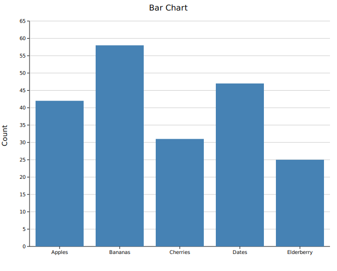

# Bar Chart

A bar chart renders categorical data as vertical bars. It has three modes — simple, grouped, and stacked — all built from the same `BarPlot` struct.

**Import path:** `visus::plot::BarPlot`

---

## Simple bar chart

Use `.with_bar()` or `.with_bars()` to add one bar per category, then `.with_color()` to set a uniform fill.

```rust,no_run
use visus::plot::BarPlot;
use visus::backend::svg::SvgBackend;
use visus::render::render::render_multiple;
use visus::render::layout::Layout;
use visus::render::plots::Plot;

let plot = BarPlot::new()
    .with_bars(vec![
        ("Apples",     42.0),
        ("Bananas",    58.0),
        ("Cherries",   31.0),
        ("Dates",      47.0),
        ("Elderberry", 25.0),
    ])
    .with_color("steelblue");

let plots = vec![Plot::Bar(plot)];
let layout = Layout::auto_from_plots(&plots)
    .with_title("Bar Chart")
    .with_y_label("Count");

let scene = render_multiple(plots, layout);
let svg = SvgBackend.render_scene(&scene);
std::fs::write("bar.svg", svg).unwrap();
```



### Adding bars individually

`.with_bar(label, value)` adds one bar at a time, which is useful when constructing data programmatically:

```rust,no_run
# use visus::plot::BarPlot;
let plot = BarPlot::new()
    .with_bar("A", 3.2)
    .with_bar("B", 4.7)
    .with_bar("C", 2.8)
    .with_color("steelblue");
```

---

## Grouped bar chart

Use `.with_group(label, values)` to add a category with multiple side-by-side bars. Each item in `values` is a `(value, color)` pair — one per series. Call `.with_legend()` to label each series.

```rust,no_run
use visus::plot::BarPlot;
use visus::backend::svg::SvgBackend;
use visus::render::render::render_multiple;
use visus::render::layout::Layout;
use visus::render::plots::Plot;

let plot = BarPlot::new()
    .with_group("Q1", vec![(18.0, "steelblue"), (12.0, "crimson"), (9.0,  "seagreen")])
    .with_group("Q2", vec![(22.0, "steelblue"), (17.0, "crimson"), (14.0, "seagreen")])
    .with_group("Q3", vec![(19.0, "steelblue"), (21.0, "crimson"), (11.0, "seagreen")])
    .with_group("Q4", vec![(25.0, "steelblue"), (15.0, "crimson"), (18.0, "seagreen")])
    .with_legend(vec!["Product A", "Product B", "Product C"]);

let plots = vec![Plot::Bar(plot)];
let layout = Layout::auto_from_plots(&plots)
    .with_title("Grouped Bar Chart")
    .with_y_label("Sales (units)");

let svg = SvgBackend.render_scene(&render_multiple(plots, layout));
```


---

## Stacked bar chart

Add `.with_stacked()` to the same grouped structure to stack segments vertically instead of placing them side-by-side.

```rust,no_run
use visus::plot::BarPlot;
use visus::backend::svg::SvgBackend;
use visus::render::render::render_multiple;
use visus::render::layout::Layout;
use visus::render::plots::Plot;

let plot = BarPlot::new()
    .with_group("Q1", vec![(18.0, "steelblue"), (12.0, "crimson"), (9.0,  "seagreen")])
    .with_group("Q2", vec![(22.0, "steelblue"), (17.0, "crimson"), (14.0, "seagreen")])
    .with_group("Q3", vec![(19.0, "steelblue"), (21.0, "crimson"), (11.0, "seagreen")])
    .with_group("Q4", vec![(25.0, "steelblue"), (15.0, "crimson"), (18.0, "seagreen")])
    .with_legend(vec!["Product A", "Product B", "Product C"])
    .with_stacked();

let plots = vec![Plot::Bar(plot)];
let layout = Layout::auto_from_plots(&plots)
    .with_title("Stacked Bar Chart")
    .with_y_label("Sales (units)");

let svg = SvgBackend.render_scene(&render_multiple(plots, layout));
```


---

## Bar width

`.with_width()` controls how much of each category slot the bar fills. The default is `0.8`; `1.0` means bars touch.

```rust,no_run
# use visus::plot::BarPlot;
let plot = BarPlot::new()
    .with_bars(vec![("A", 3.0), ("B", 5.0), ("C", 4.0)])
    .with_color("steelblue")
    .with_width(0.5);   // narrower bars with more whitespace
```

---

## API reference

| Method | Description |
|--------|-------------|
| `BarPlot::new()` | Create a bar plot with defaults |
| `.with_bar(label, value)` | Add a single bar (simple mode) |
| `.with_bars(vec)` | Add multiple bars at once (simple mode) |
| `.with_color(s)` | Set a uniform color across all existing bars |
| `.with_group(label, values)` | Add a category with one bar per series (grouped / stacked mode) |
| `.with_legend(vec)` | Set series labels; one label per bar within a group |
| `.with_stacked()` | Stack bars vertically instead of side-by-side |
| `.with_width(f)` | Bar width as a fraction of slot width (default `0.8`) |

### Choosing a mode

| Goal | Methods to use |
|------|---------------|
| One color, one bar per category | `.with_bars()` + `.with_color()` |
| Multiple series, side-by-side | `.with_group()` × N + `.with_legend()` |
| Multiple series, stacked | `.with_group()` × N + `.with_legend()` + `.with_stacked()` |
