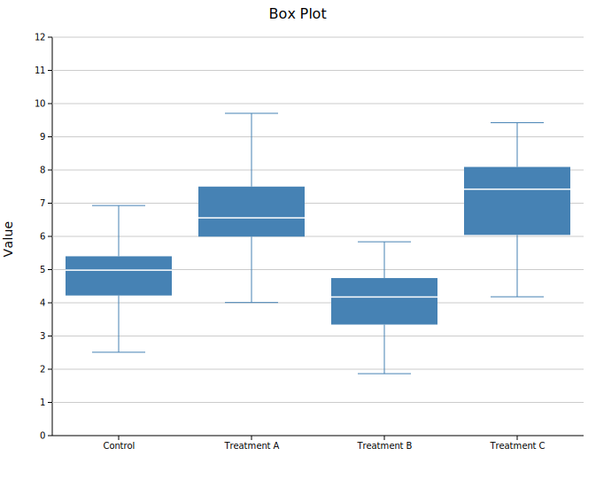
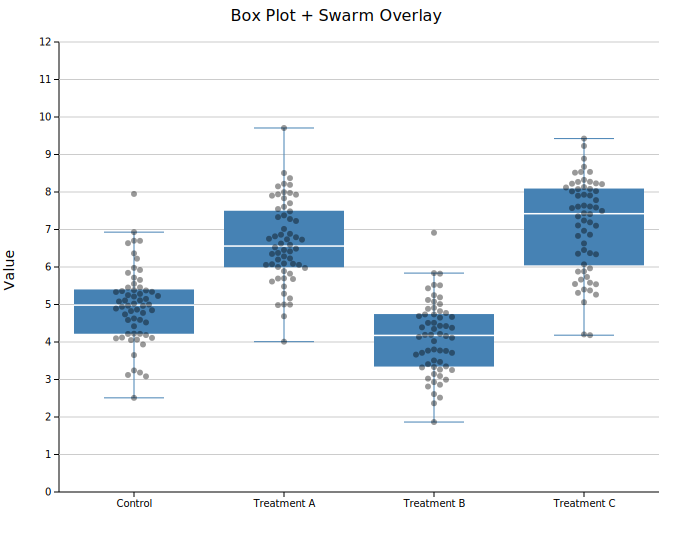

# Box Plot

A box plot (box-and-whisker plot) displays the five-number summary of one or more groups of values. Boxes show the interquartile range (Q1–Q3) with a median line; whiskers extend to the most extreme values within 1.5×IQR of the box edges (Tukey style). Individual data points can optionally be overlaid as a jittered strip or beeswarm.

**Import path:** `visus::plot::BoxPlot`

---

## Basic usage

Add one group per category with `.with_group(label, values)`. Groups are rendered left-to-right in the order they are added.

```rust,no_run
use visus::plot::BoxPlot;
use visus::backend::svg::SvgBackend;
use visus::render::render::render_multiple;
use visus::render::layout::Layout;
use visus::render::plots::Plot;

let plot = BoxPlot::new()
    .with_group("Control",     vec![4.1, 5.0, 5.3, 5.8, 6.2, 7.0, 5.5, 4.8])
    .with_group("Treatment A", vec![5.5, 6.1, 6.4, 7.2, 7.8, 8.5, 6.9, 7.0])
    .with_group("Treatment B", vec![3.2, 4.0, 4.5, 4.8, 5.1, 5.9, 4.3, 4.7])
    .with_group("Treatment C", vec![6.0, 7.2, 7.5, 8.1, 8.8, 9.5, 7.9, 8.2])
    .with_color("steelblue");

let plots = vec![Plot::Box(plot)];
let layout = Layout::auto_from_plots(&plots)
    .with_title("Box Plot")
    .with_y_label("Value");

let scene = render_multiple(plots, layout);
let svg = SvgBackend.render_scene(&scene);
std::fs::write("boxplot.svg", svg).unwrap();
```



### What the box shows

| Element | Meaning |
|---------|---------|
| Bottom of box | Q1 — 25th percentile |
| Line in box | Q2 — median (50th percentile) |
| Top of box | Q3 — 75th percentile |
| Lower whisker | Smallest value ≥ Q1 − 1.5×IQR |
| Upper whisker | Largest value ≤ Q3 + 1.5×IQR |

Values outside the whisker range are not drawn automatically — use an [overlay](#point-overlays) to show them.

---

## Point overlays

Overlaying the raw data on top of each box makes the sample size and distribution shape immediately visible. Both modes accept an optional color and point size.

### Jittered strip

`.with_strip(jitter)` scatters points randomly within a horizontal band. The `jitter` argument controls the spread width (in data-axis units; `0.2` is a reasonable starting value).

```rust,no_run
use visus::plot::BoxPlot;
# use visus::render::plots::Plot;

let plot = BoxPlot::new()
    .with_group("Control",     vec![/* values */])
    .with_group("Treatment A", vec![/* values */])
    .with_color("steelblue")
    .with_strip(0.2)
    .with_overlay_color("rgba(0,0,0,0.4)")
    .with_overlay_size(3.0);
```


### Beeswarm

`.with_swarm_overlay()` uses a beeswarm algorithm to spread points horizontally to avoid overlap. This gives a clearer picture of data density and is particularly useful for smaller datasets (roughly N < 200 per group).

```rust,no_run
use visus::plot::BoxPlot;
# use visus::render::plots::Plot;

let plot = BoxPlot::new()
    .with_group("Control",     vec![/* values */])
    .with_group("Treatment A", vec![/* values */])
    .with_color("steelblue")
    .with_swarm_overlay()
    .with_overlay_color("rgba(0,0,0,0.4)")
    .with_overlay_size(3.0);
```



A semi-transparent `overlay_color` is recommended so the box remains visible beneath the points.

---

## API reference

| Method | Description |
|--------|-------------|
| `BoxPlot::new()` | Create a box plot with defaults |
| `.with_group(label, values)` | Add a group; accepts any `Into<f64>` iterable |
| `.with_color(s)` | Box fill color (CSS color string) |
| `.with_width(f)` | Box width as a fraction of the category slot (default `0.8`) |
| `.with_legend(s)` | Attach a legend label |
| `.with_strip(jitter)` | Overlay jittered strip points; `jitter` is horizontal spread width |
| `.with_swarm_overlay()` | Overlay beeswarm points (spread to avoid overlap) |
| `.with_overlay_color(s)` | Color for overlay points (default `"rgba(0,0,0,0.45)"`) |
| `.with_overlay_size(r)` | Radius of overlay points in pixels (default `3.0`) |
