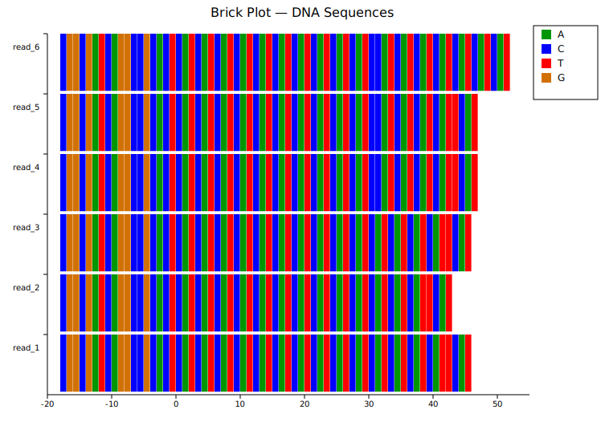
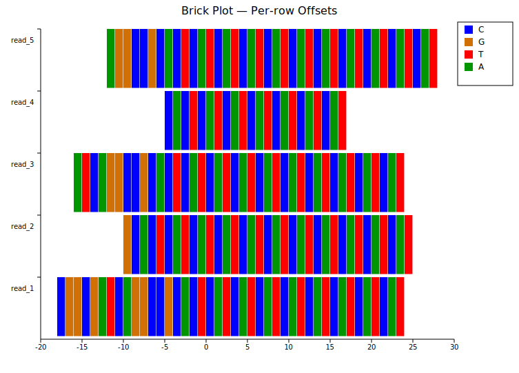
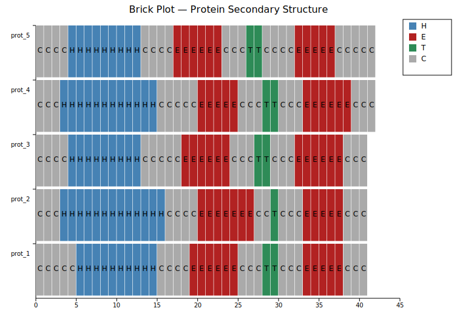

# Brick Plot

A brick plot displays sequences as rows of colored rectangles — one brick per character. It is designed for bioinformatics workflows involving **DNA/RNA sequence visualization** and **tandem-repeat structure analysis**. Each character maps to a color defined by a template; rows are labeled on the y-axis.

**Import paths:** `kuva::plot::BrickPlot`, `kuva::plot::brick::BrickTemplate`

---

## DNA sequences

`BrickTemplate::dna()` provides a standard A / C / G / T color scheme. Pass the `.template` field to `BrickPlot::with_template()`. Use `with_x_offset(n)` to skip a common flanking region so the region of interest starts at x = 0.

```rust,no_run
use std::collections::HashMap;
use kuva::plot::BrickPlot;
use kuva::plot::brick::BrickTemplate;
use kuva::backend::svg::SvgBackend;
use kuva::render::render::render_multiple;
use kuva::render::layout::Layout;
use kuva::render::plots::Plot;

let tmpl = BrickTemplate::new().dna();

let plot = BrickPlot::new()
    .with_sequences(vec![
        "CGGCGATCAGGCCGCACTCATCATCATCATCATCATCAT",
        "CGGCGATCAGGCCGCACTCATCATCATCATCATCATCATCAT",
    ])
    .with_names(vec!["read_1", "read_2"])
    .with_template(tmpl.template)
    .with_x_offset(18.0);  // skip 18-base common prefix

let plots = vec![Plot::Brick(plot)];
let layout = Layout::auto_from_plots(&plots)
    .with_title("DNA Repeat Region");

let svg = SvgBackend.render_scene(&render_multiple(plots, layout));
std::fs::write("brick.svg", svg).unwrap();
```



The 18-character flanking prefix is hidden by `with_x_offset(18.0)`. All rows start at the same x = 0, aligning the CAT repeat region across reads.

---

## Per-row offsets

When reads begin at different positions, `with_x_offsets` accepts one offset per row. Pass `None` for any row that should fall back to the global `x_offset`.

```rust,no_run
# use kuva::plot::BrickPlot;
# use kuva::plot::brick::BrickTemplate;
# use kuva::render::plots::Plot;
let plot = BrickPlot::new()
    .with_sequences(sequences)
    .with_names(names)
    .with_template(BrickTemplate::new().dna().template)
    .with_x_offset(12.0)                       // global fallback
    .with_x_offsets(vec![
        Some(18.0_f64),  // read 1: skip 18
        Some(10.0),      // read 2: skip 10
        Some(16.0),      // read 3: skip 16
        Some(5.0),       // read 4: skip 5
        None,            // read 5: use global (12)
    ]);
```



Each row is shifted independently, aligning the repeat boundary across reads with different flanking lengths.

---

## Custom template with value overlay

`with_template` accepts any `HashMap<char, String>`. Here a protein secondary-structure alphabet (H, E, C, T) gets custom colors. `with_values()` prints the character label inside each brick.

```rust,no_run
use std::collections::HashMap;
# use kuva::plot::BrickPlot;
# use kuva::render::plots::Plot;

let mut tmpl: HashMap<char, String> = HashMap::new();
tmpl.insert('H', "steelblue".into());   // α-helix
tmpl.insert('E', "firebrick".into());   // β-strand
tmpl.insert('C', "#aaaaaa".into());     // coil
tmpl.insert('T', "seagreen".into());    // turn

let plot = BrickPlot::new()
    .with_sequences(vec!["CCCHHHHHHHHHHCCCCEEEEEECCC"])
    .with_names(vec!["prot_1"])
    .with_template(tmpl)
    .with_values();  // show letter labels inside bricks
```



Any single-character alphabet can be used — amino acids, repeat unit categories, chromatin states, etc.

---

## Strigar mode (tandem-repeat motifs)

`with_strigars` switches to **strigar mode** for structured tandem-repeat data produced by [BLADERUNNER](https://github.com/Psy-Fer/bladerunner). Each read is described by two strings:

- **motif string** — maps local letters to k-mers: `"CAT:A,C:B,T:C"`
- **strigar string** — run-length encoding of those letters: `"10A1B4A1C1A"`

`with_strigars` normalises k-mers across all reads by canonical rotation, assigns global letters (A, B, C, …) by frequency, auto-generates colors, and renders **variable-width** bricks proportional to each motif's nucleotide length.

```rust,no_run
# use kuva::plot::BrickPlot;
# use kuva::render::plots::Plot;
let strigars: Vec<(String, String)> = vec![
    ("CAT:A,C:B,T:C".to_string(),   "10A1B4A1C1A".to_string()),
    ("CAT:A,T:B".to_string(),        "14A1B1A".to_string()),
    ("CAT:A,C:B,GGT:C".to_string(), "10A1B8A1C5A".to_string()),
    // ...
];

let plot = BrickPlot::new()
    .with_names(names)
    .with_strigars(strigars);  // sequences not needed — derived from strigars
```


Bricks are proportional to motif length (CAT = 3 bp wide; single-nucleotide interruptions are narrower). The dominant repeat unit (CAT) is assigned letter A and the first color; rarer motifs receive subsequent letters and colors.

---

## Built-in templates

| Method | Alphabet | Colors |
|--------|----------|--------|
| `BrickTemplate::new().dna()` | A C G T | green / blue / orange / red |
| `BrickTemplate::new().rna()` | A C G U | green / blue / orange / red |

Access the populated map via `.template` and pass it to `with_template()`.

---

## API reference

| Method | Description |
|--------|-------------|
| `BrickPlot::new()` | Create with defaults |
| `.with_sequences(iter)` | Load character sequences (one string per row) |
| `.with_names(iter)` | Load row labels (one per sequence) |
| `.with_template(map)` | Set `HashMap<char, CSS color>` |
| `.with_x_offset(f)` | Global x-offset applied to all rows |
| `.with_x_offsets(iter)` | Per-row offsets (`f64` or `Option<f64>`; `None` → global fallback) |
| `.with_values()` | Draw character labels inside bricks |
| `.with_strigars(iter)` | Load strigar data and switch to strigar mode |
| `BrickTemplate::new().dna()` | Pre-built DNA (A/C/G/T) color template |
| `BrickTemplate::new().rna()` | Pre-built RNA (A/C/G/U) color template |
