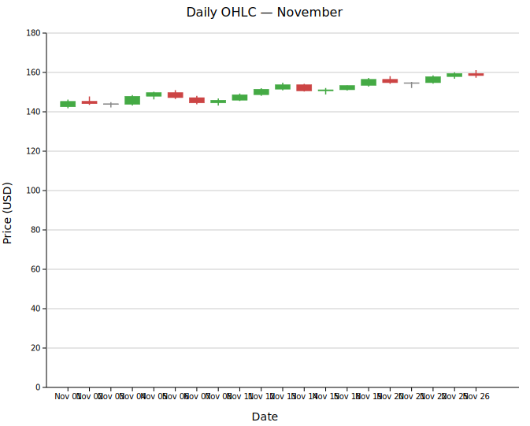
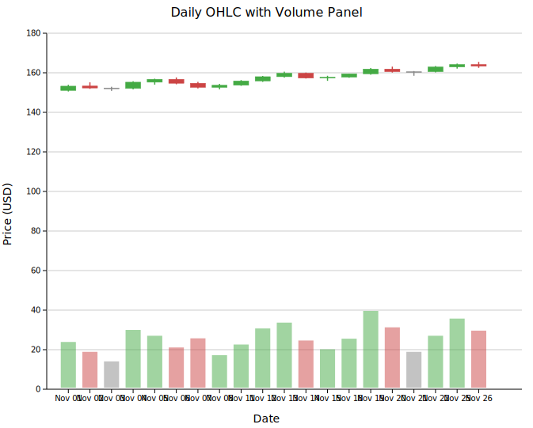
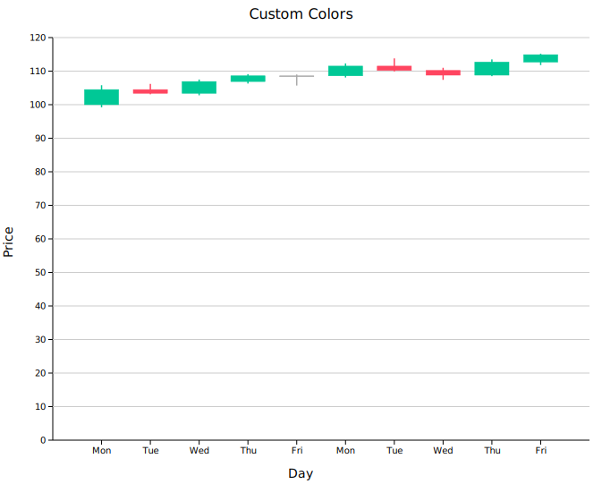
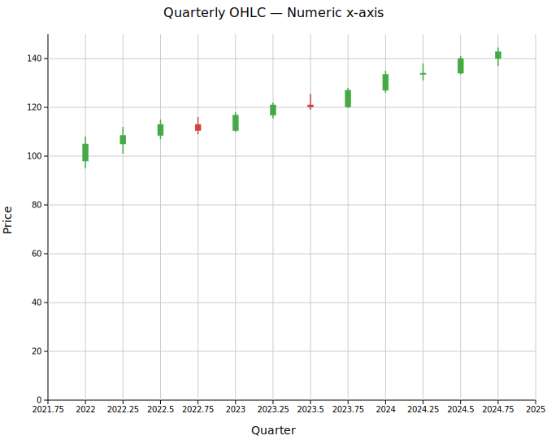

# Candlestick Plot

A candlestick chart visualises OHLC (open, high, low, close) data. Each candle encodes four values for a single period:

- The **body** spans from open to close. Green = close above open (bullish); red = close below open (bearish); gray = close equals open (doji).
- The **wicks** extend from the body to the period high (upper wick) and low (lower wick).

An optional **volume panel** shows trading volume as bars below the price chart.

**Import path:** `kuva::plot::CandlestickPlot`

---

## Basic usage

Add candles one at a time with `.with_candle(label, open, high, low, close)`. Labels are placed on the x-axis as category ticks and candles are spaced evenly.

```rust,no_run
use kuva::plot::CandlestickPlot;
use kuva::backend::svg::SvgBackend;
use kuva::render::render::render_multiple;
use kuva::render::layout::Layout;
use kuva::render::plots::Plot;

let plot = CandlestickPlot::new()
    .with_candle("Nov 01", 142.50, 146.20, 141.80, 145.30)  // bullish
    .with_candle("Nov 02", 145.40, 147.80, 143.50, 144.10)  // bearish
    .with_candle("Nov 03", 144.10, 144.90, 142.20, 144.10)  // doji
    .with_candle("Nov 04", 143.80, 148.50, 143.20, 147.90)  // bullish
    .with_candle("Nov 05", 147.90, 150.20, 146.30, 149.80); // bullish

let plots = vec![Plot::Candlestick(plot)];
let layout = Layout::auto_from_plots(&plots)
    .with_title("Daily OHLC — November")
    .with_x_label("Date")
    .with_y_label("Price (USD)");

let svg = SvgBackend.render_scene(&render_multiple(plots, layout));
std::fs::write("candlestick.svg", svg).unwrap();
```



Twenty trading days showing the full mix of bullish, bearish, and doji candles. The overall upward trend is visible from the rising body positions — two doji sessions (Nov 03 and Nov 21) mark brief pauses in the move.

---

## Volume panel

Attach volume data with `.with_volume(iter)` then call `.with_volume_panel()` to render a bar sub-panel below the price chart. Volume bars are colored to match their candle (green for up days, red for down days).

```rust,no_run
# use kuva::plot::CandlestickPlot;
let plot = CandlestickPlot::new()
    .with_candle("Nov 01", 142.50, 146.20, 141.80, 145.30)
    .with_candle("Nov 02", 145.40, 147.80, 143.50, 144.10)
    // ... more candles ...
    .with_volume([1_250_000.0, 980_000.0 /*, ... */])
    .with_volume_panel();
```



The volume panel occupies the bottom 22 % of the chart area by default. Adjust with `.with_volume_ratio(f)` — for example `.with_volume_ratio(0.30)` gives the panel 30 % of the height.

---

## Custom colors

Replace the default green/red/gray with any CSS color string using `.with_color_up()`, `.with_color_down()`, and `.with_color_doji()`.

```rust,no_run
# use kuva::plot::CandlestickPlot;
let plot = CandlestickPlot::new()
    .with_color_up("#00c896")     // teal green
    .with_color_down("#ff4560")   // bright red
    .with_color_doji("#aaaaaa")   // light gray
    .with_candle("Mon", 100.0, 105.8, 99.2, 104.5)
    .with_candle("Tue", 104.5, 106.2, 103.1, 103.4)
    // ...
    ;
```



---

## Numeric x-axis

`.with_candle_at(x, label, open, high, low, close)` places a candle at an explicit numeric x position, enabling uneven spacing and a true numeric axis. This is useful for quarterly, monthly, or any irregularly spaced data.

When using this mode, set `.with_candle_width(w)` to a value in data units smaller than the spacing between candles (e.g. `0.15` for quarterly data spaced `0.25` apart).

```rust,no_run
# use kuva::plot::CandlestickPlot;
let plot = CandlestickPlot::new()
    // x = fractional year; candles spaced 0.25 apart
    .with_candle_at(2023.00, "Q1'23", 110.5, 118.0, 110.0, 116.8)
    .with_candle_at(2023.25, "Q2'23", 116.8, 122.0, 115.5, 121.0)
    .with_candle_at(2023.50, "Q3'23", 121.0, 125.5, 119.0, 120.2)
    .with_candle_at(2023.75, "Q4'23", 120.2, 128.0, 119.8, 127.0)
    .with_candle_width(0.15);
```



Twelve quarters (2022 Q1 – 2024 Q4) on a continuous fractional-year axis. The x-axis tick marks are placed at round numeric values rather than category slots.

---

## Legend

`.with_legend(label)` adds a legend box inside the plot area identifying the series.

```rust,no_run
# use kuva::plot::CandlestickPlot;
let plot = CandlestickPlot::new()
    .with_candle("Jan", 100.0, 108.0, 98.0, 106.0)
    .with_candle("Feb", 106.0, 112.0, 104.0, 110.5)
    .with_legend("ACME Corp");
```

---

## Sizing

| Method | Default | Description |
|--------|---------|-------------|
| `.with_candle_width(f)` | `0.7` | Body width as fraction of slot (categorical) or in data units (numeric) |
| `.with_wick_width(px)` | `1.5` | Wick stroke width in pixels |
| `.with_volume_ratio(f)` | `0.22` | Fraction of chart height used by the volume panel |

---

## API reference

| Method | Description |
|--------|-------------|
| `CandlestickPlot::new()` | Create a plot with defaults |
| `.with_candle(label, o, h, l, c)` | Append a candle at the next categorical position |
| `.with_candle_at(x, label, o, h, l, c)` | Append a candle at an explicit numeric x position |
| `.with_volume(iter)` | Attach volume values to existing candles (in order) |
| `.with_volume_panel()` | Enable the volume bar sub-panel |
| `.with_volume_ratio(f)` | Panel height as fraction of total chart (default `0.22`) |
| `.with_candle_width(f)` | Body width — fraction of slot or data units (default `0.7`) |
| `.with_wick_width(px)` | Wick stroke width in pixels (default `1.5`) |
| `.with_color_up(s)` | Bullish candle color (default green) |
| `.with_color_down(s)` | Bearish candle color (default red) |
| `.with_color_doji(s)` | Doji candle color (default `#888888`) |
| `.with_legend(s)` | Add a legend box with the given label |
