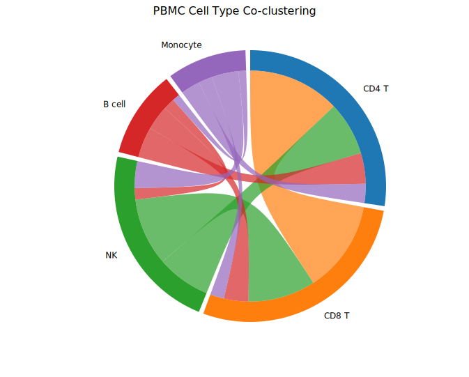
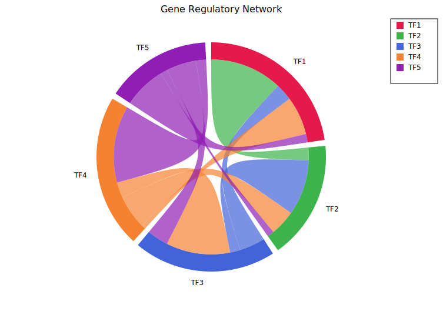
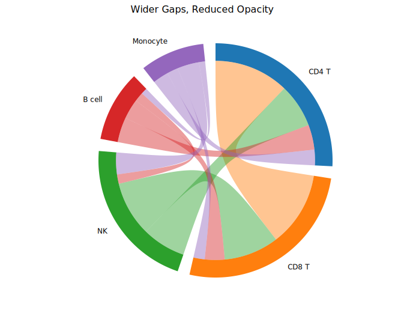

# Chord Diagram

A chord diagram arranges N nodes around a circle and connects them with ribbons whose widths are proportional to flow magnitudes from an N×N matrix. Each node occupies an arc on the outer ring; arc length is proportional to the node's total flow. It is well suited for showing pairwise relationships in network data — co-occurrence, migration, regulatory influence, or any square flow matrix.

**Import path:** `kuva::plot::ChordPlot`

---

## Basic usage

Supply an N×N matrix with `.with_matrix()` and node labels with `.with_labels()`. The diagram renders in pixel space — no x/y axis system is used. A title set on the `Layout` is still shown.

```rust,no_run
use kuva::plot::ChordPlot;
use kuva::backend::svg::SvgBackend;
use kuva::render::render::render_multiple;
use kuva::render::layout::Layout;
use kuva::render::plots::Plot;

// Co-clustering proximity scores between PBMC cell types
let matrix = vec![
    //         CD4T   CD8T    NK   Bcell   Mono
    vec![   0.0, 120.0,  70.0,  40.0,  25.0],  // CD4 T
    vec![ 120.0,   0.0,  88.0,  32.0,  18.0],  // CD8 T
    vec![  70.0,  88.0,   0.0,  15.0,  35.0],  // NK
    vec![  40.0,  32.0,  15.0,   0.0,  10.0],  // B cell
    vec![  25.0,  18.0,  35.0,  10.0,   0.0],  // Monocyte
];

let chord = ChordPlot::new()
    .with_matrix(matrix)
    .with_labels(["CD4 T", "CD8 T", "NK", "B cell", "Monocyte"]);

let plots = vec![Plot::Chord(chord)];
let layout = Layout::auto_from_plots(&plots)
    .with_title("PBMC Cell Type Co-clustering");

let svg = SvgBackend.render_scene(&render_multiple(plots, layout));
std::fs::write("chord.svg", svg).unwrap();
```



The symmetric matrix means each ribbon has equal width at both ends. The CD4 T–CD8 T ribbon is the widest because those two cell types have the highest co-clustering score (120); B cell–Monocyte is the thinnest (10). Colors come from the default `category10` palette.

---

## Asymmetric (directed) flows

When `matrix[i][j] ≠ matrix[j][i]`, flows are directed — for example regulatory influence, migration counts, or transition probabilities. The ribbon is **thicker at the source end** (high outgoing flow) and thinner at the target end.

Use `.with_colors()` to assign explicit per-node colors, and `.with_legend()` to show a color-coded node legend.

```rust,no_run
# use kuva::plot::ChordPlot;
# use kuva::render::plots::Plot;
// Directed regulatory influence between five transcription factors
let matrix = vec![
    vec![ 0.0, 85.0, 20.0, 45.0, 10.0],  // TF1 → others
    vec![15.0,  0.0, 65.0, 30.0,  8.0],  // TF2 → others
    vec![30.0, 12.0,  0.0, 75.0, 25.0],  // TF3 → others
    vec![ 5.0, 40.0, 18.0,  0.0, 90.0],  // TF4 → others
    vec![50.0,  8.0, 35.0, 12.0,  0.0],  // TF5 → others
];

let chord = ChordPlot::new()
    .with_matrix(matrix)
    .with_labels(["TF1", "TF2", "TF3", "TF4", "TF5"])
    .with_colors(["#e6194b", "#3cb44b", "#4363d8", "#f58231", "#911eb4"])
    .with_gap(3.0)
    .with_legend("Transcription factors");
```



TF4→TF5 (90) and TF1→TF2 (85) are the strongest regulatory edges. Asymmetry is visible — the TF4→TF5 ribbon is much thicker at the TF4 end than the TF5→TF4 end (5). The legend in the top-right corner maps each color to its node label.

---

## Gap and opacity

`.with_gap(degrees)` controls the white space between adjacent arc segments (default `2.0`°). Larger gaps make individual nodes easier to distinguish at the cost of compressing arc lengths.

`.with_opacity(f)` sets ribbon transparency (default `0.7`). Reducing opacity helps readability when many ribbons overlap in the centre.

```rust,no_run
# use kuva::plot::ChordPlot;
# let matrix = vec![vec![0.0_f64; 5]; 5];
let chord = ChordPlot::new()
    .with_matrix(matrix)
    .with_labels(["CD4 T", "CD8 T", "NK", "B cell", "Monocyte"])
    .with_gap(6.0)       // default 2.0 — wider arc separation
    .with_opacity(0.45); // default 0.7 — more transparent ribbons
```



The same co-clustering data as the basic example. Wider gaps make each cell type's arc clearly separate; the lower opacity lets the arc ring show through the ribbon bundle in the centre.

---

## Matrix layout

The N×N matrix convention:

| Entry | Meaning |
|-------|---------|
| `matrix[i][j]` | Flow **from** node i **to** node j |
| `matrix[i][i]` | Self-loop (typically `0.0` — not rendered) |
| Symmetric matrix | Undirected relationships (co-occurrence, correlation) |
| Asymmetric matrix | Directed flows (migration, regulation, transitions) |

Arc length for node i is proportional to the **row sum** of `matrix[i]`. In a symmetric matrix this equals the column sum, so arcs represent total pairwise interaction strength.

---

## Colors

Without `.with_colors()`, node colors are assigned automatically from the `category10` palette (cycling for more than ten nodes). Supply explicit per-node colors to match publication figures or color-blind-safe palettes:

```rust,no_run
# use kuva::plot::ChordPlot;
let chord = ChordPlot::new()
    .with_matrix(vec![vec![0.0, 1.0], vec![1.0, 0.0]])
    .with_labels(["Group A", "Group B"])
    .with_colors(["#377eb8", "#e41a1c"]);   // ColorBrewer blue / red
```

---

## API reference

| Method | Description |
|--------|-------------|
| `ChordPlot::new()` | Create a chord plot with defaults |
| `.with_matrix(m)` | N×N flow matrix: `m[i][j]` = flow from node i to node j |
| `.with_labels(iter)` | Node labels — one per row/column |
| `.with_colors(iter)` | Per-node fill colors (default: `category10` palette) |
| `.with_gap(deg)` | Gap between arc segments in degrees (default `2.0`) |
| `.with_opacity(f)` | Ribbon fill opacity `0.0`–`1.0` (default `0.7`) |
| `.with_legend(s)` | Enable a per-node color legend |
