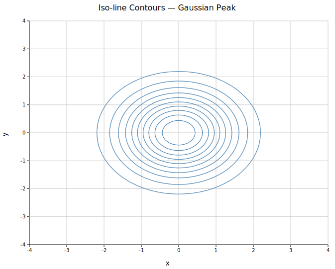
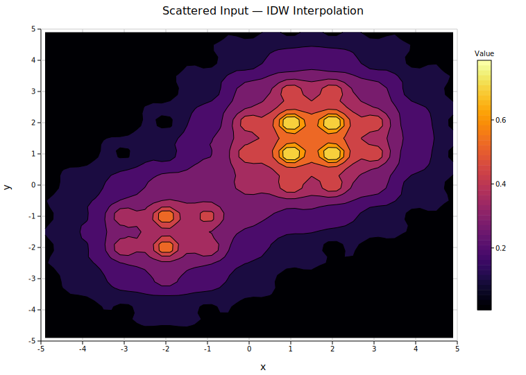
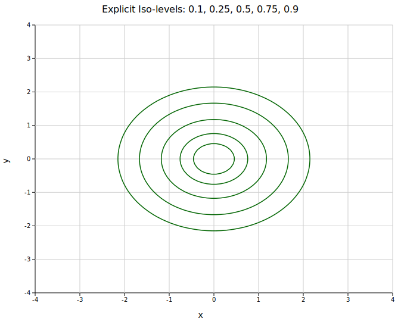

# Contour Plot

A contour plot draws iso-lines (or filled iso-bands) on a 2D scalar field, connecting all points that share the same z value. It is well suited for visualising any continuous surface: density functions, spatial expression gradients, topographic elevation, or any field that varies over an x–y plane.

**Import path:** `visus::plot::ContourPlot`

---

## Basic usage — iso-lines from a grid

Supply a pre-computed grid with `.with_grid(z, x_coords, y_coords)`. `z[row][col]` is the scalar value at position (`x_coords[col]`, `y_coords[row]`). By default, `n_levels` evenly spaced iso-lines are drawn (default 8).

```rust,no_run
use visus::plot::ContourPlot;
use visus::backend::svg::SvgBackend;
use visus::render::render::render_multiple;
use visus::render::layout::Layout;
use visus::render::plots::Plot;

// Build a 60×60 Gaussian grid over [-3, 3]²
let n = 60_usize;
let coords: Vec<f64> = (0..n)
    .map(|i| -3.0 + i as f64 / (n - 1) as f64 * 6.0)
    .collect();
let z: Vec<Vec<f64>> = coords.iter()
    .map(|&y| coords.iter()
        .map(|&x| (-(x * x + y * y) / 2.0).exp())
        .collect())
    .collect();

let cp = ContourPlot::new()
    .with_grid(z, coords.clone(), coords)
    .with_n_levels(10)
    .with_line_color("steelblue")
    .with_line_width(1.2);

let plots = vec![Plot::Contour(cp)];
let layout = Layout::auto_from_plots(&plots)
    .with_title("Iso-line Contours — Gaussian Peak")
    .with_x_label("x")
    .with_y_label("y");

let svg = SvgBackend.render_scene(&render_multiple(plots, layout));
std::fs::write("contour.svg", svg).unwrap();
```



Ten evenly spaced iso-lines trace the nested ellipses of the Gaussian peak. A fixed line color is used here; without `.with_line_color()` each iso-line would be colored by the active colormap.

---

## Filled contours

`.with_filled()` fills each band between adjacent iso-levels using the colormap. `.with_legend(label)` enables a colorbar in the right margin.

```rust,no_run
# use visus::plot::ContourPlot;
# use visus::render::plots::Plot;
let cp = ContourPlot::new()
    .with_grid(z, xs, ys)
    .with_n_levels(9)
    .with_filled()
    .with_legend("Density");
```


A bimodal surface with two overlapping peaks. The Viridis colormap maps low z values to purple/blue and high values to yellow. The colorbar on the right shows the full z range.

---

## Scattered input — IDW interpolation

`.with_points(iter)` accepts an iterator of `(x, y, z)` triples at **arbitrary positions** — no regular grid required. The values are interpolated onto an internal 50×50 grid using inverse-distance weighting (IDW) before iso-lines are computed. This is the natural input mode for spatial data such as tissue sample coordinates or irregular sensor readings.

```rust,no_run
# use visus::plot::{ContourPlot, ColorMap};
# use visus::render::plots::Plot;
// 121 sample points from a bimodal function
let pts: Vec<(f64, f64, f64)> = (-5..=5)
    .flat_map(|i| (-5..=5).map(move |j| {
        let (x, y) = (i as f64, j as f64);
        let z = (- ((x - 1.5) * (x - 1.5) + (y - 1.5) * (y - 1.5)) / 4.0).exp()
              + 0.7 * (- ((x + 2.0) * (x + 2.0) + (y + 1.5) * (y + 1.5)) / 3.0).exp();
        (x, y, z)
    }))
    .collect();

let cp = ContourPlot::new()
    .with_points(pts)
    .with_n_levels(8)
    .with_filled()
    .with_colormap(ColorMap::Inferno)
    .with_legend("Value");
```



The Inferno colormap with filled bands on IDW-interpolated data. Denser point clouds produce sharper interpolations; the 50×50 internal grid is fixed regardless of input count.

---

## Explicit iso-levels

`.with_levels(&[…])` pins the iso-lines to specific z values. This overrides `n_levels`. Use it when lines should correspond to meaningful thresholds — specific expression cutoffs, probability contours, or fixed elevation intervals.

```rust,no_run
# use visus::plot::ContourPlot;
# use visus::render::plots::Plot;
# let (z, xs, ys) = (vec![vec![0.0f64]], vec![0.0f64], vec![0.0f64]);
let cp = ContourPlot::new()
    .with_grid(z, xs, ys)
    .with_levels(&[0.1, 0.25, 0.5, 0.75, 0.9])
    .with_line_color("darkgreen")
    .with_line_width(1.5);
```



Five explicit iso-lines at z = 0.1, 0.25, 0.5, 0.75, 0.9 on the same Gaussian. The innermost ring at 0.9 is very tight around the peak; the outermost at 0.1 reaches almost to the grid boundary.

---

## Line color

By default each iso-line is colored using the active colormap. `.with_line_color(s)` overrides this with a single fixed color for all lines — useful for clean black-and-white figures or when the colormap is reserved for a filled background.

```rust,no_run
# use visus::plot::ContourPlot;
# let (z, xs, ys) = (vec![vec![0.0f64]], vec![0.0f64], vec![0.0f64]);
let cp = ContourPlot::new()
    .with_grid(z, xs, ys)
    .with_line_color("navy")    // all iso-lines in navy
    .with_line_width(1.2);
```

---

## Color maps

`.with_colormap(map)` selects the colormap (default `Viridis`). The same [`ColorMap`](../reference/palettes.md) variants available for heatmaps apply: `Viridis`, `Inferno`, `Grayscale`, and `Custom`.

```rust,no_run
use visus::plot::{ContourPlot, ColorMap};
# let (z, xs, ys) = (vec![vec![0.0f64]], vec![0.0f64], vec![0.0f64]);
let cp = ContourPlot::new()
    .with_grid(z, xs, ys)
    .with_filled()
    .with_colormap(ColorMap::Inferno)
    .with_legend("Density");
```

---

## API reference

| Method | Description |
|--------|-------------|
| `ContourPlot::new()` | Create a plot with defaults |
| `.with_grid(z, xs, ys)` | Regular grid input: `z[row][col]` with coordinate vectors |
| `.with_points(iter)` | Scattered `(x, y, z)` input — IDW interpolated to 50×50 grid |
| `.with_n_levels(n)` | Number of auto-spaced iso-levels (default `8`) |
| `.with_levels(&[…])` | Explicit iso-level values — overrides `n_levels` |
| `.with_filled()` | Enable filled color bands between iso-levels |
| `.with_colormap(map)` | Color map: `Viridis`, `Inferno`, `Grayscale`, `Custom` (default `Viridis`) |
| `.with_line_color(s)` | Fixed color for all iso-lines (default: derive from colormap) |
| `.with_line_width(px)` | Iso-line stroke width in pixels (default `1.0`) |
| `.with_legend(s)` | Colorbar label (filled mode) or line legend entry (line mode) |
