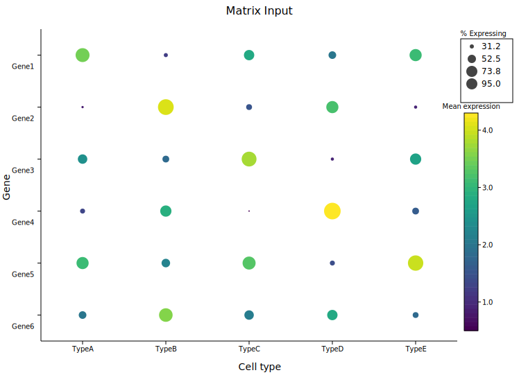
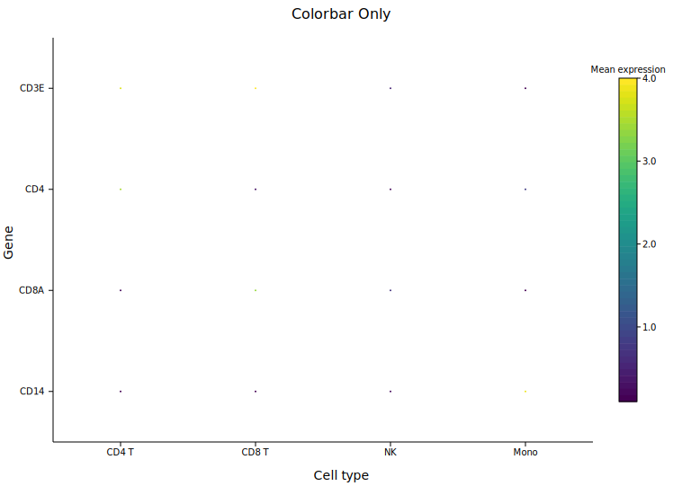

# Dot Plot

A dot plot (bubble matrix) places circles at the intersections of two categorical axes. Each circle encodes two independent continuous variables: **size** (radius) and **color**. This makes it well suited for compact display of multi-variable summaries across a grid — the canonical use case in bioinformatics is a gene expression dot plot where size shows the fraction of cells expressing a gene and color shows the mean expression level.

**Import path:** `kuva::plot::DotPlot`

---

## Basic usage

Pass an iterator of `(x_cat, y_cat, size, color)` tuples to `.with_data()`. Category order on each axis follows first-seen insertion order. Enable legends independently with `.with_size_legend()` and `.with_colorbar()`.

```rust,no_run
use kuva::plot::DotPlot;
use kuva::backend::svg::SvgBackend;
use kuva::render::render::render_multiple;
use kuva::render::layout::Layout;
use kuva::render::plots::Plot;

let data = vec![
    // (x_cat,   y_cat,   size,  color)
    ("CD4 T",  "CD3E",  88.0_f64, 3.8_f64),
    ("CD8 T",  "CD3E",  91.0,     4.0    ),
    ("NK",     "CD3E",  12.0,     0.5    ),
    ("CD4 T",  "CD4",   85.0,     3.5    ),
    ("CD8 T",  "CD4",    8.0,     0.3    ),
    ("NK",     "CD4",    4.0,     0.2    ),
];

let dot = DotPlot::new()
    .with_data(data)
    .with_size_legend("% Expressing")
    .with_colorbar("Mean expression");

let plots = vec![Plot::DotPlot(dot)];
let layout = Layout::auto_from_plots(&plots)
    .with_title("Gene Expression")
    .with_x_label("Cell type")
    .with_y_label("Gene");

let scene = render_multiple(plots, layout);
let svg = SvgBackend.render_scene(&scene);
std::fs::write("dotplot.svg", svg).unwrap();
```


Eight immune marker genes across six cell types. Large circles show genes expressed in many cells; bright colors (Viridis: yellow) show high mean expression. The cell-type specificity of each marker is immediately legible — CD3E is large in T cells, MS4A1 only in B cells, LYZ highest in monocytes.

---

## Matrix input

`.with_matrix(x_cats, y_cats, sizes, colors)` accepts dense 2-D data where every grid cell is filled. `sizes[row_i][col_j]` maps to `y_cats[row_i]` and `x_cats[col_j]`. Use this when your data comes from a matrix or 2-D array.

```rust,no_run
use kuva::plot::DotPlot;
# use kuva::render::plots::Plot;

let x_cats = vec!["TypeA", "TypeB", "TypeC", "TypeD", "TypeE"];
let y_cats = vec!["Gene1", "Gene2", "Gene3", "Gene4", "Gene5", "Gene6"];

// sizes[row_i][col_j] → y_cats[row_i], x_cats[col_j]
let sizes = vec![
    vec![80.0, 25.0, 60.0, 45.0, 70.0],
    vec![15.0, 90.0, 35.0, 70.0, 20.0],
    // ...
];
let colors = vec![
    vec![3.5, 1.2, 2.8, 2.0, 3.1],
    vec![0.8, 4.1, 1.5, 3.2, 0.9],
    // ...
];

let dot = DotPlot::new()
    .with_matrix(x_cats, y_cats, sizes, colors)
    .with_size_legend("% Expressing")
    .with_colorbar("Mean expression");
```



---

## Sparse data

With `.with_data()`, grid positions with no corresponding tuple are simply left empty — no circle is drawn at that cell. There is no need to fill missing values with zero or NaN.

```rust,no_run
# use kuva::plot::DotPlot;
let dot = DotPlot::new().with_data(vec![
    ("TypeA", "GeneX", 80.0_f64, 2.5_f64),
    // ("TypeA", "GeneY") absent — no circle drawn
    ("TypeA", "GeneZ", 40.0,     1.2    ),
    ("TypeB", "GeneY", 90.0,     2.9    ),
]);
```

---

## Legends

The size legend and colorbar are independent. Enable either, both, or neither.

### Size legend only

`.with_size_legend(label)` adds a key in the right margin showing representative radii with their corresponding values. Use this when color carries no additional information (or when all dots share the same constant color value).

```rust,no_run
# use kuva::plot::DotPlot;
let dot = DotPlot::new()
    .with_data(data)
    .with_size_legend("% Expressing");   // only size legend; no colorbar
```


### Colorbar only

`.with_colorbar(label)` adds a colorbar for the color encoding. Useful when all dots should be the same size (pass a constant for the `size` field) so the color variable is the sole focus.

```rust,no_run
# use kuva::plot::DotPlot;
let dot = DotPlot::new()
    .with_data(data)
    .with_colorbar("Mean expression");   // only colorbar; no size legend
```



### Both legends

When both are set, the size legend and colorbar are stacked in a single right-margin column automatically.

```rust,no_run
# use kuva::plot::DotPlot;
let dot = DotPlot::new()
    .with_data(data)
    .with_size_legend("% Expressing")
    .with_colorbar("Mean expression");
```

---

## Clamping ranges

By default the size and color encodings are normalised to the data extent automatically. Use `.with_size_range()` and `.with_color_range()` to fix an explicit `[min, max]` — useful for excluding outliers or keeping a consistent scale across multiple plots.

```rust,no_run
# use kuva::plot::DotPlot;
let dot = DotPlot::new()
    .with_data(data)
    // Clamp size to 0–100 % regardless of data range;
    // values above 100 map to max_radius.
    .with_size_range(0.0, 100.0)
    // Fix color scale to 0–5 log-normalised expression.
    .with_color_range(0.0, 5.0);
```

---

## Radius range

`.with_max_radius(px)` and `.with_min_radius(px)` set the pixel size limits (defaults: `12.0` and `1.0`). Increase `max_radius` for a larger grid or reduce it for dense plots with many categories.

```rust,no_run
# use kuva::plot::DotPlot;
let dot = DotPlot::new()
    .with_data(data)
    .with_max_radius(18.0)   // default 12.0
    .with_min_radius(2.0);   // default 1.0
```

---

## Color maps

`.with_color_map(ColorMap)` selects the color encoding (default `Viridis`). The same [`ColorMap`](../reference/palettes.md) variants available for heatmaps apply here: `Viridis`, `Inferno`, `Grayscale`, and `Custom`.

```rust,no_run
use kuva::plot::{DotPlot, ColorMap};
# use kuva::render::plots::Plot;

let dot = DotPlot::new()
    .with_data(data)
    .with_color_map(ColorMap::Inferno);
```

---

## API reference

| Method | Description |
|--------|-------------|
| `DotPlot::new()` | Create a dot plot with defaults |
| `.with_data(iter)` | Sparse input: iterator of `(x_cat, y_cat, size, color)` tuples |
| `.with_matrix(x, y, sizes, colors)` | Dense input: category lists + 2-D matrices |
| `.with_color_map(map)` | Color encoding: `Viridis`, `Inferno`, `Grayscale`, `Custom` (default `Viridis`) |
| `.with_max_radius(px)` | Largest circle radius in pixels (default `12.0`) |
| `.with_min_radius(px)` | Smallest circle radius in pixels (default `1.0`) |
| `.with_size_range(min, max)` | Clamp size values before normalising (default: data extent) |
| `.with_color_range(min, max)` | Clamp color values before normalising (default: data extent) |
| `.with_size_legend(label)` | Add a size key in the right margin |
| `.with_colorbar(label)` | Add a colorbar in the right margin |
