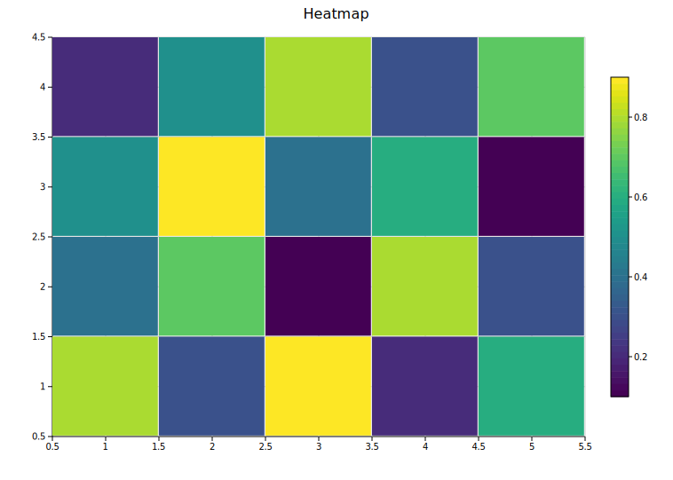
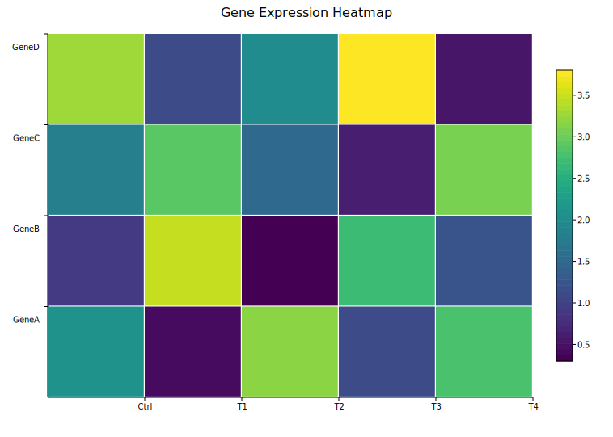
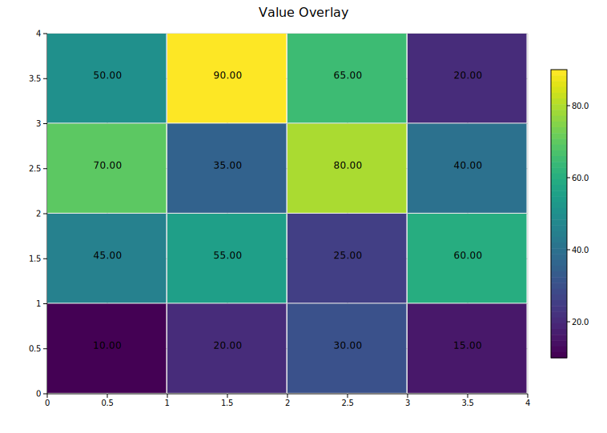
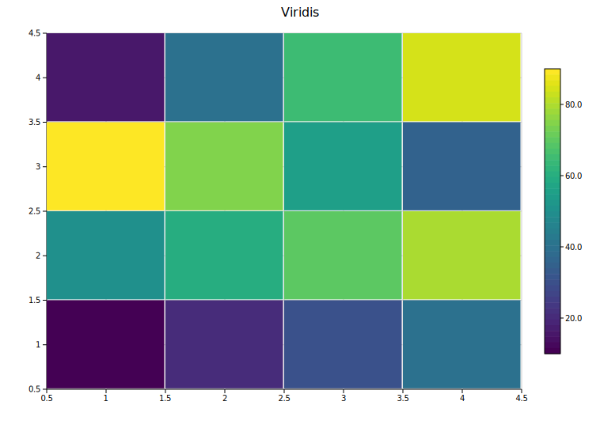
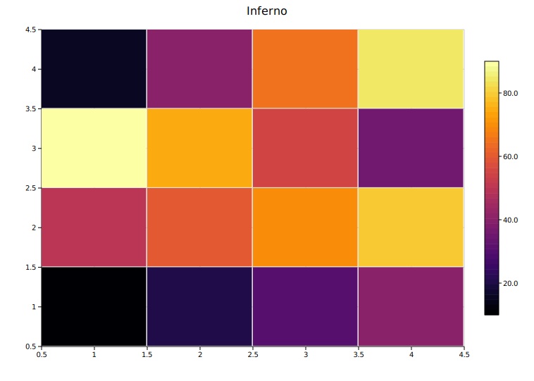

# Heatmap

A heatmap renders a two-dimensional grid where each cell's color encodes a numeric value. Values are normalized to the data range and passed through a color map. A colorbar is always shown in the right margin.

**Import path:** `visus::plot::Heatmap`

---

## Basic usage

Pass a 2-D array to `.with_data()`. The outer dimension is rows (top to bottom) and the inner dimension is columns (left to right).

```rust,no_run
use visus::plot::Heatmap;
use visus::backend::svg::SvgBackend;
use visus::render::render::render_multiple;
use visus::render::layout::Layout;
use visus::render::plots::Plot;

let data = vec![
    vec![0.8, 0.3, 0.9, 0.2, 0.6],
    vec![0.4, 0.7, 0.1, 0.8, 0.3],
    vec![0.5, 0.9, 0.4, 0.6, 0.1],
    vec![0.2, 0.5, 0.8, 0.3, 0.7],
];

let heatmap = Heatmap::new().with_data(data);

let plots = vec![Plot::Heatmap(heatmap)];
let layout = Layout::auto_from_plots(&plots).with_title("Heatmap");

let scene = render_multiple(plots, layout);
let svg = SvgBackend.render_scene(&scene);
std::fs::write("heatmap.svg", svg).unwrap();
```



`.with_data()` accepts any iterable of iterables of numeric values — `Vec<Vec<f64>>`, slices, or any type implementing `Into<f64>`.

---

## Axis labels

Axis labels are set on the `Layout`, not on the `Heatmap` struct. Pass column labels to `.with_x_categories()` and row labels to `.with_y_categories()`.

```rust,no_run
use visus::plot::Heatmap;
use visus::backend::svg::SvgBackend;
use visus::render::render::render_multiple;
use visus::render::layout::Layout;
use visus::render::plots::Plot;

let data = vec![
    vec![2.1, 0.4, 3.2, 1.1, 2.8],
    vec![0.9, 3.5, 0.3, 2.7, 1.2],
    vec![1.8, 2.9, 1.5, 0.6, 3.1],
    vec![3.3, 1.1, 2.0, 3.8, 0.5],
];

let col_labels = vec!["Ctrl", "T1", "T2", "T3", "T4"]
    .into_iter().map(String::from).collect::<Vec<_>>();
let row_labels = vec!["GeneA", "GeneB", "GeneC", "GeneD"]
    .into_iter().map(String::from).collect::<Vec<_>>();

let heatmap = Heatmap::new().with_data(data);
let plots = vec![Plot::Heatmap(heatmap)];
let layout = Layout::auto_from_plots(&plots)
    .with_title("Gene Expression Heatmap")
    .with_x_categories(col_labels)   // column labels on x-axis
    .with_y_categories(row_labels);  // row labels on y-axis

let svg = SvgBackend.render_scene(&render_multiple(plots, layout));
```



---

## Value overlay

`.with_values()` prints each cell's raw numeric value (formatted to two decimal places) centered inside the cell. Most useful for small grids where the text remains legible.

```rust,no_run
# use visus::plot::Heatmap;
let heatmap = Heatmap::new()
    .with_data(vec![
        vec![10.0, 20.0, 30.0, 15.0],
        vec![45.0, 55.0, 25.0, 60.0],
        vec![70.0, 35.0, 80.0, 40.0],
        vec![50.0, 90.0, 65.0, 20.0],
    ])
    .with_values();
```



---

## Color maps

`.with_color_map(ColorMap)` selects the color encoding. The default is `Viridis`.

| Variant | Scale | Notes |
|---------|-------|-------|
| `Viridis` | Blue → green → yellow | Perceptually uniform; colorblind-safe. **Default.** |
| `Inferno` | Black → purple → yellow | High-contrast; works in greyscale print |
| `Grayscale` | Black → white | Clean publication style |
| `Custom(Arc<Fn>)` | User-defined | Full control |

```rust,no_run
use visus::plot::{Heatmap, ColorMap};
# use visus::render::plots::Plot;

let heatmap = Heatmap::new()
    .with_data(vec![vec![1.0, 2.0], vec![3.0, 4.0]])
    .with_color_map(ColorMap::Inferno);
```

<table>
<tr>
<td></td>
<td></td>
<td></td>
</tr>
<tr>
<td align="center"><code>Viridis</code></td>
<td align="center"><code>Inferno</code></td>
<td align="center"><code>Grayscale</code></td>
</tr>
</table>

### Custom color map

For diverging scales or other custom encodings, use `ColorMap::Custom` with a closure that maps a normalized `[0.0, 1.0]` value to a CSS color string.

```rust,no_run
use std::sync::Arc;
use visus::plot::{Heatmap, ColorMap};

// Blue-to-red diverging scale
let cmap = ColorMap::Custom(Arc::new(|t: f64| {
    let r = (t * 255.0) as u8;
    let b = ((1.0 - t) * 255.0) as u8;
    format!("rgb({r},0,{b})")
}));

let heatmap = Heatmap::new()
    .with_data(vec![vec![1.0, 2.0, 3.0], vec![4.0, 5.0, 6.0]])
    .with_color_map(cmap);
```

---

## API reference

| Method | Description |
|--------|-------------|
| `Heatmap::new()` | Create a heatmap with defaults |
| `.with_data(rows)` | Set grid data; accepts any numeric iterable of iterables |
| `.with_color_map(map)` | Color encoding: `Viridis`, `Inferno`, `Grayscale`, or `Custom` (default `Viridis`) |
| `.with_values()` | Print each cell's value as text inside the cell |
| `.with_labels(rows, cols)` | Store label strings in the struct (pass to `Layout` to render them) |
| `.with_legend(s)` | Attach a legend label |

**Layout methods used with heatmaps:**

| Method | Description |
|--------|-------------|
| `Layout::with_x_categories(labels)` | Column labels on the x-axis |
| `Layout::with_y_categories(labels)` | Row labels on the y-axis |
