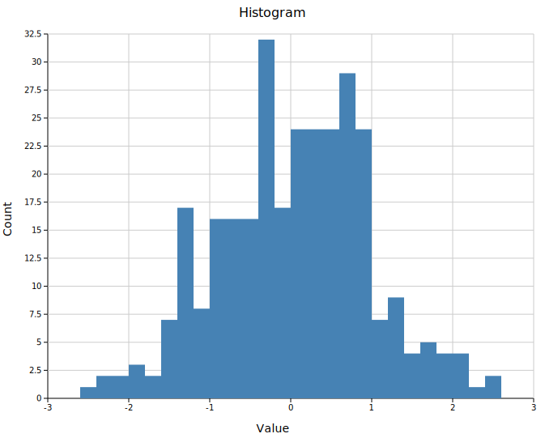
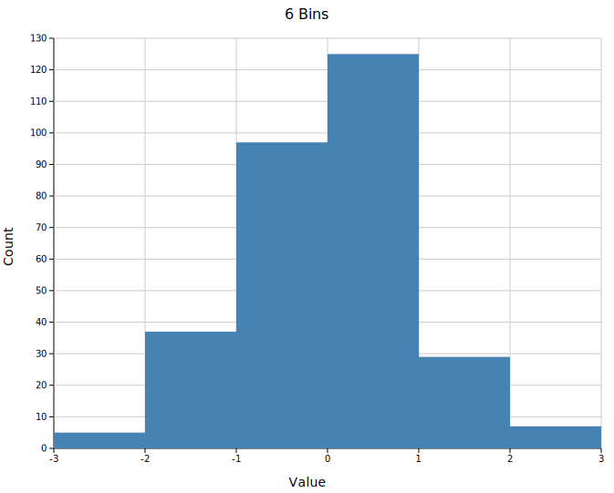
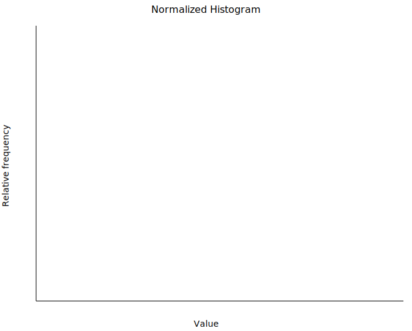

# Histogram

A histogram bins a 1-D dataset into equal-width intervals and renders each bin as a vertical bar. It supports explicit ranges, normalization, and overlapping distributions.

**Import path:** `visus::plot::Histogram`

---

## Basic usage

`.with_range((min, max))` is **required** — without it `Layout::auto_from_plots` cannot determine the axis extent and will produce an empty chart. Compute the range from your data before building the histogram:

```rust,no_run
use visus::plot::Histogram;
use visus::backend::svg::SvgBackend;
use visus::render::render::render_multiple;
use visus::render::layout::Layout;
use visus::render::plots::Plot;

let data: Vec<f64> = vec![/* your samples */];

// Compute range from data first.
let min = data.iter().cloned().fold(f64::INFINITY, f64::min);
let max = data.iter().cloned().fold(f64::NEG_INFINITY, f64::max);

let hist = Histogram::new()
    .with_data(data)
    .with_bins(20)
    .with_range((min, max))   // required for auto_from_plots
    .with_color("steelblue");

let plots = vec![Plot::Histogram(hist)];
let layout = Layout::auto_from_plots(&plots)
    .with_title("Histogram")
    .with_x_label("Value")
    .with_y_label("Count");

let scene = render_multiple(plots, layout);
let svg = SvgBackend.render_scene(&scene);
std::fs::write("histogram.svg", svg).unwrap();
```



---

## Bin count

`.with_bins(n)` sets the number of equal-width bins (default `10`). Fewer bins smooth out noise; more bins reveal finer structure at the cost of per-bin counts. The same range is used in both cases so the x-axis stays comparable.

```rust,no_run
# use visus::plot::Histogram;
// Coarse — few bins, clear shape
let hist = Histogram::new().with_data(data.clone()).with_bins(5).with_range(range);

// Fine — many bins, more detail
let hist = Histogram::new().with_data(data).with_bins(40).with_range(range);
```

<table>
<tr>
<td></td>
<td></td>
</tr>
</table>

---

## Fixed range

Pass an explicit `(min, max)` to `.with_range()` to fix the bin edges regardless of the data. Values outside the range are silently ignored. This is useful when you want to focus on a sub-range, exclude outliers, or ensure two independent histograms cover the same x-axis scale.

```rust,no_run
# use visus::plot::Histogram;
let hist = Histogram::new()
    .with_data(data)
    .with_bins(20)
    .with_range((-3.0, 3.0))   // bins fixed to [-3, 3]; outliers ignored
    .with_color("steelblue");
```

---

## Normalized histogram

`.with_normalize()` rescales bar heights so the tallest bar equals `1.0`. This is peak-normalization — useful for comparing the shape of distributions with different sample sizes. The y-axis shows relative frequency, not counts or probability density.

```rust,no_run
use visus::plot::Histogram;
use visus::backend::svg::SvgBackend;
use visus::render::render::render_multiple;
use visus::render::layout::Layout;
use visus::render::plots::Plot;

let min = data.iter().cloned().fold(f64::INFINITY, f64::min);
let max = data.iter().cloned().fold(f64::NEG_INFINITY, f64::max);

let hist = Histogram::new()
    .with_data(data)
    .with_bins(20)
    .with_range((min, max))
    .with_color("steelblue")
    .with_normalize();

let plots = vec![Plot::Histogram(hist)];
let layout = Layout::auto_from_plots(&plots)
    .with_title("Normalized Histogram")
    .with_x_label("Value")
    .with_y_label("Relative frequency");
```



---

## Overlapping distributions

Place multiple `Histogram` structs in the same `Vec<Plot>`. Since bars have no built-in opacity setting, use 8-digit hex colors (`#RRGGBBAA`) to make each series semi-transparent so the overlap is visible.

When overlapping, compute a **shared range** from the combined data so both histograms use the same bin edges and x-axis scale:

```rust,no_run
use visus::plot::Histogram;
use visus::backend::svg::SvgBackend;
use visus::render::render::render_multiple;
use visus::render::layout::Layout;
use visus::render::plots::Plot;

// Shared range across both groups so x-axes align.
let combined_min = group_a.iter().chain(group_b.iter())
    .cloned().fold(f64::INFINITY, f64::min);
let combined_max = group_a.iter().chain(group_b.iter())
    .cloned().fold(f64::NEG_INFINITY, f64::max);
let range = (combined_min, combined_max);

// #4682b480 = steelblue at ~50% opacity
// #dc143c80 = crimson  at ~50% opacity
let hist_a = Histogram::new()
    .with_data(group_a)
    .with_bins(20)
    .with_range(range)
    .with_color("#4682b480")
    .with_legend("Group A");

let hist_b = Histogram::new()
    .with_data(group_b)
    .with_bins(20)
    .with_range(range)
    .with_color("#dc143c80")
    .with_legend("Group B");

let plots = vec![Plot::Histogram(hist_a), Plot::Histogram(hist_b)];
let layout = Layout::auto_from_plots(&plots)
    .with_title("Overlapping Distributions")
    .with_x_label("Value")
    .with_y_label("Count");

let svg = SvgBackend.render_scene(&render_multiple(plots, layout));
```


The `AA` byte in the hex color controls opacity: `ff` = fully opaque, `80` ≈ 50%, `40` ≈ 25%.

---

## API reference

| Method | Description |
|--------|-------------|
| `Histogram::new()` | Create a histogram with defaults (10 bins, color `"black"`) |
| `.with_data(iter)` | Set input values; accepts any `Into<f64>` numeric type |
| `.with_bins(n)` | Number of equal-width bins (default `10`) |
| `.with_range((min, max))` | **Required.** Sets bin edges and the layout axis extent |
| `.with_color(s)` | Bar fill color; use 8-digit hex (`#RRGGBBAA`) for alpha transparency |
| `.with_normalize()` | Scale heights so peak bar = 1.0 (relative frequency) |
| `.with_legend(s)` | Attach a legend label to this series |
