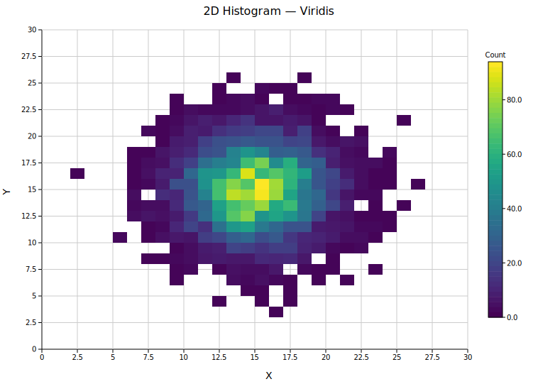
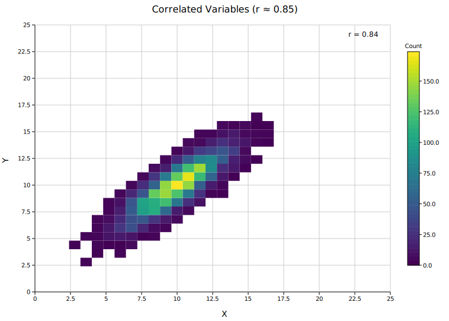
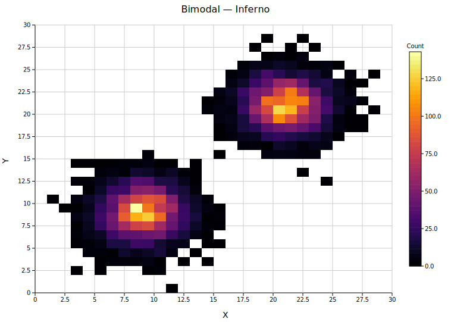
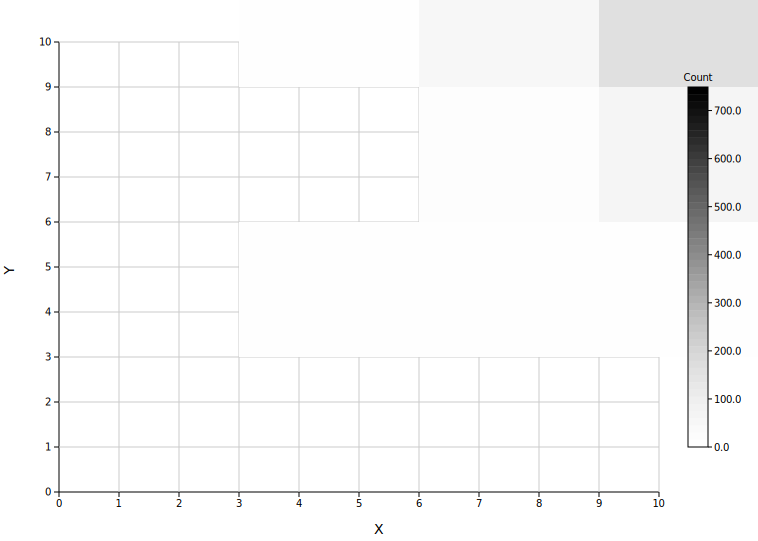
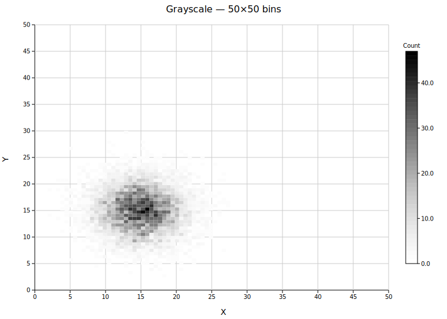

# 2D Histogram

A 2D histogram (density map) bins scatter points `(x, y)` into a rectangular grid and colors each cell by its count. The colorbar labeled **"Count"** is added to the right margin automatically. Use it to visualize the joint distribution of two continuous variables.

**Import path:** `kuva::plot::Histogram2D`, `kuva::plot::histogram2d::ColorMap`

---

## Basic usage

Pass `(x, y)` scatter points along with explicit axis ranges and bin counts to `.with_data()`. Points outside the specified ranges are silently discarded.

```rust,no_run
use kuva::plot::Histogram2D;
use kuva::backend::svg::SvgBackend;
use kuva::render::render::render_multiple;
use kuva::render::layout::Layout;
use kuva::render::plots::Plot;

// (x, y) scatter points — e.g. from a 2D measurement
let data: Vec<(f64, f64)> = vec![];  // ...your data here

let hist = Histogram2D::new()
    .with_data(data, (0.0, 30.0), (0.0, 30.0), 30, 30);

let plots = vec![Plot::Histogram2d(hist)];
let layout = Layout::auto_from_plots(&plots)
    .with_title("2D Histogram — Viridis")
    .with_x_label("X")
    .with_y_label("Y");

let svg = SvgBackend.render_scene(&render_multiple(plots, layout));
std::fs::write("hist2d.svg", svg).unwrap();
```



A single bivariate Gaussian cluster binned into a 30×30 grid. The Viridis colorbar on the right shows the count scale from zero (dark blue) to the maximum (yellow).

---

## Correlation annotation

`.with_correlation()` computes the Pearson r coefficient from the raw scatter points and prints it in the top-right corner.

```rust,no_run
# use kuva::plot::Histogram2D;
# use kuva::render::plots::Plot;
let hist = Histogram2D::new()
    .with_data(data, (0.0, 20.0), (0.0, 20.0), 25, 25)
    .with_correlation();
```



The diagonal density ridge reflects a strong positive correlation (r ≈ 0.85). The coefficient is computed from all input points, including those clipped outside the plot range.

---

## Bimodal data — Inferno colormap

`ColorMap::Inferno` maps low counts to near-black and high counts to bright yellow. It is effective for high-contrast visualization of structured or multi-modal data.

```rust,no_run
use kuva::plot::Histogram2D;
use kuva::plot::histogram2d::ColorMap;
# use kuva::render::plots::Plot;

let hist = Histogram2D::new()
    .with_data(data, (0.0, 30.0), (0.0, 30.0), 30, 30)
    .with_color_map(ColorMap::Inferno);
```



Two Gaussian clusters in opposite corners of the grid, visible as bright islands against the dark background. Empty bins are not drawn, preserving the black background of Inferno.

---

## Bin resolution

Bin count controls the trade-off between noise and detail.

`ColorMap::Grayscale` maps zero to white and the maximum to black — useful for printing or publication figures.



10×10 bins smooth the distribution and make the Gaussian shape immediately obvious, but lose fine-grained density structure.

`ColorMap::Viridis` (the default) uses a perceptually uniform blue → green → yellow scale, making density gradients easy to read at high resolution.



50×50 bins reveal the internal shape of the distribution, though individual cells become noisier at lower sample counts.

---

## Range convention

The axis is calibrated directly to the physical `x_range` / `y_range` values you supply, so tick labels always show real data units regardless of bin count. Any `(min, max)` pair works.

| Range | `bins_x` | Bin width |
|-------|----------|-----------|
| `(0.0, 30.0)` | `30` | 1.0 |
| `(0.0, 20.0)` | `25` | 0.8 |
| `(5.0, 25.0)` | `20` | 1.0 |

---

## Colormaps

| `ColorMap` variant | Description |
|--------------------|-------------|
| `ColorMap::Viridis` | Blue → green → yellow. Perceptually uniform, colorblind-safe. **(default)** |
| `ColorMap::Inferno` | Black → orange → yellow. High contrast. |
| `ColorMap::Grayscale` | White → black. Print-friendly. |
| `ColorMap::Custom(f)` | User-supplied `Arc<dyn Fn(f64) -> String>`. |

---

## API reference

| Method | Description |
|--------|-------------|
| `Histogram2D::new()` | Create with defaults (10×10 bins, Viridis) |
| `.with_data(data, x_range, y_range, bins_x, bins_y)` | Load `(x, y)` points and bin them |
| `.with_color_map(cmap)` | Set the colormap (default `ColorMap::Viridis`) |
| `.with_correlation()` | Print Pearson r in the top-right corner |
