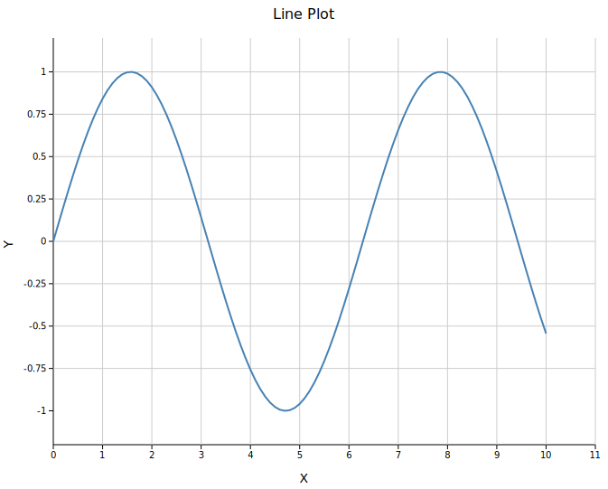
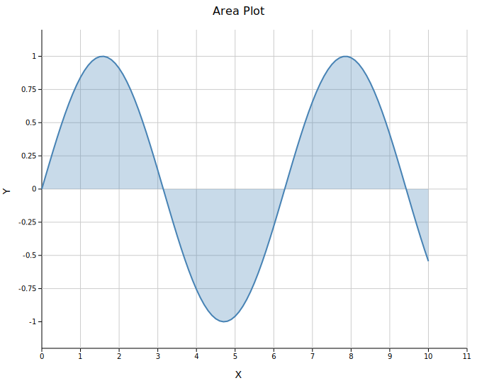
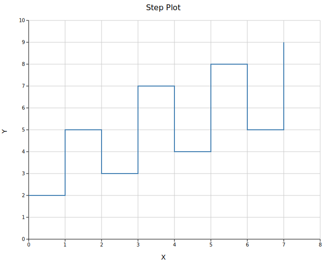
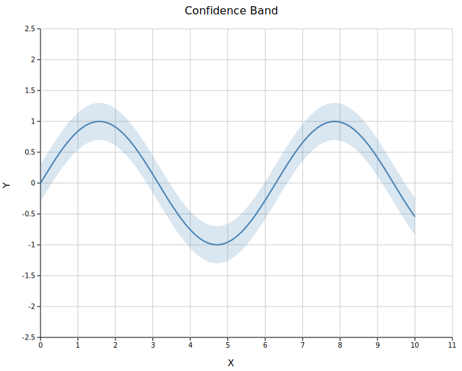
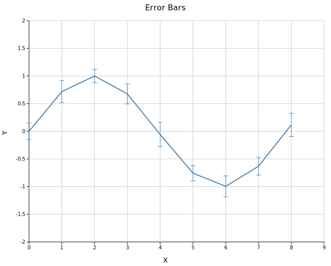

# Line Plot

A line plot connects (x, y) data points with a continuous path. It supports four built-in stroke styles, area fills, step interpolation, confidence bands, and error bars.

**Import path:** `visus::plot::LinePlot`

---

## Basic usage

```rust,no_run
use visus::plot::LinePlot;
use visus::backend::svg::SvgBackend;
use visus::render::render::render_multiple;
use visus::render::layout::Layout;
use visus::render::plots::Plot;

let data: Vec<(f64, f64)> = (0..=100)
    .map(|i| { let x = i as f64 * 0.1; (x, x.sin()) })
    .collect();

let plot = LinePlot::new()
    .with_data(data)
    .with_color("steelblue")
    .with_stroke_width(2.0);

let plots = vec![Plot::Line(plot)];
let layout = Layout::auto_from_plots(&plots)
    .with_title("Line Plot")
    .with_x_label("X")
    .with_y_label("Y");

let scene = render_multiple(plots, layout);
let svg = SvgBackend.render_scene(&scene);
std::fs::write("line.svg", svg).unwrap();
```



---

## Line styles

Four built-in stroke styles are available. Use the shorthand methods or pass a `LineStyle` variant directly.

```rust,no_run
use visus::plot::{LinePlot, LineStyle};
use visus::backend::svg::SvgBackend;
use visus::render::render::render_multiple;
use visus::render::layout::Layout;
use visus::render::plots::Plot;

let xs: Vec<f64> = (0..=80).map(|i| i as f64 * 0.125).collect();

let plots = vec![
    Plot::Line(LinePlot::new()
        .with_data(xs.iter().map(|&x| (x, x.sin())))
        .with_color("steelblue").with_stroke_width(2.0)
        .with_line_style(LineStyle::Solid).with_legend("Solid")),

    Plot::Line(LinePlot::new()
        .with_data(xs.iter().map(|&x| (x, x.cos())))
        .with_color("crimson").with_stroke_width(2.0)
        .with_dashed().with_legend("Dashed")),

    Plot::Line(LinePlot::new()
        .with_data(xs.iter().map(|&x| (x, (x * 0.7).sin())))
        .with_color("seagreen").with_stroke_width(2.0)
        .with_dotted().with_legend("Dotted")),

    Plot::Line(LinePlot::new()
        .with_data(xs.iter().map(|&x| (x, (x * 0.7).cos())))
        .with_color("darkorange").with_stroke_width(2.0)
        .with_dashdot().with_legend("Dash-dot")),
];

let layout = Layout::auto_from_plots(&plots)
    .with_title("Line Styles")
    .with_x_label("X")
    .with_y_label("Y");

let svg = SvgBackend.render_scene(&render_multiple(plots, layout));
```


### Custom dasharray

For patterns not covered by the built-in variants, use `LineStyle::Custom` with an SVG `stroke-dasharray` string:

```rust,no_run
# use visus::plot::{LinePlot, LineStyle};
let plot = LinePlot::new()
    .with_data(vec![(0.0_f64, 0.0_f64), (1.0, 1.0), (2.0, 0.5)])
    .with_line_style(LineStyle::Custom("12 3 3 3".into()));
```

---

## Area plot

Call `.with_fill()` to shade the region between the line and the x-axis. The fill uses the line color at `0.3` opacity by default.

```rust,no_run
use visus::plot::LinePlot;
use visus::backend::svg::SvgBackend;
use visus::render::render::render_multiple;
use visus::render::layout::Layout;
use visus::render::plots::Plot;

let data: Vec<(f64, f64)> = (0..=100)
    .map(|i| { let x = i as f64 * 0.1; (x, x.sin()) })
    .collect();

let plot = LinePlot::new()
    .with_data(data)
    .with_color("steelblue")
    .with_stroke_width(2.0)
    .with_fill()
    .with_fill_opacity(0.3);   // optional, 0.3 is the default

let plots = vec![Plot::Line(plot)];
let layout = Layout::auto_from_plots(&plots)
    .with_title("Area Plot")
    .with_x_label("X")
    .with_y_label("Y");

let svg = SvgBackend.render_scene(&render_multiple(plots, layout));
```



---

## Step plot

`.with_step()` draws horizontal-then-vertical transitions between consecutive points rather than diagonal segments. This is the standard rendering for histograms and discrete time-series data.

```rust,no_run
use visus::plot::LinePlot;
use visus::backend::svg::SvgBackend;
use visus::render::render::render_multiple;
use visus::render::layout::Layout;
use visus::render::plots::Plot;

let data = vec![
    (0.0_f64, 2.0_f64), (1.0, 5.0), (2.0, 3.0), (3.0, 7.0),
    (4.0, 4.0), (5.0, 8.0), (6.0, 5.0), (7.0, 9.0),
];

let plot = LinePlot::new()
    .with_data(data)
    .with_color("steelblue")
    .with_stroke_width(2.0)
    .with_step();

let plots = vec![Plot::Line(plot)];
let layout = Layout::auto_from_plots(&plots)
    .with_title("Step Plot")
    .with_x_label("X")
    .with_y_label("Y");

let svg = SvgBackend.render_scene(&render_multiple(plots, layout));
```



Step and fill can be combined: `.with_step().with_fill()` produces a filled step area.

---

## Confidence band

`.with_band(y_lower, y_upper)` draws a shaded region between two boundary series aligned to the line's x positions. The band color inherits from the line color.

```rust,no_run
use visus::plot::LinePlot;
use visus::backend::svg::SvgBackend;
use visus::render::render::render_multiple;
use visus::render::layout::Layout;
use visus::render::plots::Plot;

let xs: Vec<f64> = (0..=80).map(|i| i as f64 * 0.125).collect();
let ys: Vec<f64> = xs.iter().map(|&x| x.sin()).collect();
let lower: Vec<f64> = ys.iter().map(|&y| y - 0.3).collect();
let upper: Vec<f64> = ys.iter().map(|&y| y + 0.3).collect();

let data: Vec<(f64, f64)> = xs.into_iter().zip(ys).collect();

let plot = LinePlot::new()
    .with_data(data)
    .with_color("steelblue")
    .with_stroke_width(2.0)
    .with_band(lower, upper);

let plots = vec![Plot::Line(plot)];
let layout = Layout::auto_from_plots(&plots)
    .with_title("Confidence Band")
    .with_x_label("X")
    .with_y_label("Y");

let svg = SvgBackend.render_scene(&render_multiple(plots, layout));
```



---

## Error bars

`.with_y_err()` and `.with_x_err()` attach symmetric error bars. Asymmetric variants take `(negative, positive)` tuples.

```rust,no_run
use visus::plot::LinePlot;
use visus::backend::svg::SvgBackend;
use visus::render::render::render_multiple;
use visus::render::layout::Layout;
use visus::render::plots::Plot;

let data: Vec<(f64, f64)> = (0..=8)
    .map(|i| (i as f64, (i as f64 * 0.8).sin()))
    .collect();
let y_err = vec![0.15, 0.20, 0.12, 0.18, 0.22, 0.14, 0.19, 0.16, 0.21_f64];

let plot = LinePlot::new()
    .with_data(data)
    .with_y_err(y_err)
    .with_color("steelblue")
    .with_stroke_width(2.0);

let plots = vec![Plot::Line(plot)];
let layout = Layout::auto_from_plots(&plots)
    .with_title("Error Bars")
    .with_x_label("X")
    .with_y_label("Y");

let svg = SvgBackend.render_scene(&render_multiple(plots, layout));
```



---

## Multiple series

Pass multiple `LinePlot` structs in a `Vec<Plot>`. Legends appear automatically when any series has a label.

```rust,no_run
use visus::plot::LinePlot;
use visus::backend::svg::SvgBackend;
use visus::render::render::render_multiple;
use visus::render::layout::Layout;
use visus::render::plots::Plot;

let xs: Vec<f64> = (0..=60).map(|i| i as f64 * 0.1).collect();

let plots = vec![
    Plot::Line(LinePlot::new()
        .with_data(xs.iter().map(|&x| (x, x.sin())))
        .with_color("steelblue").with_legend("sin(x)")),
    Plot::Line(LinePlot::new()
        .with_data(xs.iter().map(|&x| (x, x.cos())))
        .with_color("crimson").with_legend("cos(x)")),
];

let layout = Layout::auto_from_plots(&plots)
    .with_title("Multiple Series")
    .with_x_label("X")
    .with_y_label("Y");

let svg = SvgBackend.render_scene(&render_multiple(plots, layout));
```

---

## API reference

| Method | Description |
|--------|-------------|
| `LinePlot::new()` | Create a new line plot with defaults |
| `.with_data(iter)` | Set (x, y) data; accepts any `Into<f64>` numeric type |
| `.with_color(s)` | Set line color (CSS color string) |
| `.with_stroke_width(w)` | Set stroke width in pixels (default `2.0`) |
| `.with_legend(s)` | Attach a legend label to this series |
| `.with_line_style(LineStyle)` | Set stroke style explicitly |
| `.with_dashed()` | Shorthand for `LineStyle::Dashed` |
| `.with_dotted()` | Shorthand for `LineStyle::Dotted` |
| `.with_dashdot()` | Shorthand for `LineStyle::DashDot` |
| `.with_step()` | Use step interpolation |
| `.with_fill()` | Fill area under the line |
| `.with_fill_opacity(f)` | Set fill opacity (default `0.3`) |
| `.with_band(lower, upper)` | Confidence band aligned to line x positions |
| `.with_x_err(iter)` | Symmetric X error bars |
| `.with_x_err_asymmetric(iter)` | Asymmetric X error bars: `(neg, pos)` tuples |
| `.with_y_err(iter)` | Symmetric Y error bars |
| `.with_y_err_asymmetric(iter)` | Asymmetric Y error bars: `(neg, pos)` tuples |

### `LineStyle` variants

`Solid` (default) · `Dashed` (`8 4`) · `Dotted` (`2 4`) · `DashDot` (`8 4 2 4`) · `Custom(String)`
