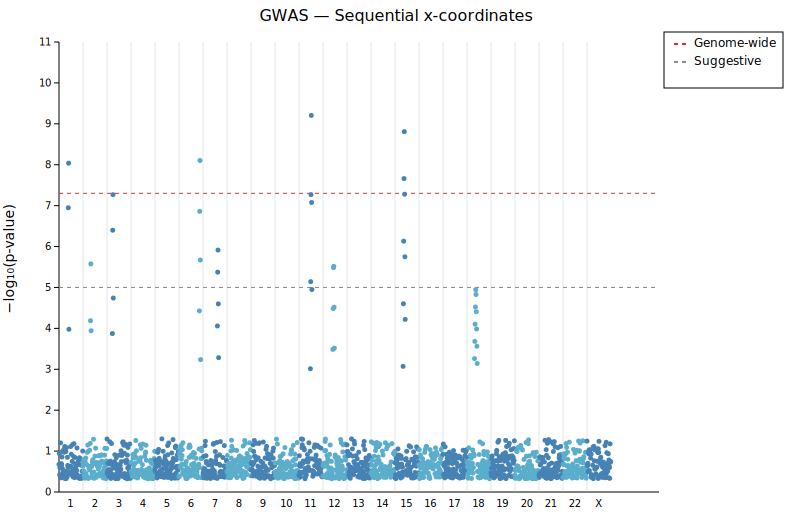
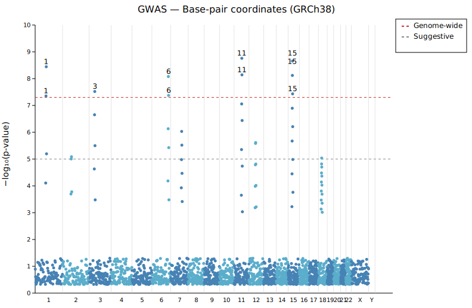
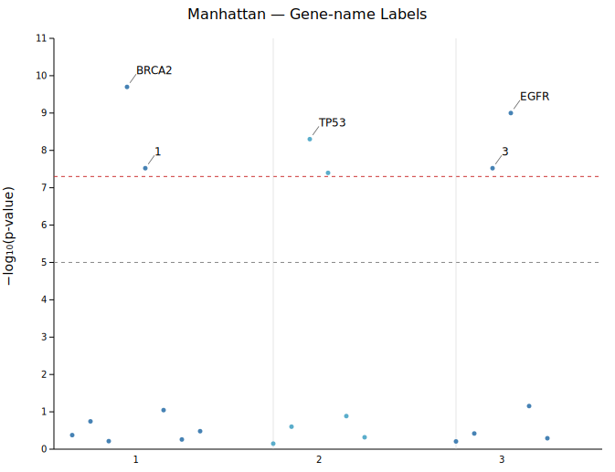

# Manhattan Plot

A Manhattan plot displays **GWAS p-values** across the genome. Each point represents a SNP; the x-axis spans chromosomes and the y-axis shows **−log₁₀(p-value)**. Chromosomes are colored with an alternating scheme. Dashed threshold lines are drawn automatically at the genome-wide (p = 5×10⁻⁸) and suggestive (p = 1×10⁻⁵) significance levels.

**Import path:** `visus::plot::ManhattanPlot`

---

## Basic usage — sequential mode

When base-pair positions are unavailable, pass `(chrom, pvalue)` pairs to `.with_data()`. Chromosomes are sorted in standard genomic order (1–22, X, Y, MT); points within each chromosome receive consecutive integer x positions.

```rust,no_run
use visus::plot::ManhattanPlot;
use visus::backend::svg::SvgBackend;
use visus::render::render::render_multiple;
use visus::render::layout::Layout;
use visus::render::plots::Plot;

let data: Vec<(String, f64)> = vec![
    ("1".into(), 0.42), ("1".into(), 3e-8),
    ("3".into(), 2e-9), ("6".into(), 5e-6),
    // ...
];

let mp = ManhattanPlot::new()
    .with_data(data)
    .with_legend("GWAS thresholds");

let plots = vec![Plot::Manhattan(mp)];
let layout = Layout::auto_from_plots(&plots)
    .with_title("GWAS — Sequential x-coordinates")
    .with_y_label("−log₁₀(p-value)");

let svg = SvgBackend.render_scene(&render_multiple(plots, layout));
std::fs::write("manhattan.svg", svg).unwrap();
```



All 23 chromosomes appear. Points in the significant and suggestive regions are visible above the dashed threshold lines. The legend shows both threshold entries.

---

## Base-pair mode — GRCh38

`.with_data_bp(data, GenomeBuild::Hg38)` maps each `(chrom, bp, pvalue)` triplet onto a true genomic x-axis. All chromosomes in the build appear as labeled bands even if they contain no data points.

```rust,no_run
use visus::plot::{ManhattanPlot, GenomeBuild};
# use visus::render::plots::Plot;

// (chrom, base-pair position, pvalue) from PLINK/GCTA output
let data: Vec<(String, f64, f64)> = vec![];  // ...

let mp = ManhattanPlot::new()
    .with_data_bp(data, GenomeBuild::Hg38)
    .with_label_top(10)
    .with_legend("GWAS thresholds");
```



The x-axis now reflects true chromosomal proportions. The 10 most significant hits above the genome-wide threshold are labeled. Chromosome names are accepted with or without the `"chr"` prefix.

Available builds:

| Variant | Assembly | Chromosomes |
|---------|----------|-------------|
| `GenomeBuild::Hg19` | GRCh37 / hg19 | 1–22, X, Y, MT |
| `GenomeBuild::Hg38` | GRCh38 / hg38 | 1–22, X, Y, MT |
| `GenomeBuild::T2T` | T2T-CHM13 v2.0 | 1–22, X, Y, MT |
| `GenomeBuild::Custom(…)` | User-defined | Any |

---

## Gene-name labels with `with_point_labels`

`.with_point_labels(iter)` attaches specific gene or SNP names to individual points by `(chrom, x, label)` triplets. Combine this with `.with_data_x()` (pre-computed x positions) for exact matching.

```rust,no_run
use visus::plot::{ManhattanPlot, LabelStyle};
# use visus::render::plots::Plot;

let data: Vec<(&str, f64, f64)> = vec![
    // chr1 — BRCA2 locus
    ("1",  10.0, 0.42), ("1",  40.0, 2e-10), ("1",  60.0, 0.09),
    // chr2 — TP53 locus
    ("2", 120.0, 0.71), ("2", 140.0, 5e-9),  ("2", 160.0, 0.13),
    // chr3 — EGFR locus
    ("3", 220.0, 0.62), ("3", 250.0, 1e-9),  ("3", 270.0, 0.51),
];

let mp = ManhattanPlot::new()
    .with_data_x(data)
    .with_label_top(5)
    .with_label_style(LabelStyle::Arrow { offset_x: 10.0, offset_y: 14.0 })
    .with_point_labels(vec![
        ("1",  40.0, "BRCA2"),
        ("2", 140.0, "TP53"),
        ("3", 250.0, "EGFR"),
    ]);
```



Each significant peak is labeled with its gene name. The `Arrow` style draws a short leader line from the label to the point, keeping the label legible even when the peak is narrow.

The `x` value passed to `with_point_labels` must match the x coordinate assigned at data-load time. A tolerance of ±0.5 is used, so integer positions are always matched exactly.

---

## Custom genome build

`GenomeBuild::Custom` accepts a `Vec<(chrom_name, size_in_bp)>` list in the order you want chromosomes displayed. Use this for non-human organisms or subsets of the human genome.

```rust,no_run
use visus::plot::{ManhattanPlot, GenomeBuild};
use visus::Palette;
# use visus::render::plots::Plot;

let build = GenomeBuild::Custom(vec![
    ("chr1".to_string(), 120_000_000),
    ("chr2".to_string(),  95_000_000),
    ("chr3".to_string(),  80_000_000),
    ("chrX".to_string(),  55_000_000),
]);

let mp = ManhattanPlot::new()
    .with_data_bp(data, build)
    .with_palette(Palette::tol_bright())
    .with_label_top(6)
    .with_legend("GWAS thresholds");
```


`Palette::tol_bright()` cycles six colorblind-safe colors across the four chromosomes. Chromosome names are accepted with or without the `"chr"` prefix in both the build definition and the data.

---

## Thresholds

| Method | Default | Description |
|--------|---------|-------------|
| `.with_genome_wide(f)` | `7.301` | −log₁₀ threshold for the red dashed line (p = 5×10⁻⁸) |
| `.with_suggestive(f)` | `5.0` | −log₁₀ threshold for the gray dashed line (p = 1×10⁻⁵) |

Pass −log₁₀(p) directly: for p = 1×10⁻⁶, use `6.0`.

---

## Colors

By default chromosomes alternate between two shades of blue:

| Method | Default | Description |
|--------|---------|-------------|
| `.with_color_a(s)` | `"steelblue"` | Even-indexed chromosomes (0, 2, 4, …) |
| `.with_color_b(s)` | `"#5aadcb"` | Odd-indexed chromosomes (1, 3, 5, …) |
| `.with_palette(p)` | — | Full palette; overrides the two-color scheme |

All color methods accept any CSS color string. `.with_palette()` assigns colors in chromosome order, cycling with modulo wrapping.

---

## API reference

| Method | Description |
|--------|-------------|
| `ManhattanPlot::new()` | Create a plot with defaults |
| `.with_data(iter)` | Load `(chrom, pvalue)` pairs; sequential integer x |
| `.with_data_bp(iter, build)` | Load `(chrom, bp, pvalue)` triplets; true genomic x |
| `.with_data_x(iter)` | Load `(chrom, x, pvalue)` triplets; pre-computed x |
| `.with_genome_wide(f)` | Genome-wide threshold in −log₁₀ (default `7.301`) |
| `.with_suggestive(f)` | Suggestive threshold in −log₁₀ (default `5.0`) |
| `.with_color_a(s)` | Even-chromosome color (default `"steelblue"`) |
| `.with_color_b(s)` | Odd-chromosome color (default `"#5aadcb"`) |
| `.with_palette(p)` | Full palette, overrides alternating colors |
| `.with_point_size(f)` | Circle radius in pixels (default `2.5`) |
| `.with_label_top(n)` | Label the `n` top hits above genome-wide threshold |
| `.with_label_style(s)` | `Nudge` (default), `Exact`, or `Arrow { offset_x, offset_y }` |
| `.with_point_labels(iter)` | Attach gene/SNP names to specific `(chrom, x)` positions |
| `.with_pvalue_floor(f)` | Explicit p-value floor for −log₁₀ transform |
| `.with_legend(s)` | Show genome-wide and suggestive legend entries |
