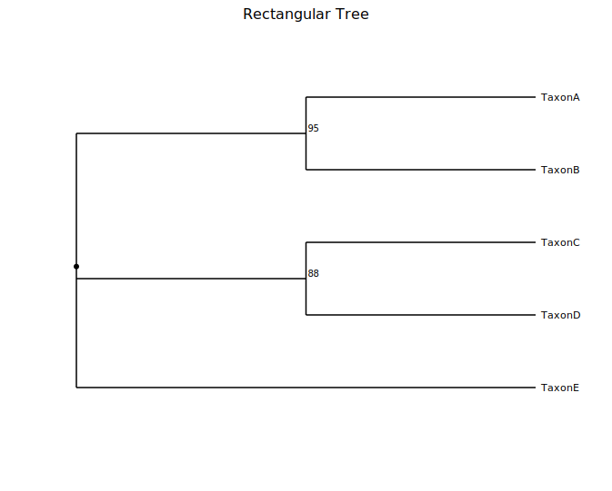
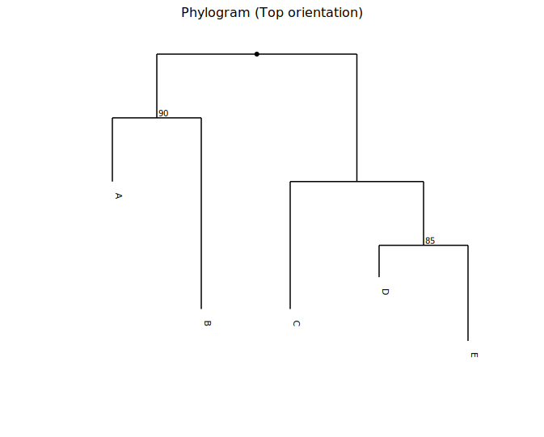
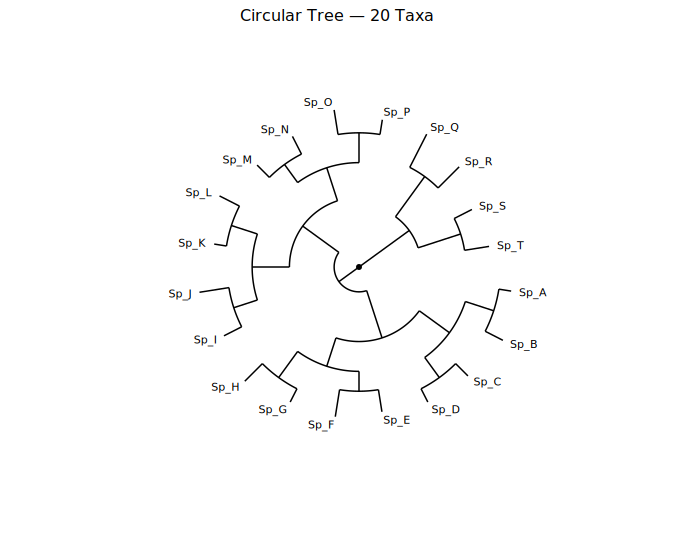
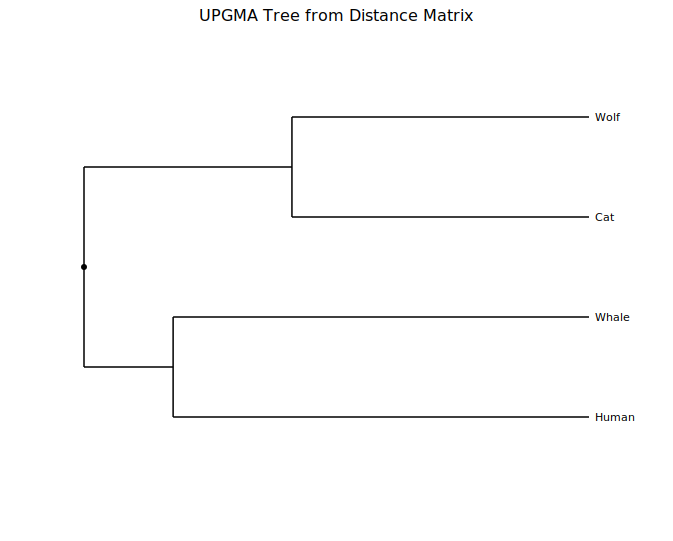

# Phylogenetic Tree

A phylogenetic tree (dendrogram) visualises evolutionary or hierarchical relationships between taxa. kuva supports three branch styles (rectangular, slanted, circular), four orientations, phylogram mode for branch-length-accurate layouts, clade coloring, and support value display. Trees can be constructed from Newick strings, edge lists, pairwise distance matrices, or scipy/R linkage output.

**Import path:** `kuva::plot::PhyloTree`

---

## Basic usage

Parse a [Newick](https://en.wikipedia.org/wiki/Newick_format) string with `PhyloTree::from_newick()`. Branch lengths are optional; support values on internal nodes are read automatically. Call `.with_support_threshold(t)` to display any support value ≥ `t` on the plot.

```rust,no_run
use kuva::plot::PhyloTree;
use kuva::backend::svg::SvgBackend;
use kuva::render::render::render_multiple;
use kuva::render::layout::Layout;
use kuva::render::plots::Plot;

let tree = PhyloTree::from_newick(
    "((TaxonA:1.0,TaxonB:2.0)95:1.0,(TaxonC:0.5,TaxonD:0.5)88:1.5,TaxonE:3.0);"
)
.with_support_threshold(80.0);   // show internal node values ≥ 80

let plots = vec![Plot::PhyloTree(tree)];
let layout = Layout::auto_from_plots(&plots)
    .with_title("Rectangular Tree");

let svg = SvgBackend.render_scene(&render_multiple(plots, layout));
std::fs::write("phylo.svg", svg).unwrap();
```



The default layout is rectangular branches, root on the left, leaves on the right (cladogram mode — all leaves aligned). Support values are drawn beside their internal node.

---

## Phylogram mode

In cladogram mode (the default) all leaves are aligned regardless of branch length. Enable **phylogram mode** with `.with_phylogram()` to position each node according to the accumulated branch lengths from the root, so edge lengths directly represent evolutionary distance.

```rust,no_run
use kuva::plot::{PhyloTree, TreeOrientation};
use kuva::backend::svg::SvgBackend;
use kuva::render::render::render_multiple;
use kuva::render::layout::Layout;
use kuva::render::plots::Plot;

let tree = PhyloTree::from_newick(
    "((A:1.0,B:3.0)90:1.0,(C:2.0,(D:0.5,E:1.5)85:1.0):2.0);"
)
.with_orientation(TreeOrientation::Top)
.with_phylogram()
.with_support_threshold(80.0);

let plots = vec![Plot::PhyloTree(tree)];
let layout = Layout::auto_from_plots(&plots)
    .with_title("Phylogram (Top orientation)");

let svg = SvgBackend.render_scene(&render_multiple(plots, layout));
```



---

## Circular layout

`.with_branch_style(TreeBranchStyle::Circular)` projects the tree radially — the root is at the centre and leaves fan outward. This style is especially useful for large trees where a linear layout becomes tall.

```rust,no_run
use kuva::plot::{PhyloTree, TreeBranchStyle};
use kuva::backend::svg::SvgBackend;
use kuva::render::render::render_multiple;
use kuva::render::layout::Layout;
use kuva::render::plots::Plot;

let newick = concat!(
    "(((((Sp_A:0.05,Sp_B:0.08):0.12,(Sp_C:0.07,Sp_D:0.06):0.10):0.15,",
    "((Sp_E:0.09,Sp_F:0.11):0.08,(Sp_G:0.06,Sp_H:0.10):0.13):0.12):0.20,",
    "(((Sp_I:0.08,Sp_J:0.12):0.10,(Sp_K:0.05,Sp_L:0.09):0.11):0.15,",
    "((Sp_M:0.07,Sp_N:0.08):0.09,(Sp_O:0.10,Sp_P:0.06):0.12):0.14):0.18):0.10,",
    "((Sp_Q:0.15,Sp_R:0.12):0.20,(Sp_S:0.08,Sp_T:0.10):0.18):0.25);"
);

let tree = PhyloTree::from_newick(newick)
    .with_branch_style(TreeBranchStyle::Circular)
    .with_phylogram();

let plots = vec![Plot::PhyloTree(tree)];
let layout = Layout::auto_from_plots(&plots)
    .with_title("Circular Tree — 20 Taxa");

let svg = SvgBackend.render_scene(&render_multiple(plots, layout));
```



---

## Clade coloring

`.with_clade_color(node_id, color)` colors the entire subtree rooted at `node_id`. Call `.with_legend("")` to enable the legend; each colored clade gets an entry labeled with its node's name (or `"Node N"` for unnamed internal nodes).

When building a tree with `from_edges()`, node IDs are assigned in order of first appearance across all `(parent, child, length)` tuples — the first unique label encountered becomes node 0, the second node 1, and so on.

```rust,no_run
use kuva::plot::PhyloTree;
use kuva::backend::svg::SvgBackend;
use kuva::render::render::render_multiple;
use kuva::render::layout::Layout;
use kuva::render::plots::Plot;

let edges: Vec<(&str, &str, f64)> = vec![
    ("root",     "Bacteria",    1.5),  // root=0, Bacteria=1
    ("root",     "Eukarya",     2.0),  //         Eukarya=2
    ("Bacteria", "E. coli",     0.5),
    ("Bacteria", "B. subtilis", 0.7),
    ("Eukarya",  "Yeast",       1.0),
    ("Eukarya",  "Human",       0.8),
];

let tree = PhyloTree::from_edges(&edges)
    .with_clade_color(1, "#e41a1c")   // Bacteria subtree
    .with_clade_color(2, "#377eb8")   // Eukarya subtree
    .with_legend("Domains");

let plots = vec![Plot::PhyloTree(tree)];
let layout = Layout::auto_from_plots(&plots)
    .with_title("Clade Coloring by Domain");

let svg = SvgBackend.render_scene(&render_multiple(plots, layout));
```


---

## UPGMA from a distance matrix

`PhyloTree::from_distance_matrix(labels, dist)` clusters taxa by [UPGMA](https://en.wikipedia.org/wiki/UPGMA) and returns a rooted ultrametric tree. The distance matrix must be square and symmetric; diagonal values are ignored.

```rust,no_run
use kuva::plot::PhyloTree;
use kuva::backend::svg::SvgBackend;
use kuva::render::render::render_multiple;
use kuva::render::layout::Layout;
use kuva::render::plots::Plot;

let labels = ["Wolf", "Cat", "Whale", "Human"];
let dist = vec![
    //         Wolf  Cat   Whale Human
    vec![0.0,  0.5,  0.9,  0.8],  // Wolf
    vec![0.5,  0.0,  0.9,  0.8],  // Cat
    vec![0.9,  0.9,  0.0,  0.7],  // Whale
    vec![0.8,  0.8,  0.7,  0.0],  // Human
];

let tree = PhyloTree::from_distance_matrix(&labels, &dist)
    .with_phylogram();

let plots = vec![Plot::PhyloTree(tree)];
let layout = Layout::auto_from_plots(&plots)
    .with_title("UPGMA Tree from Distance Matrix");

let svg = SvgBackend.render_scene(&render_multiple(plots, layout));
```



Wolf and Cat cluster first (distance 0.5), reflecting their close relationship; Whale and Human share the next merge (0.7) before joining the carnivore clade.

---

## Scipy / R linkage input

`PhyloTree::from_linkage(labels, linkage)` accepts the output format of `scipy.cluster.hierarchy.linkage` or R's `hclust`. Each row is `[left_idx, right_idx, distance, n_leaves]`. Leaf indices `0..n-1` correspond to `labels`; merge nodes use indices `n..`.

```rust,no_run
# use kuva::plot::PhyloTree;
let labels = ["A", "B", "C", "D"];
// linkage matrix produced by scipy or R
let linkage: &[[f64; 4]] = &[
    [0.0, 1.0, 0.5, 2.0],   // merge leaf 0 (A) + leaf 1 (B) at d=0.5
    [2.0, 3.0, 0.7, 2.0],   // merge leaf 2 (C) + leaf 3 (D) at d=0.7
    [4.0, 5.0, 1.2, 4.0],   // merge node 4 + node 5 at d=1.2
];

let tree = PhyloTree::from_linkage(labels, linkage).with_phylogram();
```

---

## Orientations

Four root positions are available via `TreeOrientation`:

| Variant | Root position |
|---------|--------------|
| `Left` | Left edge — leaves fan rightward **(default)** |
| `Right` | Right edge — leaves fan leftward |
| `Top` | Top edge — leaves hang downward |
| `Bottom` | Bottom edge — leaves grow upward |

```rust,no_run
# use kuva::plot::{PhyloTree, TreeOrientation};
let tree = PhyloTree::from_newick("((A:1,B:2):1,C:3);")
    .with_orientation(TreeOrientation::Top);
```

---

## Branch styles

| Variant | Shape |
|---------|-------|
| `Rectangular` | Right-angle elbow at the parent depth **(default)** |
| `Slanted` | Single diagonal segment from parent to child |
| `Circular` | Polar / radial projection |

```rust,no_run
# use kuva::plot::{PhyloTree, TreeBranchStyle};
let slanted = PhyloTree::from_newick("((A:1,B:2):1,C:3);")
    .with_branch_style(TreeBranchStyle::Slanted);
```

---

## Heatmap alignment

`leaf_labels_top_to_bottom()` returns leaf labels in the exact top-to-bottom render order. Pass the result to `Heatmap::with_y_categories()` to align heatmap rows with tree leaves when composing both plots side by side.

```rust,no_run
use kuva::plot::{PhyloTree, Heatmap};

let tree = PhyloTree::from_newick("((A:1,B:2):1,C:3);");
let leaf_order = tree.leaf_labels_top_to_bottom();  // ["A", "B", "C"]

// Use leaf_order as the y-axis category order for a paired heatmap
let heatmap = Heatmap::new()
    .with_y_categories(leaf_order);
```

---

## API reference

### Constructors

| Method | Description |
|--------|-------------|
| `PhyloTree::from_newick(s)` | Parse a Newick-format string |
| `PhyloTree::from_edges(edges)` | Build from `(parent, child, branch_length)` triples |
| `PhyloTree::from_distance_matrix(labels, dist)` | UPGMA clustering of a pairwise distance matrix |
| `PhyloTree::from_linkage(labels, linkage)` | Import scipy / R `hclust` linkage output |

### Builder methods

| Method | Description |
|--------|-------------|
| `.with_orientation(TreeOrientation)` | Root position (default `Left`) |
| `.with_branch_style(TreeBranchStyle)` | Branch drawing style (default `Rectangular`) |
| `.with_phylogram()` | Use branch lengths for the depth axis |
| `.with_branch_color(s)` | Line color for branches (default `"black"`) |
| `.with_leaf_color(s)` | Text color for leaf labels (default `"black"`) |
| `.with_support_threshold(t)` | Show support values ≥ `t` at internal nodes |
| `.with_clade_color(node_id, color)` | Color the entire subtree rooted at `node_id` |
| `.with_legend("")` | Enable the clade legend; one entry per colored clade, labeled with the node name |

### Helper

| Method | Description |
|--------|-------------|
| `.leaf_labels_top_to_bottom()` | Leaf labels in render order — use to align a `Heatmap` |

### `TreeOrientation` variants

`Left` (default) · `Right` · `Top` · `Bottom`

### `TreeBranchStyle` variants

`Rectangular` (default) · `Slanted` · `Circular`
