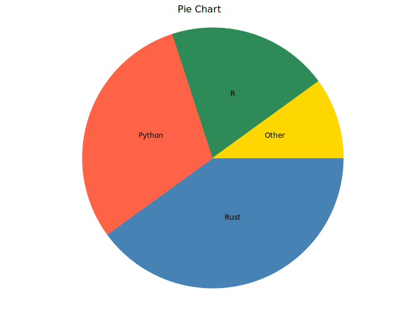
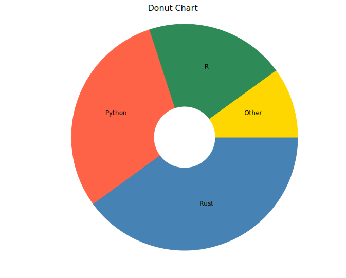
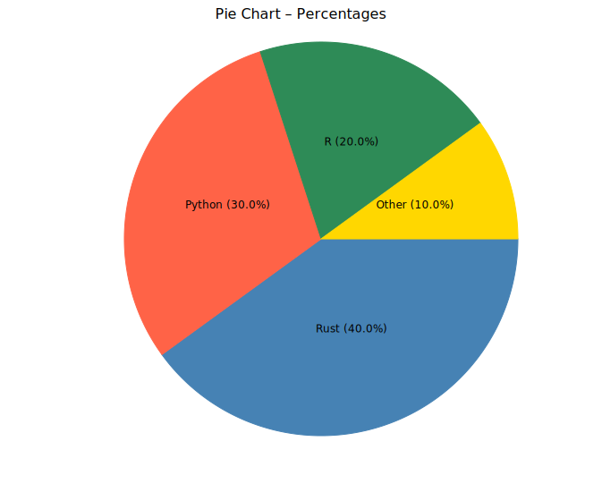
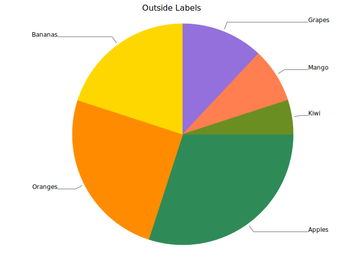
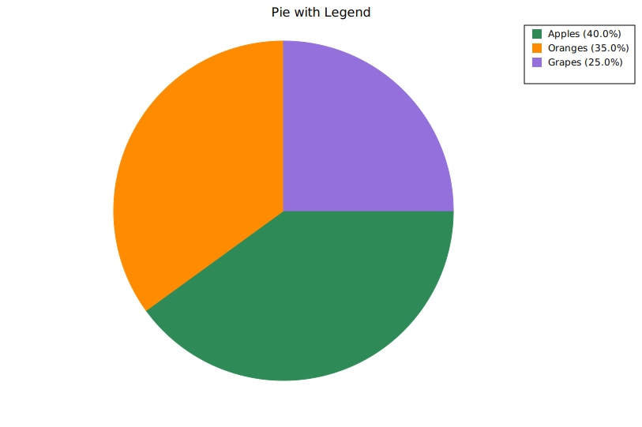

# Pie Chart

A pie chart divides a circle into slices proportional to each category's value. Each slice has its own explicit color. Slice labels can be placed automatically (inside large slices, outside small ones), forced to one side, or replaced with a legend.

**Import path:** `kuva::plot::PiePlot`

---

## Basic usage

Add slices with `.with_slice(label, value, color)`. Slices are drawn clockwise from 12 o'clock in the order they are added.

```rust,no_run
use kuva::plot::PiePlot;
use kuva::backend::svg::SvgBackend;
use kuva::render::render::render_pie;
use kuva::render::layout::Layout;
use kuva::render::plots::Plot;

let pie = PiePlot::new()
    .with_slice("Rust",   40.0, "steelblue")
    .with_slice("Python", 30.0, "tomato")
    .with_slice("R",      20.0, "seagreen")
    .with_slice("Other",  10.0, "gold");

let plots = vec![Plot::Pie(pie.clone())];
let layout = Layout::auto_from_plots(&plots).with_title("Pie Chart");

let scene = render_pie(&pie, &layout);
let svg = SvgBackend.render_scene(&scene);
std::fs::write("pie.svg", svg).unwrap();
```



> Only the *ratio* between slice values matters — absolute magnitudes are irrelevant. `.with_slice("A", 1.0, ...)` and `.with_slice("A", 100.0, ...)` produce the same slice if all others scale identically.

---

## Donut chart

`.with_inner_radius(r)` cuts a hollow centre, converting the pie into a donut. `r` is the inner radius in pixels; the outer radius is computed from the canvas size. Values in the range `40.0`–`80.0` work well at the default canvas size.

```rust,no_run
# use kuva::plot::PiePlot;
let pie = PiePlot::new()
    .with_slice("Rust",   40.0, "steelblue")
    .with_slice("Python", 30.0, "tomato")
    .with_slice("R",      20.0, "seagreen")
    .with_slice("Other",  10.0, "gold")
    .with_inner_radius(60.0);   // donut hole radius in pixels
```



---

## Percentage labels

`.with_percent()` appends each slice's percentage of the total to its label, formatted to one decimal place (e.g. `"Rust 40.0%"`).

```rust,no_run
# use kuva::plot::PiePlot;
let pie = PiePlot::new()
    .with_slice("Rust",   40.0, "steelblue")
    .with_slice("Python", 30.0, "tomato")
    .with_slice("R",      20.0, "seagreen")
    .with_slice("Other",  10.0, "gold")
    .with_percent();
```



---

## Label positioning

`.with_label_position(PieLabelPosition)` controls where labels appear.

| Variant | Behaviour |
|---------|-----------|
| `Auto` | Inside large slices; outside (with leader line) for small ones. **Default.** |
| `Inside` | All labels placed at mid-radius, regardless of slice size. |
| `Outside` | All labels outside with leader lines. Labels are spaced to avoid overlap. |
| `None` | No slice labels. Combine with a legend (see below). |

### Outside labels

`Outside` is recommended when slices vary widely in size or when many slices are present, since leader lines prevent labels from overlapping.

```rust,no_run
use kuva::plot::{PiePlot, PieLabelPosition};
# use kuva::render::plots::Plot;

let pie = PiePlot::new()
    .with_slice("Apples",  30.0, "seagreen")
    .with_slice("Oranges", 25.0, "darkorange")
    .with_slice("Bananas", 20.0, "gold")
    .with_slice("Grapes",  12.0, "mediumpurple")
    .with_slice("Mango",    8.0, "coral")
    .with_slice("Kiwi",     5.0, "olivedrab")
    .with_label_position(PieLabelPosition::Outside);
```



### Minimum label fraction

By default, slices smaller than 5 % of the total are not labelled (to avoid cramped text). Adjust this with `.with_min_label_fraction(f)`.

```rust,no_run
# use kuva::plot::PiePlot;
// Label every slice, even slices below 5 %
let pie = PiePlot::new()
    .with_slice("Big",  90.0, "steelblue")
    .with_slice("Tiny",  1.0, "tomato")
    .with_min_label_fraction(0.0);   // default is 0.05
```

---

## Legend

`.with_legend("")` enables a per-slice legend in the right margin. Each slice gets an entry (colored square + slice label); the slice labels come from `.with_slice()`, not from the string passed to `.with_legend()`. Use `render_multiple` instead of `render_pie` so the legend is rendered.

Combine with `PieLabelPosition::None` to use the legend as the sole means of identification.

```rust,no_run
use kuva::plot::{PiePlot, PieLabelPosition};
use kuva::backend::svg::SvgBackend;
use kuva::render::render::render_multiple;
use kuva::render::layout::Layout;
use kuva::render::plots::Plot;

let pie = PiePlot::new()
    .with_slice("Apples",  40.0, "seagreen")
    .with_slice("Oranges", 35.0, "darkorange")
    .with_slice("Grapes",  25.0, "mediumpurple")
    .with_legend("Fruit")
    .with_percent()
    .with_label_position(PieLabelPosition::None);  // legend replaces labels

let plots = vec![Plot::Pie(pie)];
let layout = Layout::auto_from_plots(&plots).with_title("Pie with Legend");

// render_multiple (not render_pie) so the legend is drawn
let svg = SvgBackend.render_scene(&render_multiple(plots, layout));
std::fs::write("pie_legend.svg", svg).unwrap();
```



---

## API reference

| Method | Description |
|--------|-------------|
| `PiePlot::new()` | Create a pie chart with defaults |
| `.with_slice(label, value, color)` | Add a slice; value is proportional |
| `.with_inner_radius(r)` | Inner radius in pixels; `> 0` makes a donut (default `0.0`) |
| `.with_percent()` | Append percentage to each slice label |
| `.with_label_position(pos)` | Label placement: `Auto`, `Inside`, `Outside`, `None` (default `Auto`) |
| `.with_min_label_fraction(f)` | Minimum slice fraction to receive a label (default `0.05`) |
| `.with_legend("")` | Enable the per-slice legend; entry labels are the slice names from `.with_slice()`. Use `render_multiple` to render it |
