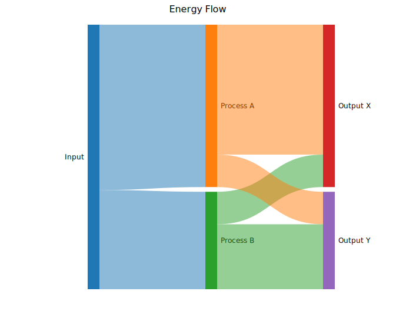
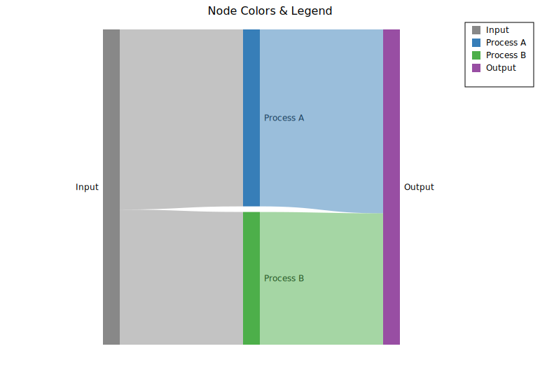
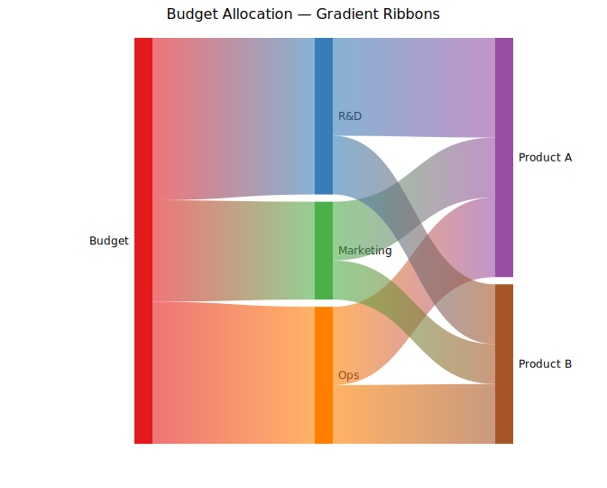
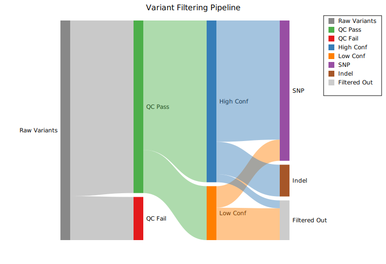

# Sankey Diagram

A Sankey diagram arranges nodes in columns and connects them with tapered ribbons whose widths are proportional to flow magnitude. It is well suited for showing multi-stage flows — energy transfer, budget allocation, data processing pipelines, or any directed network where quantities must be conserved through each stage.

**Import path:** `visus::plot::SankeyPlot`

---

## Basic usage

Add directed links with `.with_link(source, target, value)`. Nodes are created automatically from the label strings; column positions are inferred by tracing the flow graph from left to right.

```rust,no_run
use visus::plot::SankeyPlot;
use visus::backend::svg::SvgBackend;
use visus::render::render::render_multiple;
use visus::render::layout::Layout;
use visus::render::plots::Plot;

let sankey = SankeyPlot::new()
    .with_link("Input", "Process A", 50.0)
    .with_link("Input", "Process B", 30.0)
    .with_link("Process A", "Output X", 40.0)
    .with_link("Process A", "Output Y", 10.0)
    .with_link("Process B", "Output X", 10.0)
    .with_link("Process B", "Output Y", 20.0);

let plots = vec![Plot::Sankey(sankey)];
let layout = Layout::auto_from_plots(&plots)
    .with_title("Energy Flow");

let svg = SvgBackend.render_scene(&render_multiple(plots, layout));
std::fs::write("sankey.svg", svg).unwrap();
```



Node heights are proportional to the larger of incoming and outgoing flow at each node. Colors come from the default `category10` palette. Each label is printed to the left or right of its column.

---

## Node colors & legend

Set per-node fill colors with `.with_node_color(label, color)`. Call `.with_legend(title)` to add a color-coded legend entry for every node.

```rust,no_run
use visus::plot::SankeyPlot;
use visus::backend::svg::SvgBackend;
use visus::render::render::render_multiple;
use visus::render::layout::Layout;
use visus::render::plots::Plot;

let sankey = SankeyPlot::new()
    .with_node_color("Input",     "#888888")
    .with_node_color("Process A", "#377eb8")
    .with_node_color("Process B", "#4daf4a")
    .with_node_color("Output",    "#984ea3")
    .with_link("Input",     "Process A", 40.0)
    .with_link("Input",     "Process B", 30.0)
    .with_link("Process A", "Output",    35.0)
    .with_link("Process B", "Output",    25.0)
    .with_node_width(24.0)
    .with_legend("Stage");

let plots = vec![Plot::Sankey(sankey)];
let layout = Layout::auto_from_plots(&plots)
    .with_title("Node Colors & Legend");

let svg = SvgBackend.render_scene(&render_multiple(plots, layout));
```



Ribbons inherit the source node color by default. To color nodes without linking them first (e.g. to control palette order), use `.with_node(label)` to declare a node explicitly before adding links.

---

## Link coloring

### Gradient ribbons

`.with_gradient_links()` renders each ribbon as a linear gradient from the source node color to the target node color.

```rust,no_run
use visus::plot::SankeyPlot;
use visus::backend::svg::SvgBackend;
use visus::render::render::render_multiple;
use visus::render::layout::Layout;
use visus::render::plots::Plot;

let sankey = SankeyPlot::new()
    .with_node_color("Budget",    "#e41a1c")
    .with_node_color("R&D",       "#377eb8")
    .with_node_color("Marketing", "#4daf4a")
    .with_node_color("Ops",       "#ff7f00")
    .with_node_color("Product A", "#984ea3")
    .with_node_color("Product B", "#a65628")
    .with_link("Budget",    "R&D",       40.0)
    .with_link("Budget",    "Marketing", 25.0)
    .with_link("Budget",    "Ops",       35.0)
    .with_link("R&D",       "Product A", 25.0)
    .with_link("R&D",       "Product B", 15.0)
    .with_link("Marketing", "Product A", 15.0)
    .with_link("Marketing", "Product B", 10.0)
    .with_link("Ops",       "Product A", 20.0)
    .with_link("Ops",       "Product B", 15.0)
    .with_gradient_links()
    .with_link_opacity(0.6);

let plots = vec![Plot::Sankey(sankey)];
let layout = Layout::auto_from_plots(&plots)
    .with_title("Budget Allocation — Gradient Ribbons");

let svg = SvgBackend.render_scene(&render_multiple(plots, layout));
```



### Per-link colors

For full control, supply a color on each link individually with `.with_link_colored()`, then call `.with_per_link_colors()` to activate that mode:

```rust,no_run
# use visus::plot::SankeyPlot;
let sankey = SankeyPlot::new()
    .with_link_colored("Budget", "R&D",       40.0, "#377eb8")
    .with_link_colored("Budget", "Marketing", 25.0, "#e41a1c")
    .with_link_colored("Budget", "Ops",       35.0, "#4daf4a")
    // …remaining links…
    .with_per_link_colors()
    .with_link_opacity(0.55);
```

---

## Bulk link loading

`.with_links()` accepts any iterator of `(source, target, value)` triples, which is convenient when links come from a data file or computed table:

```rust,no_run
# use visus::plot::SankeyPlot;
let edges: Vec<(&str, &str, f64)> = vec![
    ("A", "B", 10.0),
    ("A", "C", 20.0),
    ("B", "D", 10.0),
    ("C", "D", 20.0),
];

let sankey = SankeyPlot::new().with_links(edges);
```

---

## Column layout

By default, columns are assigned by propagating each node one step further right than its leftmost source (BFS order). Use `.with_node_column(label, col)` to pin specific nodes to explicit columns when the automatic layout is incorrect — for example, when a node should appear in a later column despite having an early source:

```rust,no_run
# use visus::plot::SankeyPlot;
let sankey = SankeyPlot::new()
    .with_node_column("Input",  0)
    .with_node_column("Middle", 1)
    .with_node_column("Output", 2)
    .with_link("Input",  "Middle", 80.0)
    .with_link("Input",  "Output", 20.0)   // skip link — goes directly to col 2
    .with_link("Middle", "Output", 80.0);
```

---

## Bioinformatics example

A 4-stage variant filtering pipeline: raw variants pass QC, get classified by confidence level, and are split into variant types or discarded.

```rust,no_run
use visus::plot::SankeyPlot;
use visus::backend::svg::SvgBackend;
use visus::render::render::render_multiple;
use visus::render::layout::Layout;
use visus::render::plots::Plot;

let sankey = SankeyPlot::new()
    .with_node_color("Raw Variants", "#888888")
    .with_node_color("QC Pass",      "#4daf4a")
    .with_node_color("QC Fail",      "#e41a1c")
    .with_node_color("High Conf",    "#377eb8")
    .with_node_color("Low Conf",     "#ff7f00")
    .with_node_color("SNP",          "#984ea3")
    .with_node_color("Indel",        "#a65628")
    .with_node_color("Filtered Out", "#cccccc")
    .with_link("Raw Variants", "QC Pass",       8000.0)
    .with_link("Raw Variants", "QC Fail",       2000.0)
    .with_link("QC Pass",      "High Conf",     6000.0)
    .with_link("QC Pass",      "Low Conf",      2000.0)
    .with_link("High Conf",    "SNP",           4500.0)
    .with_link("High Conf",    "Indel",         1200.0)
    .with_link("High Conf",    "Filtered Out",   300.0)
    .with_link("Low Conf",     "SNP",            800.0)
    .with_link("Low Conf",     "Filtered Out",  1200.0)
    .with_link_opacity(0.45)
    .with_legend("Stage");

let plots = vec![Plot::Sankey(sankey)];
let layout = Layout::auto_from_plots(&plots)
    .with_title("Variant Filtering Pipeline");

let svg = SvgBackend.render_scene(&render_multiple(plots, layout));
```



---

## API reference

| Method | Description |
|--------|-------------|
| `SankeyPlot::new()` | Create a Sankey plot with defaults |
| `.with_link(src, tgt, val)` | Add a directed link; auto-creates nodes from labels |
| `.with_link_colored(src, tgt, val, color)` | Add a link with an explicit ribbon color |
| `.with_links(iter)` | Bulk-add links from `(source, target, value)` triples |
| `.with_node(label)` | Declare a node without adding a link |
| `.with_node_color(label, color)` | Set a node's fill color (CSS color string) |
| `.with_node_column(label, col)` | Pin a node to a specific column (0-indexed) |
| `.with_node_width(px)` | Node rectangle width in pixels (default `20.0`) |
| `.with_node_gap(px)` | Minimum vertical gap between nodes in a column (default `8.0`) |
| `.with_gradient_links()` | Ribbons fade from source to target color |
| `.with_per_link_colors()` | Use per-link color set by `.with_link_colored()` |
| `.with_link_opacity(f)` | Ribbon fill opacity `0.0`–`1.0` (default `0.5`) |
| `.with_legend(title)` | Add one legend entry per node |

### `SankeyLinkColor` variants

| Variant | Behavior |
|---------|----------|
| `Source` | Ribbon inherits the source node color **(default)** |
| `Gradient` | SVG `linearGradient` from source to target color |
| `PerLink` | Color from `.with_link_colored()` per ribbon |
