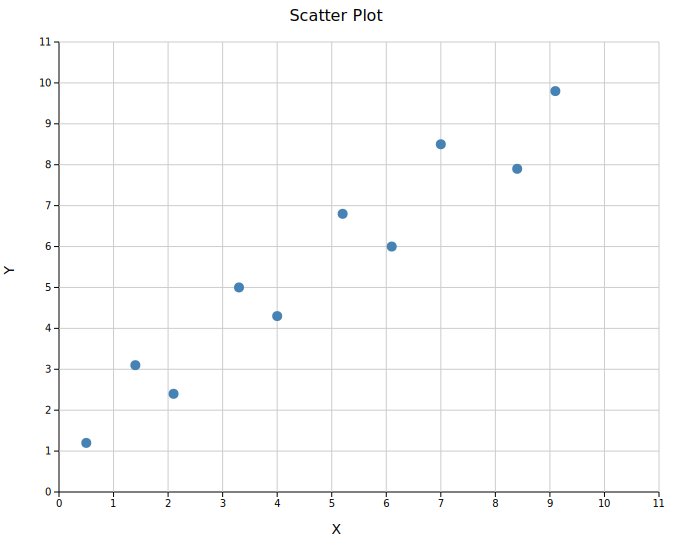
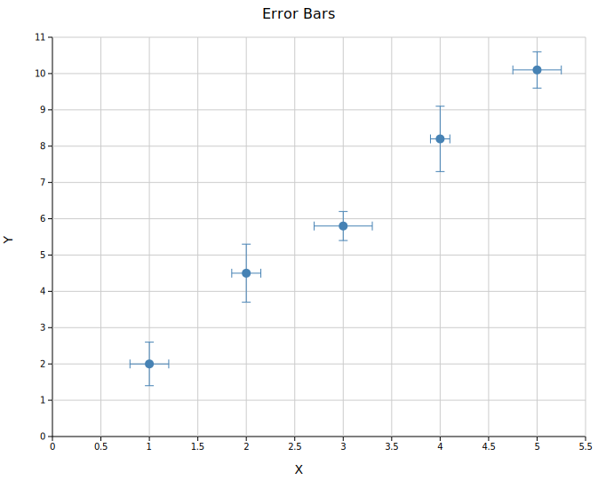
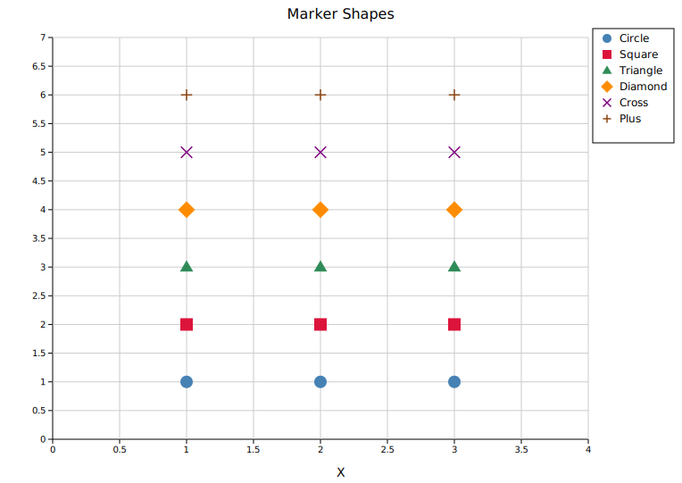
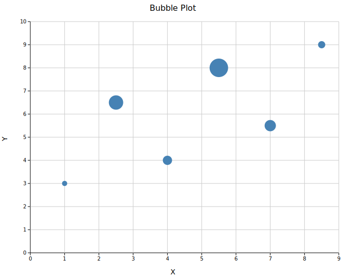

# Scatter Plot

A scatter plot renders individual (x, y) data points as markers. It supports trend lines, error bars, variable point sizes, and six marker shapes.

**Import path:** `visus::plot::scatter::ScatterPlot`

---

## Basic usage

```rust,no_run
use visus::plot::scatter::ScatterPlot;
use visus::backend::svg::SvgBackend;
use visus::render::render::render_multiple;
use visus::render::layout::Layout;
use visus::render::plots::Plot;

let data = vec![
    (0.5_f64, 1.2_f64),
    (2.1, 2.4),
    (4.0, 4.3),
    (6.1, 6.0),
    (8.4, 7.9),
];

let plot = ScatterPlot::new()
    .with_data(data)
    .with_color("steelblue")
    .with_size(5.0);

let plots = vec![Plot::Scatter(plot)];
let layout = Layout::auto_from_plots(&plots)
    .with_title("Scatter Plot")
    .with_x_label("X")
    .with_y_label("Y");

let scene = render_multiple(plots, layout);
let svg = SvgBackend.render_scene(&scene);
std::fs::write("scatter.svg", svg).unwrap();
```



### Layout options

`Layout::auto_from_plots()` automatically computes axis ranges from the data. You can also set ranges manually with `Layout::new((x_min, x_max), (y_min, y_max))`.

---

## Trend line

Add a linear trend line with `.with_trend(TrendLine::Linear)`. Optionally overlay the regression equation and the Pearson R² value.

```rust,no_run
use visus::plot::scatter::{ScatterPlot, TrendLine};
use visus::backend::svg::SvgBackend;
use visus::render::render::render_multiple;
use visus::render::layout::Layout;
use visus::render::plots::Plot;

let data = vec![
    (1.0_f64, 2.1_f64), (2.0, 3.9), (3.0, 6.2),
    (4.0, 7.8), (5.0, 10.1), (6.0, 12.3),
    (7.0, 13.9), (8.0, 16.2), (9.0, 17.8), (10.0, 19.7),
];

let plot = ScatterPlot::new()
    .with_data(data)
    .with_color("steelblue")
    .with_size(5.0)
    .with_trend(TrendLine::Linear)
    .with_trend_color("crimson")   // defaults to "black"
    .with_equation()               // show y = mx + b
    .with_correlation();           // show R²

let plots = vec![Plot::Scatter(plot)];
let layout = Layout::auto_from_plots(&plots)
    .with_title("Linear Trend Line")
    .with_x_label("X")
    .with_y_label("Y");

let svg = SvgBackend.render_scene(&render_multiple(plots, layout));
```


### Confidence band

Attach a shaded uncertainty region with `.with_band(y_lower, y_upper)`, where both iterables align with the x positions of the scatter data:

```rust,no_run
# use visus::plot::scatter::ScatterPlot;
let x: Vec<f64> = (1..=5).map(|i| i as f64).collect();
let y: Vec<f64> = x.iter().map(|&xi| xi * 2.0).collect();
let lower: Vec<f64> = y.iter().map(|&yi| yi - 0.5).collect();
let upper: Vec<f64> = y.iter().map(|&yi| yi + 0.5).collect();

let data: Vec<(f64, f64)> = x.into_iter().zip(y).collect();

let plot = ScatterPlot::new()
    .with_data(data)
    .with_color("steelblue")
    .with_band(lower, upper);
```

---

## Error bars

Use `.with_x_err()` and `.with_y_err()` for symmetric error bars. Asymmetric variants accept `(negative, positive)` tuples.

```rust,no_run
use visus::plot::scatter::ScatterPlot;
use visus::backend::svg::SvgBackend;
use visus::render::render::render_multiple;
use visus::render::layout::Layout;
use visus::render::plots::Plot;

let data = vec![
    (1.0_f64, 2.0_f64), (2.0, 4.5), (3.0, 5.8),
    (4.0, 8.2), (5.0, 10.1),
];
let x_err = vec![0.2_f64, 0.15, 0.3, 0.1, 0.25];  // symmetric
let y_err = vec![0.6_f64, 0.8, 0.4, 0.9, 0.5];     // symmetric

let plot = ScatterPlot::new()
    .with_data(data)
    .with_x_err(x_err)
    .with_y_err(y_err)
    .with_color("steelblue")
    .with_size(5.0);

let plots = vec![Plot::Scatter(plot)];
let layout = Layout::auto_from_plots(&plots)
    .with_title("Error Bars")
    .with_x_label("X")
    .with_y_label("Y");

let svg = SvgBackend.render_scene(&render_multiple(plots, layout));
```



### Asymmetric errors

Pass `(neg, pos)` tuples instead of scalar values:

```rust,no_run
# use visus::plot::scatter::ScatterPlot;
let data = vec![(1.0_f64, 5.0_f64), (2.0, 6.0)];
let y_err = vec![(0.3_f64, 0.8_f64), (0.5, 1.2)];  // (neg, pos)

let plot = ScatterPlot::new()
    .with_data(data)
    .with_y_err_asymmetric(y_err);
```

---

## Marker shapes

Six marker shapes are available via `MarkerShape`. They are particularly useful when overlaying multiple series on the same axes.

```rust,no_run
use visus::plot::scatter::{ScatterPlot, MarkerShape};
use visus::backend::svg::SvgBackend;
use visus::render::render::render_multiple;
use visus::render::layout::Layout;
use visus::render::plots::Plot;

let plots = vec![
    Plot::Scatter(ScatterPlot::new()
        .with_data(vec![(1.0_f64, 1.0_f64), (2.0, 1.0), (3.0, 1.0)])
        .with_color("steelblue").with_size(7.0)
        .with_marker(MarkerShape::Circle).with_legend("Circle")),

    Plot::Scatter(ScatterPlot::new()
        .with_data(vec![(1.0_f64, 2.0_f64), (2.0, 2.0), (3.0, 2.0)])
        .with_color("crimson").with_size(7.0)
        .with_marker(MarkerShape::Square).with_legend("Square")),

    Plot::Scatter(ScatterPlot::new()
        .with_data(vec![(1.0_f64, 3.0_f64), (2.0, 3.0), (3.0, 3.0)])
        .with_color("seagreen").with_size(7.0)
        .with_marker(MarkerShape::Triangle).with_legend("Triangle")),
];

let layout = Layout::auto_from_plots(&plots)
    .with_title("Marker Shapes")
    .with_x_label("X")
    .with_y_label("");

let svg = SvgBackend.render_scene(&render_multiple(plots, layout));
```

Available variants: `Circle` (default), `Square`, `Triangle`, `Diamond`, `Cross`, `Plus`.



---

## Bubble plot

Encode a third dimension through point area using `.with_sizes()`. Values are point radii in pixels.

```rust,no_run
use visus::plot::scatter::ScatterPlot;
use visus::backend::svg::SvgBackend;
use visus::render::render::render_multiple;
use visus::render::layout::Layout;
use visus::render::plots::Plot;

let data = vec![
    (1.0_f64, 3.0_f64), (2.5, 6.5), (4.0, 4.0),
    (5.5, 8.0), (7.0, 5.5), (8.5, 9.0),
];
let sizes = vec![5.0_f64, 14.0, 9.0, 18.0, 11.0, 7.0];

let plot = ScatterPlot::new()
    .with_data(data)
    .with_sizes(sizes)
    .with_color("steelblue");

let plots = vec![Plot::Scatter(plot)];
let layout = Layout::auto_from_plots(&plots)
    .with_title("Bubble Plot")
    .with_x_label("X")
    .with_y_label("Y");

let svg = SvgBackend.render_scene(&render_multiple(plots, layout));
```



---

## Multiple series

Wrap multiple `ScatterPlot` structs in a `Vec<Plot>` and pass them to `render_multiple()`. Legends are shown when any series has a label attached via `.with_legend()`.

```rust,no_run
use visus::plot::scatter::ScatterPlot;
use visus::backend::svg::SvgBackend;
use visus::render::render::render_multiple;
use visus::render::layout::Layout;
use visus::render::plots::Plot;

let series_a = ScatterPlot::new()
    .with_data(vec![(1.0_f64, 2.0_f64), (3.0, 4.0), (5.0, 3.5)])
    .with_color("steelblue")
    .with_legend("Series A");

let series_b = ScatterPlot::new()
    .with_data(vec![(1.0_f64, 5.0_f64), (3.0, 6.5), (5.0, 7.0)])
    .with_color("crimson")
    .with_legend("Series B");

let plots = vec![Plot::Scatter(series_a), Plot::Scatter(series_b)];
let layout = Layout::auto_from_plots(&plots)
    .with_title("Two Series")
    .with_x_label("X")
    .with_y_label("Y");

let svg = SvgBackend.render_scene(&render_multiple(plots, layout));
```

---

## API reference

| Method | Description |
|--------|-------------|
| `ScatterPlot::new()` | Create a new scatter plot with defaults |
| `.with_data(iter)` | Set (x, y) data; accepts any `Into<f64>` numeric type |
| `.with_color(s)` | Set point color (CSS color string) |
| `.with_size(r)` | Set uniform point radius in pixels (default 3.0) |
| `.with_sizes(iter)` | Set per-point radii (bubble plot) |
| `.with_marker(MarkerShape)` | Set marker shape (default `Circle`) |
| `.with_legend(s)` | Attach a legend label to this series |
| `.with_trend(TrendLine)` | Overlay a trend line |
| `.with_trend_color(s)` | Set trend line color |
| `.with_trend_width(w)` | Set trend line stroke width |
| `.with_equation()` | Annotate the plot with the regression equation |
| `.with_correlation()` | Annotate the plot with R² |
| `.with_x_err(iter)` | Symmetric X error bars |
| `.with_x_err_asymmetric(iter)` | Asymmetric X error bars: `(neg, pos)` tuples |
| `.with_y_err(iter)` | Symmetric Y error bars |
| `.with_y_err_asymmetric(iter)` | Asymmetric Y error bars: `(neg, pos)` tuples |
| `.with_band(lower, upper)` | Confidence band aligned to scatter x positions |

### `MarkerShape` variants

`Circle` · `Square` · `Triangle` · `Diamond` · `Cross` · `Plus`

### `TrendLine` variants

`Linear` — fits y = mx + b by ordinary least squares.
