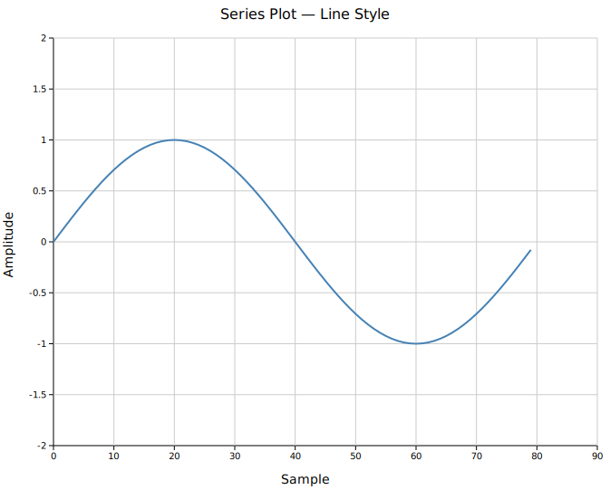
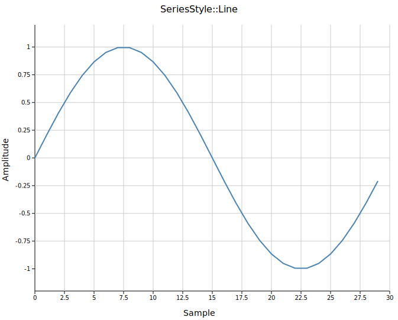
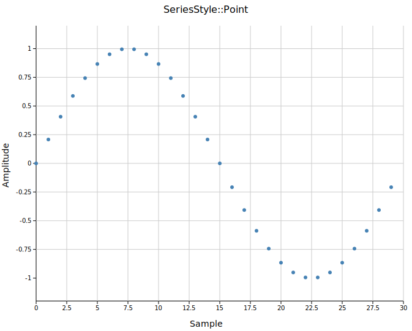
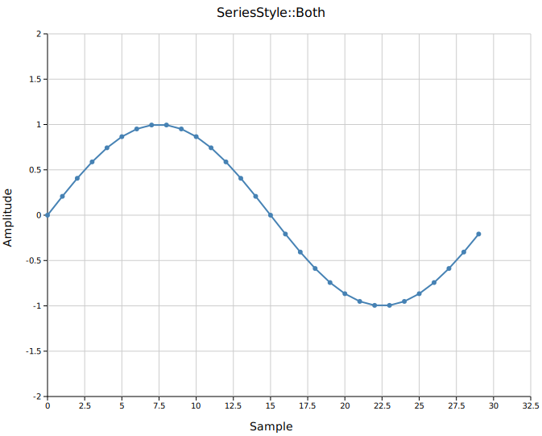
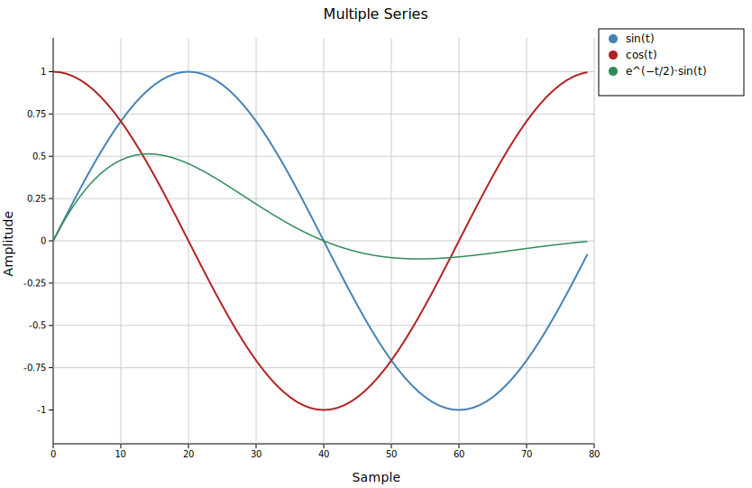
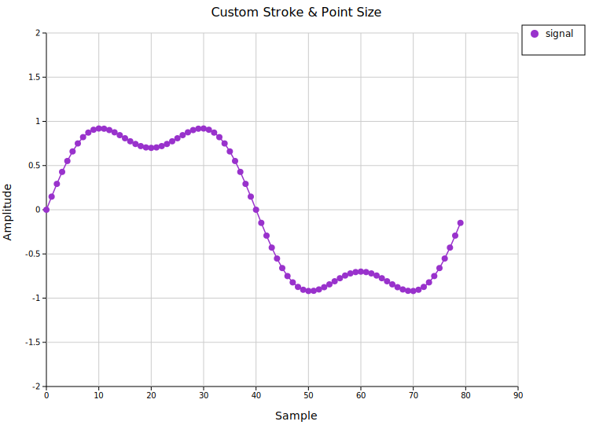

# Series Plot

A series plot displays an ordered sequence of y-values against their sequential index on the x-axis. It is the simplest way to visualise a **time series**, signal trace, or any 1D ordered measurement. Three rendering styles are available: line, point, or both.

**Import path:** `kuva::plot::SeriesPlot`

---

## Basic usage

Pass an iterable of numeric values to `.with_data()`. The x-axis is assigned automatically as `0, 1, 2, …`.

```rust,no_run
use kuva::plot::SeriesPlot;
use kuva::backend::svg::SvgBackend;
use kuva::render::render::render_multiple;
use kuva::render::layout::Layout;
use kuva::render::plots::Plot;

let data: Vec<f64> = (0..80)
    .map(|i| (i as f64 * std::f64::consts::TAU / 80.0).sin())
    .collect();

let series = SeriesPlot::new()
    .with_data(data)
    .with_color("steelblue")
    .with_line_style();

let plots = vec![Plot::Series(series)];
let layout = Layout::auto_from_plots(&plots)
    .with_title("Series Plot — Line Style")
    .with_x_label("Sample")
    .with_y_label("Amplitude");

let svg = SvgBackend.render_scene(&render_multiple(plots, layout));
std::fs::write("series.svg", svg).unwrap();
```



---

## Display styles

Three styles control how values are rendered. Call the corresponding method instead of setting a field directly.

| Method | Style | Renders |
|--------|-------|---------|
| `.with_line_style()` | `Line` | Polyline connecting consecutive points |
| `.with_point_style()` | `Point` | Circle at each value **(default)** |
| `.with_line_point_style()` | `Both` | Polyline and circles |






---

## Multiple series

Place multiple `SeriesPlot` instances in the same `plots` vector to overlay them on one canvas. All series share the same axes; they align automatically when they have the same number of values.

```rust,no_run
# use kuva::plot::SeriesPlot;
# use kuva::render::plots::Plot;
let s1 = SeriesPlot::new()
    .with_data(sin_data)
    .with_color("steelblue")
    .with_line_style()
    .with_legend("sin(t)");

let s2 = SeriesPlot::new()
    .with_data(cos_data)
    .with_color("firebrick")
    .with_line_style()
    .with_legend("cos(t)");

let s3 = SeriesPlot::new()
    .with_data(damped)
    .with_color("seagreen")
    .with_line_style()
    .with_stroke_width(1.5)
    .with_legend("e^(−t/2)·sin(t)");

let plots = vec![Plot::Series(s1), Plot::Series(s2), Plot::Series(s3)];
```



Each series has its own color and legend entry. The legend is drawn automatically when any series has a `legend_label`.

---

## Custom stroke and point size

`.with_stroke_width(f)` sets the line thickness; `.with_point_radius(f)` sets the circle size. These only affect the relevant style — `stroke_width` applies to `Line` and `Both`; `point_radius` applies to `Point` and `Both`.

```rust,no_run
# use kuva::plot::SeriesPlot;
# use kuva::render::plots::Plot;
let series = SeriesPlot::new()
    .with_data(data)
    .with_color("darkorchid")
    .with_line_point_style()
    .with_stroke_width(1.5)
    .with_point_radius(4.0)
    .with_legend("signal");
```



---

## API reference

| Method | Description |
|--------|-------------|
| `SeriesPlot::new()` | Create with defaults (`Point` style, `"black"`, radius `3.0`, width `2.0`) |
| `.with_data(iter)` | Load y-values; x positions are sequential indices |
| `.with_color(s)` | CSS color for lines and points (default `"black"`) |
| `.with_line_style()` | Polyline only |
| `.with_point_style()` | Circles only **(default)** |
| `.with_line_point_style()` | Polyline and circles |
| `.with_stroke_width(f)` | Line thickness in pixels (default `2.0`) |
| `.with_point_radius(f)` | Circle radius in pixels (default `3.0`) |
| `.with_legend(s)` | Add a legend entry with this label |
