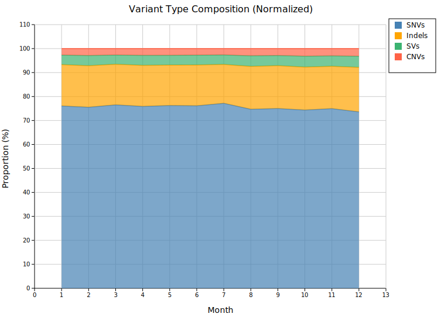
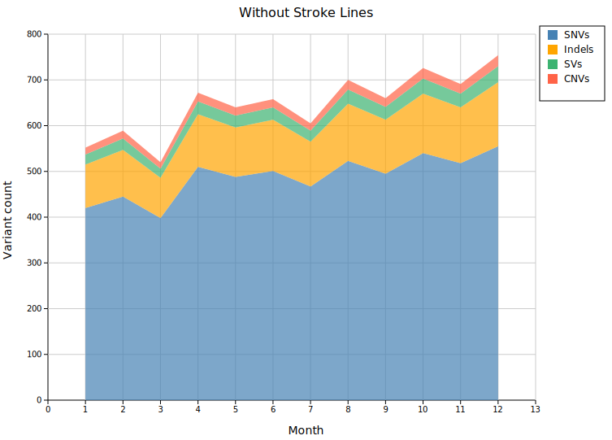

# Stacked Area Plot

A stacked area chart places multiple series on top of each other so the reader can see both the individual contribution of each series and the combined total at any x position. It is well suited for showing how a whole is composed of parts over a continuous axis — typically time.

**Import path:** `kuva::plot::StackedAreaPlot`

---

## Basic usage

Set the x values with `.with_x()`, then add series one at a time with `.with_series()`. Call `.with_color()` and `.with_legend()` immediately after each series to configure it — these methods always operate on the **most recently added** series.

```rust,no_run
use kuva::plot::StackedAreaPlot;
use kuva::backend::svg::SvgBackend;
use kuva::render::render::render_multiple;
use kuva::render::layout::Layout;
use kuva::render::plots::Plot;

let months: Vec<f64> = (1..=12).map(|m| m as f64).collect();

let sa = StackedAreaPlot::new()
    .with_x(months)
    .with_series([420.0, 445.0, 398.0, 510.0, 488.0, 501.0,
                  467.0, 523.0, 495.0, 540.0, 518.0, 555.0])
    .with_color("steelblue").with_legend("SNVs")
    .with_series([ 95.0, 102.0,  88.0, 115.0, 108.0, 112.0,
                   98.0, 125.0, 118.0, 130.0, 122.0, 140.0])
    .with_color("orange").with_legend("Indels")
    .with_series([ 22.0,  25.0,  20.0,  28.0,  26.0,  27.0,
                   24.0,  31.0,  28.0,  33.0,  30.0,  35.0])
    .with_color("mediumseagreen").with_legend("SVs")
    .with_series([ 15.0,  17.0,  14.0,  19.0,  18.0,  18.0,
                   16.0,  21.0,  19.0,  23.0,  21.0,  24.0])
    .with_color("tomato").with_legend("CNVs");

let plots = vec![Plot::StackedArea(sa)];
let layout = Layout::auto_from_plots(&plots)
    .with_title("Monthly Variant Counts by Type")
    .with_x_label("Month")
    .with_y_label("Variant count");

let svg = SvgBackend.render_scene(&render_multiple(plots, layout));
std::fs::write("stacked_area.svg", svg).unwrap();
```


Four variant types are stacked so the total height of each column shows the aggregate monthly count while the coloured bands show how much each type contributes. The growing trend in SNVs lifts all upper bands over time.

---

## Normalized (100 % stacking)

`.with_normalized()` rescales each column so all series sum to 100 %, shifting the y-axis to span 0–100 %. Use this when you want to emphasise proportional composition rather than absolute magnitude.

```rust,no_run
# use kuva::plot::StackedAreaPlot;
let sa = StackedAreaPlot::new()
    .with_x(months)
    // ... add series ...
    .with_normalized();
```



The relative dominance of SNVs (~77 %) is immediately clear and the slight month-to-month shifts in variant-type mix become visible — information that was hidden in the absolute chart by the large SNV counts.

---

## Stroke lines

By default a stroke is drawn along the top edge of each band. `.with_strokes(false)` removes all outlines for a softer, flat appearance — useful when the colors provide enough contrast.

```rust,no_run
# use kuva::plot::StackedAreaPlot;
let sa = StackedAreaPlot::new()
    .with_x(months)
    // ... add series ...
    .with_strokes(false);
```



---

## Legend position

`.with_legend_position(pos)` controls which corner of the plot area the legend occupies. Four positions are available from [`LegendPosition`](../reference/palettes.md):

| Variant | Description |
|---------|-------------|
| `TopRight` | Upper-right corner (default) |
| `TopLeft` | Upper-left corner |
| `BottomRight` | Lower-right corner |
| `BottomLeft` | Lower-left corner |

```rust,no_run
use kuva::plot::{StackedAreaPlot, LegendPosition};

let sa = StackedAreaPlot::new()
    .with_x(months)
    // ... add series ...
    .with_legend_position(LegendPosition::BottomLeft);
```


---

## Styling

### Fill opacity

`.with_fill_opacity(f)` sets the transparency of every band (default `0.7`, range `0.0`–`1.0`). Lower values let background grid lines show through; `1.0` gives fully opaque fills.

### Stroke width

`.with_stroke_width(px)` sets the thickness of the top-edge strokes (default `1.5`). Has no effect when `.with_strokes(false)` is set.

```rust,no_run
# use kuva::plot::StackedAreaPlot;
let sa = StackedAreaPlot::new()
    .with_x(months)
    // ... add series ...
    .with_fill_opacity(0.9)   // nearly opaque bands
    .with_stroke_width(2.5);  // thicker border lines
```

---

## Colors

If no color is set for a series the built-in fallback palette is used (cycling when there are more than eight series):

`steelblue`, `orange`, `green`, `red`, `purple`, `brown`, `pink`, `gray`

Set an explicit color by calling `.with_color()` immediately after `.with_series()`:

```rust,no_run
# use kuva::plot::StackedAreaPlot;
let sa = StackedAreaPlot::new()
    .with_x([1.0, 2.0, 3.0])
    .with_series([10.0, 20.0, 15.0]).with_color("#2c7bb6").with_legend("Group A")
    .with_series([ 5.0,  8.0,  6.0]).with_color("#d7191c").with_legend("Group B");
```

---

## API reference

| Method | Description |
|--------|-------------|
| `StackedAreaPlot::new()` | Create a plot with defaults |
| `.with_x(iter)` | Set shared x-axis values |
| `.with_series(iter)` | Append a new y series |
| `.with_color(s)` | Fill color of the most recently added series |
| `.with_legend(s)` | Legend label of the most recently added series |
| `.with_fill_opacity(f)` | Band transparency — `0.0` to `1.0` (default `0.7`) |
| `.with_stroke_width(px)` | Top-edge stroke thickness (default `1.5`) |
| `.with_strokes(bool)` | Show/hide top-edge strokes (default `true`) |
| `.with_normalized()` | Enable 100 % percent-stacking |
| `.with_legend_position(pos)` | Legend corner: `TopRight`, `TopLeft`, `BottomRight`, `BottomLeft` |
