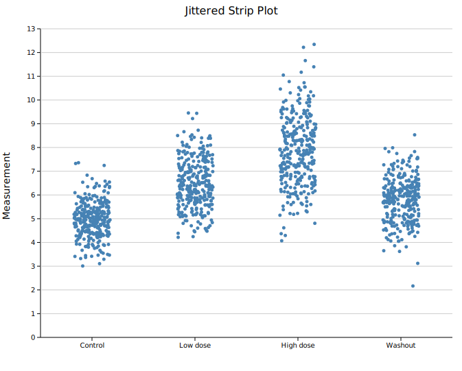
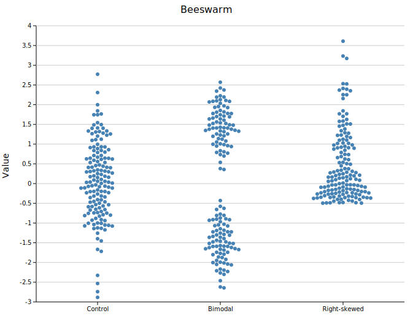
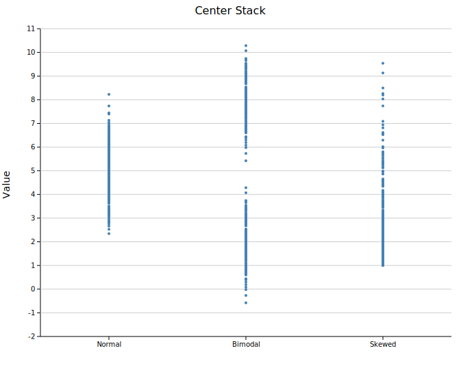
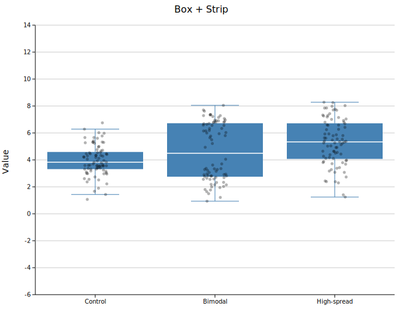
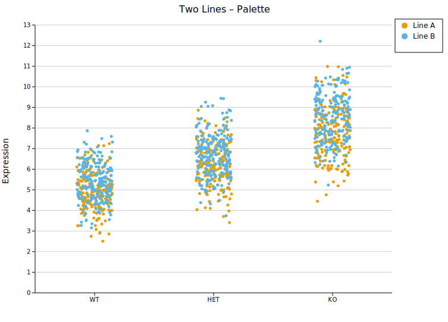

# Strip Plot

A strip plot (dot plot / univariate scatter) shows every individual data point along a categorical axis. Unlike a box or violin, nothing is summarised — the raw values are shown directly, making sample size and exact distribution shape immediately visible.

**Import path:** `kuva::plot::StripPlot`

---

## Basic usage

Add one group per category with `.with_group(label, values)`. Groups are rendered left-to-right in the order they are added.

```rust,no_run
use kuva::plot::StripPlot;
use kuva::backend::svg::SvgBackend;
use kuva::render::render::render_multiple;
use kuva::render::layout::Layout;
use kuva::render::plots::Plot;

let strip = StripPlot::new()
    .with_group("Control",   control_data)
    .with_group("Low dose",  low_data)
    .with_group("High dose", high_data)
    .with_group("Washout",   washout_data)
    .with_color("steelblue")
    .with_point_size(2.5)
    .with_jitter(0.35);

let plots = vec![Plot::Strip(strip)];
let layout = Layout::auto_from_plots(&plots)
    .with_title("Jittered Strip Plot")
    .with_y_label("Measurement");

let scene = render_multiple(plots, layout);
let svg = SvgBackend.render_scene(&scene);
std::fs::write("strip.svg", svg).unwrap();
```



300 points per group. The jitter cloud fills out the slot width, making the spread and central tendency of each distribution easy to compare.

---

## Layout modes

Three modes control how points are spread horizontally within each group slot.

### Jittered strip

`.with_jitter(j)` assigns each point a random horizontal offset. `j` is the half-width as a fraction of the slot — `0.3` spreads points ±30 % of the slot width. This is the default (`j = 0.3`).

Use a smaller `j` to tighten the column or a larger `j` to spread it out. The jitter positions are randomised with a fixed seed (changeable via `.with_seed()`), so output is reproducible.

```rust,no_run
# use kuva::plot::StripPlot;
let strip = StripPlot::new()
    .with_group("A", data)
    .with_jitter(0.35)      // ±35 % of slot width
    .with_point_size(2.5);
```

### Beeswarm

`.with_swarm()` uses a deterministic algorithm to place each point as close to the group center as possible without overlapping any already-placed point. The outline of the resulting shape traces the density of the distribution.

Swarm works best for **N < ~200 per group**. With very large N, points are pushed far from center and the spread becomes impractical.

```rust,no_run
use kuva::plot::StripPlot;
use kuva::backend::svg::SvgBackend;
use kuva::render::render::render_multiple;
use kuva::render::layout::Layout;
use kuva::render::plots::Plot;

let strip = StripPlot::new()
    .with_group("Control",      normal_data)
    .with_group("Bimodal",      bimodal_data)
    .with_group("Right-skewed", skewed_data)
    .with_color("steelblue")
    .with_point_size(3.0)
    .with_swarm();

let plots = vec![Plot::Strip(strip)];
let layout = Layout::auto_from_plots(&plots)
    .with_title("Beeswarm")
    .with_y_label("Value");

let svg = SvgBackend.render_scene(&render_multiple(plots, layout));
```



150 points per group. The bimodal group shows two distinct lobes; the right-skewed group shows the long tail — structure that jitter reveals less cleanly at this sample size.

### Center stack

`.with_center()` places all points at x = group center with no horizontal spread, creating a vertical column. The density of the distribution is readable directly from where points are most tightly packed.

```rust,no_run
# use kuva::plot::StripPlot;
let strip = StripPlot::new()
    .with_group("Normal",  normal_data)
    .with_group("Bimodal", bimodal_data)
    .with_group("Skewed",  skewed_data)
    .with_color("steelblue")
    .with_point_size(2.0)
    .with_center();
```



400 points per group. The bimodal group shows a clear gap in the column; the skewed group has a dense cluster at the low end thinning toward the tail.

---

## Composing with a box plot

A `StripPlot` can be layered on top of a `BoxPlot` by passing both to `render_multiple`. Use a semi-transparent `rgba` color for the strip so the box summary remains legible underneath.

```rust,no_run
use kuva::plot::{StripPlot, BoxPlot};
use kuva::backend::svg::SvgBackend;
use kuva::render::render::render_multiple;
use kuva::render::layout::Layout;
use kuva::render::plots::Plot;

let boxplot = BoxPlot::new()
    .with_group("Control",     control_data.clone())
    .with_group("Bimodal",     bimodal_data.clone())
    .with_group("High-spread", spread_data.clone())
    .with_color("steelblue");

let strip = StripPlot::new()
    .with_group("Control",     control_data)
    .with_group("Bimodal",     bimodal_data)
    .with_group("High-spread", spread_data)
    .with_color("rgba(0,0,0,0.3)")   // semi-transparent so box shows through
    .with_point_size(2.5)
    .with_jitter(0.2);

let plots = vec![Plot::Box(boxplot), Plot::Strip(strip)];
let layout = Layout::auto_from_plots(&plots)
    .with_title("Box + Strip")
    .with_y_label("Value");

let svg = SvgBackend.render_scene(&render_multiple(plots, layout));
```



The box summarises Q1/median/Q3; the individual points reveal that the bimodal group has two sub-populations the box conceals entirely.

---

## Multiple strip plots with a palette

Passing multiple `StripPlot`s to `render_multiple` with a `Layout::with_palette()` auto-assigns distinct colors. Attach `.with_legend()` to each plot to identify them.

```rust,no_run
use kuva::plot::StripPlot;
use kuva::backend::svg::SvgBackend;
use kuva::render::render::render_multiple;
use kuva::render::layout::Layout;
use kuva::render::plots::Plot;
use kuva::Palette;

let line_a = StripPlot::new()
    .with_group("WT",  wt_a).with_group("HET", het_a).with_group("KO", ko_a)
    .with_jitter(0.3).with_point_size(2.5)
    .with_legend("Line A");

let line_b = StripPlot::new()
    .with_group("WT",  wt_b).with_group("HET", het_b).with_group("KO", ko_b)
    .with_jitter(0.3).with_point_size(2.5)
    .with_legend("Line B");

let plots = vec![Plot::Strip(line_a), Plot::Strip(line_b)];
let layout = Layout::auto_from_plots(&plots)
    .with_title("Two Lines – Palette")
    .with_y_label("Expression")
    .with_palette(Palette::wong());

let svg = SvgBackend.render_scene(&render_multiple(plots, layout));
```



---

## API reference

| Method | Description |
|--------|-------------|
| `StripPlot::new()` | Create a strip plot with defaults |
| `.with_group(label, values)` | Add a group; accepts any `Into<f64>` iterable |
| `.with_color(s)` | Point fill color (CSS color string, default `"steelblue"`) |
| `.with_point_size(r)` | Point radius in pixels (default `4.0`) |
| `.with_jitter(j)` | Jittered strip layout; `j` is half-width as fraction of slot (default `0.3`) |
| `.with_swarm()` | Beeswarm layout — non-overlapping, best for N < 200 |
| `.with_center()` | All points at group center — vertical density column |
| `.with_seed(n)` | RNG seed for jitter positions (default `42`) |
| `.with_legend(s)` | Attach a legend label |
