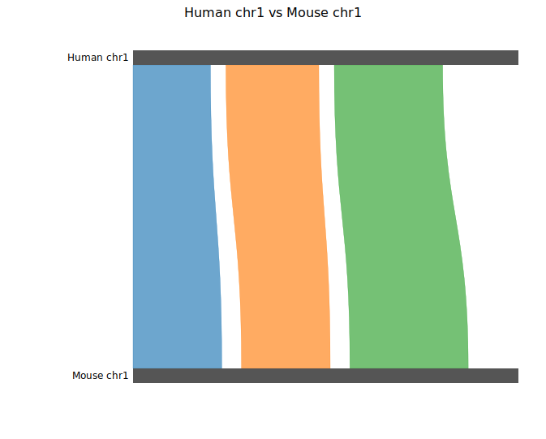
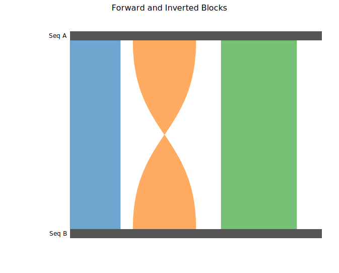
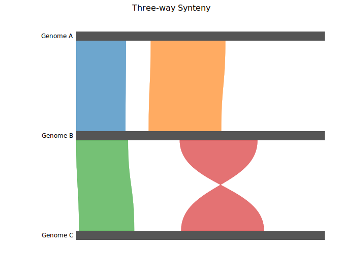
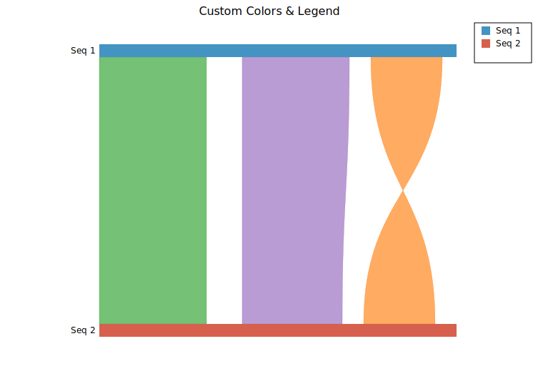

# Synteny Plot

A synteny plot visualises conserved genomic regions between two or more sequences. Each sequence is drawn as a horizontal bar; collinear blocks are drawn as ribbons connecting the matching regions. Forward blocks use parallel-sided ribbons; inverted (reverse-complement) blocks draw crossed (bowtie) ribbons. The plot is well suited for comparing chromosomes, assembled genomes, or any ordered sequence data.

**Import path:** `kuva::plot::synteny::SyntenyPlot`

---

## Basic usage

Add sequences with `.with_sequences()` as `(label, length)` pairs, then connect collinear regions with `.with_block(seq1, start1, end1, seq2, start2, end2)`. Sequences are referred to by their 0-based index in the order they were added.

```rust,no_run
use kuva::plot::synteny::SyntenyPlot;
use kuva::backend::svg::SvgBackend;
use kuva::render::render::render_multiple;
use kuva::render::layout::Layout;
use kuva::render::plots::Plot;

let plot = SyntenyPlot::new()
    .with_sequences([
        ("Human chr1", 248_956_422.0),
        ("Mouse chr1", 195_471_971.0),
    ])
    .with_block(0,   0.0,        50_000_000.0,  1,   0.0,        45_000_000.0)
    .with_block(0,  60_000_000.0, 120_000_000.0, 1,  55_000_000.0, 100_000_000.0)
    .with_block(0, 130_000_000.0, 200_000_000.0, 1, 110_000_000.0, 170_000_000.0);

let plots = vec![Plot::Synteny(plot)];
let layout = Layout::auto_from_plots(&plots)
    .with_title("Human chr1 vs Mouse chr1");

let svg = SvgBackend.render_scene(&render_multiple(plots, layout));
std::fs::write("synteny.svg", svg).unwrap();
```



By default each bar fills the full plot width regardless of sequence length (per-sequence scale). Ribbons are drawn before bars so the bars overlay them cleanly. Labels are right-padded to the left of each bar.

---

## Inversions

`.with_inv_block()` marks a region as reverse-complement: the ribbon connects the right edge of the source interval to the left edge of the target (and vice versa), producing a characteristic crossed or bowtie shape.

```rust,no_run
use kuva::plot::synteny::SyntenyPlot;
use kuva::backend::svg::SvgBackend;
use kuva::render::render::render_multiple;
use kuva::render::layout::Layout;
use kuva::render::plots::Plot;

let plot = SyntenyPlot::new()
    .with_sequences([("Seq A", 1_000_000.0), ("Seq B", 1_000_000.0)])
    .with_block(    0,       0.0, 200_000.0, 1,       0.0, 200_000.0)
    .with_inv_block(0, 250_000.0, 500_000.0, 1, 250_000.0, 500_000.0)  // inverted
    .with_block(    0, 600_000.0, 900_000.0, 1, 600_000.0, 900_000.0);

let plots = vec![Plot::Synteny(plot)];
let layout = Layout::auto_from_plots(&plots)
    .with_title("Forward and Inverted Blocks");

let svg = SvgBackend.render_scene(&render_multiple(plots, layout));
```



---

## Multiple sequences

Add more than two sequences to show a stack of pairwise comparisons. A block can connect any two sequence indices — typically adjacent pairs for a multi-genome alignment view.

```rust,no_run
use kuva::plot::synteny::SyntenyPlot;
use kuva::backend::svg::SvgBackend;
use kuva::render::render::render_multiple;
use kuva::render::layout::Layout;
use kuva::render::plots::Plot;

let plot = SyntenyPlot::new()
    .with_sequences([
        ("Genome A", 500_000.0),
        ("Genome B", 480_000.0),
        ("Genome C", 450_000.0),
    ])
    // blocks between sequences 0 and 1
    .with_block(    0,       0.0, 100_000.0, 1,       0.0,  95_000.0)
    .with_block(    0, 150_000.0, 300_000.0, 1, 140_000.0, 280_000.0)
    // blocks between sequences 1 and 2
    .with_block(    1,       0.0, 100_000.0, 2,   5_000.0, 105_000.0)
    .with_inv_block(1, 200_000.0, 350_000.0, 2, 190_000.0, 340_000.0);

let plots = vec![Plot::Synteny(plot)];
let layout = Layout::auto_from_plots(&plots)
    .with_title("Three-way Synteny");

let svg = SvgBackend.render_scene(&render_multiple(plots, layout));
```



Blocks do not need to connect adjacent sequences — a block between sequences 0 and 2 will span the full height of the diagram.

---

## Custom colors & legend

Set bar colors with `.with_sequence_colors()`. Override the ribbon color of individual blocks with `.with_colored_block()` or `.with_colored_inv_block()`. Call `.with_legend(title)` to add one legend entry per sequence.

```rust,no_run
use kuva::plot::synteny::SyntenyPlot;
use kuva::backend::svg::SvgBackend;
use kuva::render::render::render_multiple;
use kuva::render::layout::Layout;
use kuva::render::plots::Plot;

let plot = SyntenyPlot::new()
    .with_sequences([("Seq 1", 500_000.0), ("Seq 2", 500_000.0)])
    .with_sequence_colors(["#4393c3", "#d6604d"])          // bar fill colors
    .with_colored_block(    0,       0.0, 150_000.0,
                            1,       0.0, 150_000.0, "#2ca02c")
    .with_colored_block(    0, 200_000.0, 350_000.0,
                            1, 200_000.0, 340_000.0, "#9467bd")
    .with_colored_inv_block(0, 380_000.0, 480_000.0,
                             1, 370_000.0, 470_000.0, "#ff7f0e")
    .with_legend("Blocks");

let plots = vec![Plot::Synteny(plot)];
let layout = Layout::auto_from_plots(&plots)
    .with_title("Custom Colors & Legend");

let svg = SvgBackend.render_scene(&render_multiple(plots, layout));
```



Without explicit block colors, ribbons inherit the source sequence bar color.

---

## Shared scale

By default each bar fills the full plot width independently (per-sequence scale), which maximises detail for each sequence but hides length differences between them. Call `.with_shared_scale()` to use a common ruler: each bar's width is proportional to `sequence_length / max_length`, so relative sizes are accurately represented.

```rust,no_run
# use kuva::plot::synteny::SyntenyPlot;
let plot = SyntenyPlot::new()
    .with_sequences([("Long", 1_000_000.0), ("Short", 400_000.0)])
    .with_shared_scale()                                   // shorter bar is 40% width
    .with_block(0,       0.0, 300_000.0, 1,      0.0, 300_000.0)
    .with_block(0, 350_000.0, 700_000.0, 1, 50_000.0, 380_000.0);
```

---

## Bulk block loading

`.with_blocks()` accepts an iterator of pre-built `SyntenyBlock` structs, which is convenient when blocks come from a parsed alignment file:

```rust,no_run
use kuva::plot::synteny::{SyntenyPlot, SyntenyBlock, Strand};

let blocks: Vec<SyntenyBlock> = vec![
    SyntenyBlock { seq1: 0, start1:       0.0, end1: 100_000.0,
                   seq2: 1, start2:       0.0, end2:  95_000.0,
                   strand: Strand::Forward, color: None },
    SyntenyBlock { seq1: 0, start1: 150_000.0, end1: 300_000.0,
                   seq2: 1, start2: 140_000.0, end2: 280_000.0,
                   strand: Strand::Reverse, color: Some("#e41a1c".into()) },
];

let plot = SyntenyPlot::new()
    .with_sequences([("Ref", 500_000.0), ("Query", 480_000.0)])
    .with_blocks(blocks);
```

---

## API reference

| Method | Description |
|--------|-------------|
| `SyntenyPlot::new()` | Create a synteny plot with defaults |
| `.with_sequences(iter)` | Add sequences from `(label, length)` pairs |
| `.with_sequence_colors(iter)` | Override bar fill colors (parallel to sequences) |
| `.with_block(s1, start1, end1, s2, start2, end2)` | Add a forward collinear block |
| `.with_inv_block(s1, start1, end1, s2, start2, end2)` | Add an inverted (crossed ribbon) block |
| `.with_colored_block(s1, start1, end1, s2, start2, end2, color)` | Forward block with explicit ribbon color |
| `.with_colored_inv_block(s1, start1, end1, s2, start2, end2, color)` | Inverted block with explicit ribbon color |
| `.with_blocks(iter)` | Batch-add pre-built `SyntenyBlock` structs |
| `.with_bar_height(px)` | Sequence bar height in pixels (default `18.0`) |
| `.with_opacity(f)` | Ribbon fill opacity `0.0`–`1.0` (default `0.65`) |
| `.with_shared_scale()` | Use a common ruler — bar width proportional to sequence length |
| `.with_legend(title)` | Add one legend entry per sequence |

### `Strand` variants

| Variant | Ribbon shape |
|---------|-------------|
| `Forward` | Parallel-sided trapezoid |
| `Reverse` | Crossed / bowtie |
