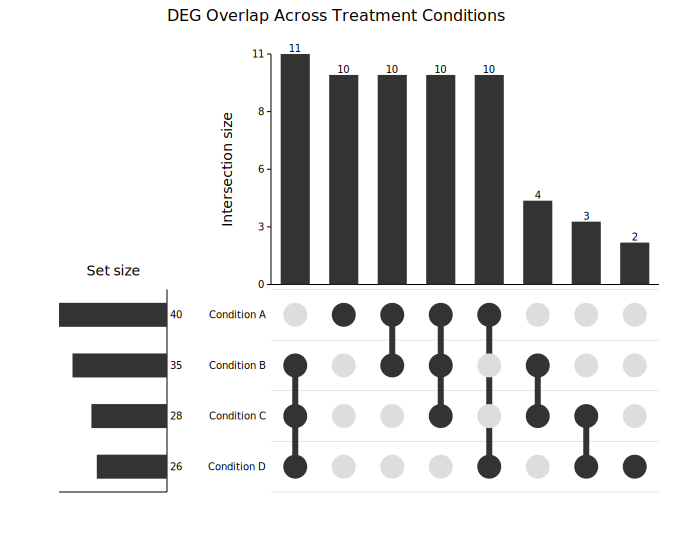
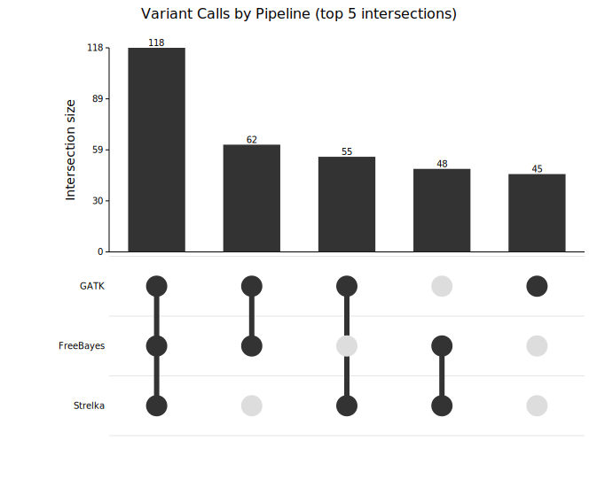
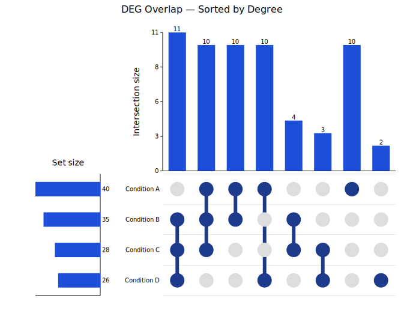

# UpSet Plot

An UpSet plot is the scalable successor to Venn diagrams for showing set intersections when there are more than three or four sets. It uses three visual components:

- **Intersection size bars** (top): vertical bars showing how many elements belong to each exact intersection.
- **Dot matrix** (middle): a grid of circles. Filled dots indicate which sets participate in each intersection; a vertical line connects them.
- **Set size bars** (left, optional): horizontal bars showing the total size of each set.

**Import path:** `kuva::plot::UpSetPlot`

---

## Basic usage

Pass `(name, elements)` pairs to `.with_sets()`. Intersection counts are computed automatically — each element is assigned to the unique combination of sets it belongs to.

```rust,no_run
use kuva::plot::UpSetPlot;
use kuva::backend::svg::SvgBackend;
use kuva::render::render::render_multiple;
use kuva::render::layout::Layout;
use kuva::render::plots::Plot;

// Overlapping differentially expressed genes across four treatment conditions
let up = UpSetPlot::new()
    .with_sets(vec![
        ("Condition A", (1u32..=40).collect::<Vec<_>>()),
        ("Condition B", (21u32..=55).collect::<Vec<_>>()),
        ("Condition C", (31u32..=58).collect::<Vec<_>>()),
        ("Condition D", (1u32..=10).chain(45..=60).collect::<Vec<_>>()),
    ]);

let plots = vec![Plot::UpSet(up)];
let layout = Layout::auto_from_plots(&plots)
    .with_title("DEG Overlap Across Treatment Conditions");

let svg = SvgBackend.render_scene(&render_multiple(plots, layout));
std::fs::write("upset.svg", svg).unwrap();
```



Intersections are sorted by frequency (default) so the largest bars are leftmost. The tallest bar (A∩B∩C: 10) is at the far left; the dot matrix below it shows three filled circles connected by a vertical line. The set-size bars on the left confirm Condition A has the most DEGs (40).

---

## Precomputed data

`.with_data(names, sizes, intersections)` accepts precomputed counts directly when you do not have the individual elements — for example summary output from an external tool.

The third argument is an iterator of `(mask, count)` pairs. The **mask** is a bitmask: **bit `i` is set when `set_names[i]` participates in that intersection**.

```rust,no_run
# use kuva::plot::UpSetPlot;
# use kuva::render::plots::Plot;
// Three variant-calling pipelines
// bit 0 = GATK, bit 1 = FreeBayes, bit 2 = Strelka
let up = UpSetPlot::new()
    .with_data(
        ["GATK", "FreeBayes", "Strelka"],
        [280usize, 263, 249],   // total variants per pipeline
        vec![
            (0b001, 45),   // GATK only
            (0b010, 35),   // FreeBayes only
            (0b100, 28),   // Strelka only
            (0b011, 62),   // GATK ∩ FreeBayes
            (0b101, 55),   // GATK ∩ Strelka
            (0b110, 48),   // FreeBayes ∩ Strelka
            (0b111, 118),  // all three (high-confidence)
        ],
    )
    .with_max_visible(5)      // show only the top 5 intersections
    .without_set_sizes();     // hide the left set-size panel
```



118 variants are called by all three pipelines (the high-confidence set). `with_max_visible(5)` caps the display to the five largest intersections after sorting; `without_set_sizes()` removes the left panel for a more compact layout.

---

## Sort order

`.with_sort(order)` controls the left-to-right ordering of intersection columns.

| Variant | Behaviour |
|---------|-----------|
| `ByFrequency` | Largest bar leftmost **(default)** |
| `ByDegree` | Most sets involved first, ties broken by count |
| `Natural` | Input order preserved (useful with `with_data`) |

`ByDegree` is useful when you specifically want to highlight complex multi-set intersections rather than the most common ones:

```rust,no_run
use kuva::plot::{UpSetPlot, UpSetSort};
# use kuva::render::plots::Plot;
let up = UpSetPlot::new()
    .with_sets(vec![
        ("Condition A", (1u32..=40).collect::<Vec<_>>()),
        ("Condition B", (21u32..=55).collect::<Vec<_>>()),
        ("Condition C", (31u32..=58).collect::<Vec<_>>()),
        ("Condition D", (1u32..=10).chain(45u32..=60).collect::<Vec<_>>()),
    ])
    .with_sort(UpSetSort::ByDegree)
    .with_bar_color("#1d4ed8")
    .with_dot_color("#1e3a8a");
```



The leftmost columns now show intersections involving the most sets. Custom blue bar and dot colors make the plot match a specific color scheme.

---

## Limiting visible intersections

`.with_max_visible(n)` keeps only the first `n` intersections after sorting. This is essential for plots with many sets — five sets have up to 31 non-empty intersections, which can be too many to read. The limit is applied after sorting, so the hidden intersections are always the smallest (or lowest-degree) ones.

```rust,no_run
# use kuva::plot::UpSetPlot;
# use kuva::render::plots::Plot;
let up = UpSetPlot::new()
    .with_sets(/* five sets */)
    .with_max_visible(15);
```

---

## Hiding set-size bars

`.without_set_sizes()` removes the left panel showing each set's total size. Use this for a more compact layout when set sizes are already known from context or when the focus is entirely on the intersections.

---

## Colors

| Method | Default | Description |
|--------|---------|-------------|
| `.with_bar_color(s)` | `"#333333"` | Intersection and set-size bar fill |
| `.with_dot_color(s)` | `"#333333"` | Filled dot color (participating set) |

Non-participating dots are always shown in light gray (`#dddddd`) for contrast.

---

## API reference

| Method | Description |
|--------|-------------|
| `UpSetPlot::new()` | Create a plot with defaults |
| `.with_sets(iter)` | Raw `(name, elements)` pairs — intersections auto-computed |
| `.with_data(names, sizes, masks)` | Precomputed `(mask, count)` intersection data |
| `.with_sort(order)` | `ByFrequency` (default), `ByDegree`, or `Natural` |
| `.with_max_visible(n)` | Show only the top `n` intersections after sorting |
| `.without_set_sizes()` | Hide the left set-size bar panel |
| `.with_bar_color(s)` | Intersection and set-size bar color (default `"#333333"`) |
| `.with_dot_color(s)` | Filled dot color (default `"#333333"`) |

---

## Terminal output

UpSet plots are not yet supported in terminal mode. Running `kuva upset --terminal` prints a message to stderr and exits cleanly; use `-o file.svg` to generate an SVG instead.
