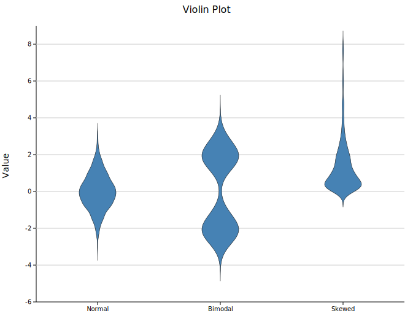
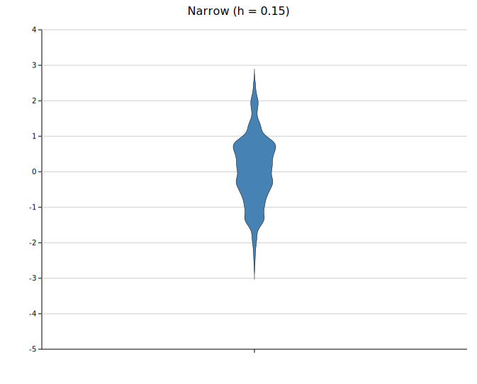
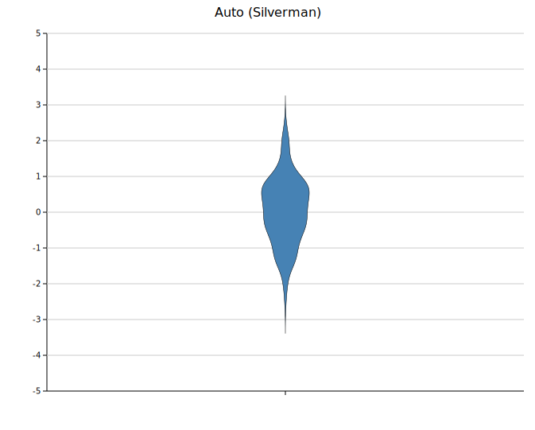
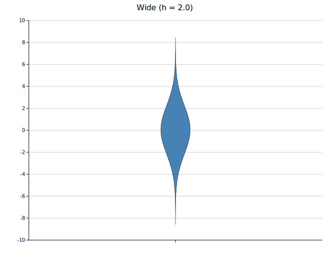

# Violin Plot

A violin plot estimates the probability density of each group using kernel density estimation (KDE) and renders it as a symmetric shape — widest where data is most dense. Unlike box plots, violins reveal multi-modal and skewed distributions that a five-number summary would obscure.

**Import path:** `visus::plot::ViolinPlot`

---

## Basic usage

Add one group per category with `.with_group(label, values)`. Groups are rendered left-to-right in the order they are added.

```rust,no_run
use visus::plot::ViolinPlot;
use visus::backend::svg::SvgBackend;
use visus::render::render::render_multiple;
use visus::render::layout::Layout;
use visus::render::plots::Plot;

let plot = ViolinPlot::new()
    .with_group("Normal",  normal_data)   // unimodal
    .with_group("Bimodal", bimodal_data)  // two peaks — invisible in a box plot
    .with_group("Skewed",  skewed_data)   // long tail
    .with_color("steelblue")
    .with_width(30.0);

let plots = vec![Plot::Violin(plot)];
let layout = Layout::auto_from_plots(&plots)
    .with_title("Violin Plot")
    .with_y_label("Value");

let scene = render_multiple(plots, layout);
let svg = SvgBackend.render_scene(&scene);
std::fs::write("violin.svg", svg).unwrap();
```



The bimodal group shows two distinct bulges — structure that a box plot would represent as a single median and IQR, losing all information about the separation.

---

## Violin width

`.with_width(px)` sets the maximum half-width of each violin in pixels. The default is `30.0`. Unlike bar width, this is an absolute pixel value, not a fraction of the category slot.

```rust,no_run
# use visus::plot::ViolinPlot;
let plot = ViolinPlot::new()
    .with_group("A", data)
    .with_width(20.0);   // narrower violins
```

---

## KDE bandwidth

Bandwidth controls how smooth the density estimate is. The default uses Silverman's rule-of-thumb, which works well for unimodal, roughly normal data. Set it manually with `.with_bandwidth(h)` when the automatic choice is too smooth (hides modes) or too rough (noisy).

```rust,no_run
use visus::plot::ViolinPlot;
# use visus::render::plots::Plot;

// Too narrow — jagged, noisy
let plot = ViolinPlot::new().with_group("", data.clone()).with_bandwidth(0.15);

// Automatic — Silverman's rule (default, no call needed)
let plot = ViolinPlot::new().with_group("", data.clone());

// Too wide — over-smoothed, modes blend together
let plot = ViolinPlot::new().with_group("", data.clone()).with_bandwidth(2.0);
```

<table>
<tr>
<td></td>
<td></td>
<td></td>
</tr>
<tr>
<td align="center"><code>h = 0.15</code> (too narrow)</td>
<td align="center">Auto — Silverman</td>
<td align="center"><code>h = 2.0</code> (too wide)</td>
</tr>
</table>

`.with_kde_samples(n)` sets the number of points at which the density is evaluated (default `200`). Increase it for a smoother rendered curve; the default is adequate for most datasets.

---

## Point overlays

Adding individual points on top of the violin makes the sample size visible and helps readers judge the reliability of the density estimate.

### Beeswarm overlay

`.with_swarm_overlay()` spreads points horizontally to avoid overlap. Recommended for smaller datasets (roughly N < 200 per group).

```rust,no_run
use visus::plot::ViolinPlot;
use visus::backend::svg::SvgBackend;
use visus::render::render::render_multiple;
use visus::render::layout::Layout;
use visus::render::plots::Plot;

let plot = ViolinPlot::new()
    .with_group("Normal",  normal_data)
    .with_group("Bimodal", bimodal_data)
    .with_group("Skewed",  skewed_data)
    .with_color("steelblue")
    .with_width(30.0)
    .with_swarm_overlay()
    .with_overlay_color("rgba(0,0,0,0.35)")
    .with_overlay_size(2.5);

let plots = vec![Plot::Violin(plot)];
let layout = Layout::auto_from_plots(&plots)
    .with_title("Violin + Swarm Overlay")
    .with_y_label("Value");

let svg = SvgBackend.render_scene(&render_multiple(plots, layout));
```


### Jittered strip

`.with_strip(jitter)` places points with random horizontal offsets. More appropriate for large datasets where beeswarm layout becomes slow.

```rust,no_run
# use visus::plot::ViolinPlot;
let plot = ViolinPlot::new()
    .with_group("A", data)
    .with_color("steelblue")
    .with_strip(0.15)                       // jitter spread in data units
    .with_overlay_color("rgba(0,0,0,0.4)") // semi-transparent recommended
    .with_overlay_size(3.0);
```

---

## API reference

| Method | Description |
|--------|-------------|
| `ViolinPlot::new()` | Create a violin plot with defaults |
| `.with_group(label, values)` | Add a group; accepts any `Into<f64>` iterable |
| `.with_color(s)` | Violin fill color (CSS color string) |
| `.with_width(px)` | Maximum half-width of each violin in pixels (default `30.0`) |
| `.with_legend(s)` | Attach a legend label |
| `.with_bandwidth(h)` | KDE bandwidth; omit for Silverman's rule (recommended default) |
| `.with_kde_samples(n)` | KDE evaluation points (default `200`) |
| `.with_strip(jitter)` | Overlay jittered strip; `jitter` is spread width in data units |
| `.with_swarm_overlay()` | Overlay beeswarm points (spread to avoid overlap) |
| `.with_overlay_color(s)` | Overlay point color (default `"rgba(0,0,0,0.45)"`) |
| `.with_overlay_size(r)` | Overlay point radius in pixels (default `3.0`) |
