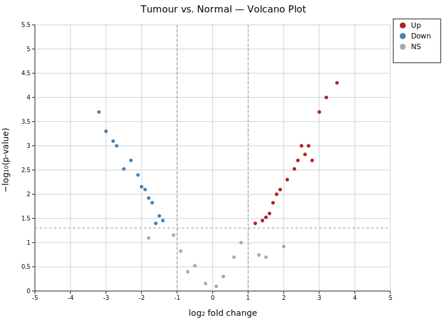
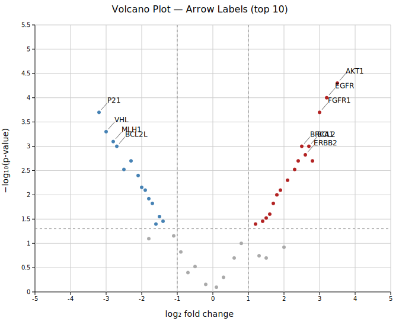
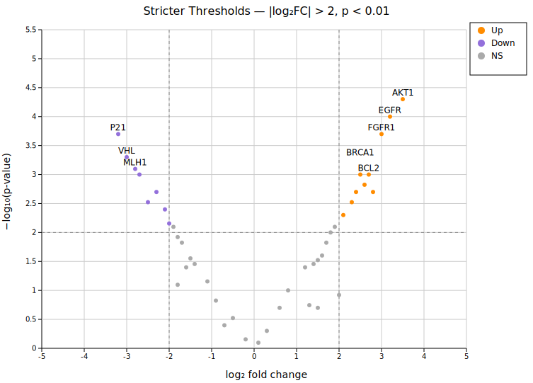

# Volcano Plot

A volcano plot visualises differential expression results by plotting **log₂ fold change** (x-axis) against **−log₁₀(p-value)** (y-axis). Points that pass both the fold-change and p-value thresholds are colored as up-regulated (right) or down-regulated (left); all others are shown as not-significant (gray). Dashed threshold lines are drawn automatically.

**Import path:** `kuva::plot::VolcanoPlot`

---

## Basic usage

Pass `(gene_name, log2fc, pvalue)` tuples to `.with_points()`. Default thresholds are `|log2FC| > 1.0` and `p < 0.05`.

```rust,no_run
use kuva::plot::VolcanoPlot;
use kuva::backend::svg::SvgBackend;
use kuva::render::render::render_multiple;
use kuva::render::layout::Layout;
use kuva::render::plots::Plot;

let results: Vec<(&str, f64, f64)> = vec![
    ("AKT1",   3.5, 5e-5),
    ("EGFR",   3.2, 1e-4),
    ("VHL",   -3.0, 5e-4),
    ("P21",   -3.2, 2e-4),
    ("GAPDH",  0.3, 0.50),
    // ...
];

let vp = VolcanoPlot::new()
    .with_points(results)
    .with_legend("DEG status");

let plots = vec![Plot::Volcano(vp)];
let layout = Layout::auto_from_plots(&plots)
    .with_title("Tumour vs. Normal — Volcano Plot")
    .with_x_label("log₂ fold change")
    .with_y_label("−log₁₀(p-value)");

let svg = SvgBackend.render_scene(&render_multiple(plots, layout));
std::fs::write("volcano.svg", svg).unwrap();
```



Up-regulated genes (red, right) include AKT1, EGFR, and FGFR1 at the top right. Down-regulated genes (blue, left) include P21, MLH1, and VHL. House-keeping genes (GAPDH, ACTB) and genes with large fold change but non-significant p-values (GeneC, GeneD) appear in gray. The legend shows the Up / Down / NS classification.

---

## Gene labels

`.with_label_top(n)` labels the `n` most significant points (lowest p-values). Three placement styles are available via `.with_label_style()`.

### Nudge (default)

Labels are sorted by x position and nudged vertically to reduce stacking — the best default for most datasets.

```rust,no_run
# use kuva::plot::VolcanoPlot;
# use kuva::render::plots::Plot;
let vp = VolcanoPlot::new()
    .with_points(results)
    .with_label_top(12);  // LabelStyle::Nudge is the default
```


The twelve most significant genes are labeled. Labels are spread vertically to avoid overlap while staying close to their points.

### Arrow

`LabelStyle::Arrow { offset_x, offset_y }` moves labels by the given pixel offset and draws a short gray leader line back to the point. Useful when labels would crowd the high-significance region.

```rust,no_run
use kuva::plot::{VolcanoPlot, LabelStyle};
# use kuva::render::plots::Plot;
let vp = VolcanoPlot::new()
    .with_points(results)
    .with_label_top(10)
    .with_label_style(LabelStyle::Arrow { offset_x: 14.0, offset_y: 16.0 });
```



Each label is offset from its point by 14 px horizontally and 16 px vertically with a connecting line. This style works well for the top points in the upper corners where nudging alone may not provide enough separation.

### Exact

`LabelStyle::Exact` places labels at the precise point position without adjustment. Labels may overlap on dense data; use this for sparse plots or when you will post-process the SVG.

---

## Thresholds

`.with_fc_cutoff(f)` and `.with_p_cutoff(f)` set the classification thresholds. Dashed vertical lines appear at `±fc_cutoff`; a dashed horizontal line appears at `−log10(p_cutoff)`.

```rust,no_run
# use kuva::plot::VolcanoPlot;
# use kuva::render::plots::Plot;
let vp = VolcanoPlot::new()
    .with_points(results)
    .with_fc_cutoff(2.0)   // default 1.0 — require ≥ 4× fold change
    .with_p_cutoff(0.01)   // default 0.05 — stricter significance
    .with_label_top(8);
```



With `|log2FC| > 2` and `p < 0.01`, fewer genes pass both filters. The threshold lines move inward on the x-axis and upward on the y-axis compared to the defaults. Orange/purple colors distinguish this comparison from the default red/blue palette.

---

## Colors

| Method | Default | Description |
|--------|---------|-------------|
| `.with_color_up(s)` | `"firebrick"` | Points with `log2FC ≥ fc_cutoff` and `p ≤ p_cutoff` |
| `.with_color_down(s)` | `"steelblue"` | Points with `log2FC ≤ −fc_cutoff` and `p ≤ p_cutoff` |
| `.with_color_ns(s)` | `"#aaaaaa"` | All other points |

All color methods accept any CSS color string.

---

## Zero and extreme p-values

p-values of exactly `0.0` cannot be log-transformed. They are automatically clamped to the smallest non-zero p-value in the data. To set an explicit ceiling (useful when comparing multiple plots on the same y-axis scale):

```rust,no_run
# use kuva::plot::VolcanoPlot;
let vp = VolcanoPlot::new()
    .with_points(results)
    .with_pvalue_floor(1e-10);  // y-axis ceiling fixed at 10
```

---

## API reference

| Method | Description |
|--------|-------------|
| `VolcanoPlot::new()` | Create a plot with defaults |
| `.with_point(name, fc, p)` | Add a single point |
| `.with_points(iter)` | Add points from a `(name, log2fc, pvalue)` iterator |
| `.with_fc_cutoff(f)` | \|log₂FC\| threshold (default `1.0`) |
| `.with_p_cutoff(f)` | p-value significance threshold (default `0.05`) |
| `.with_color_up(s)` | Up-regulated point color (default `"firebrick"`) |
| `.with_color_down(s)` | Down-regulated point color (default `"steelblue"`) |
| `.with_color_ns(s)` | Not-significant point color (default `"#aaaaaa"`) |
| `.with_point_size(f)` | Circle radius in pixels (default `3.0`) |
| `.with_label_top(n)` | Label the `n` most significant points (default `0`) |
| `.with_label_style(s)` | `Nudge` (default), `Exact`, or `Arrow { offset_x, offset_y }` |
| `.with_pvalue_floor(f)` | Explicit p-value floor for −log₁₀ transform |
| `.with_legend(s)` | Show an Up / Down / NS legend box |
