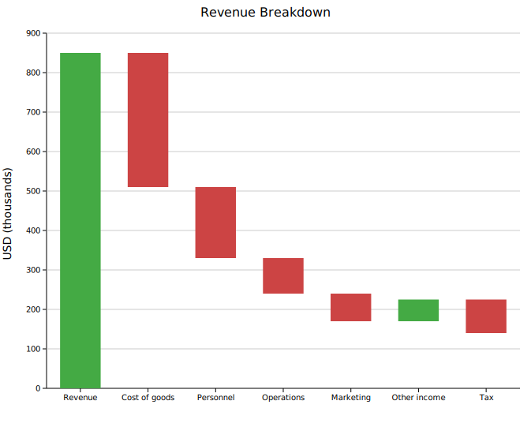
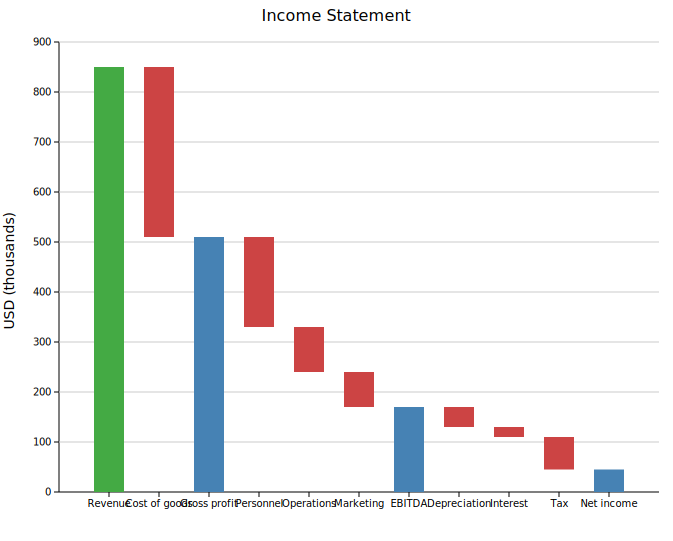
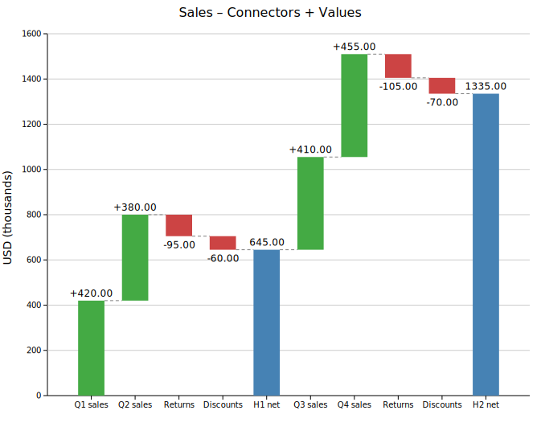
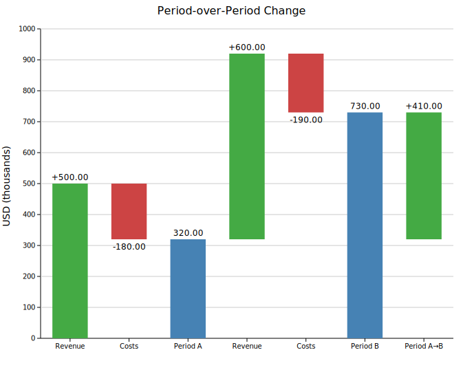

# Waterfall Chart

A waterfall chart shows a running total as a sequence of floating bars. Each bar starts where the previous one ended — rising for positive increments (green) and falling for negative ones (red). Summary bars can be placed at any point to show accumulated subtotals.

**Import path:** `kuva::plot::WaterfallPlot`

---

## Basic usage

Add bars with `.with_delta(label, value)`. The chart tracks a running total from left to right — each bar floats between the previous total and the new one.

```rust,no_run
use kuva::plot::WaterfallPlot;
use kuva::backend::svg::SvgBackend;
use kuva::render::render::render_multiple;
use kuva::render::layout::Layout;
use kuva::render::plots::Plot;

let wf = WaterfallPlot::new()
    .with_delta("Revenue",        850.0)
    .with_delta("Cost of goods", -340.0)
    .with_delta("Personnel",     -180.0)
    .with_delta("Operations",     -90.0)
    .with_delta("Marketing",      -70.0)
    .with_delta("Other income",    55.0)
    .with_delta("Tax",            -85.0);

let plots = vec![Plot::Waterfall(wf)];
let layout = Layout::auto_from_plots(&plots)
    .with_title("Revenue Breakdown")
    .with_y_label("USD (thousands)");

let scene = render_multiple(plots, layout);
let svg = SvgBackend.render_scene(&scene);
std::fs::write("waterfall.svg", svg).unwrap();
```



Green bars add to the running total; red bars subtract from it.

---

## Total bars

`.with_total(label)` places a bar that spans from zero to the current running total, rendered in a distinct color (default `"steelblue"`). The value field is irrelevant — the bar height is the accumulated total at that position. Place totals after sections of delta bars to show intermediate subtotals.

```rust,no_run
# use kuva::plot::WaterfallPlot;
# use kuva::render::plots::Plot;
let wf = WaterfallPlot::new()
    .with_delta("Revenue",        850.0)
    .with_delta("Cost of goods", -340.0)
    .with_total("Gross profit")         // subtotal after first section
    .with_delta("Personnel",     -180.0)
    .with_delta("Operations",     -90.0)
    .with_delta("Marketing",      -70.0)
    .with_total("EBITDA")               // second subtotal
    .with_delta("Depreciation",   -40.0)
    .with_delta("Interest",       -20.0)
    .with_delta("Tax",            -65.0)
    .with_total("Net income");          // final total
```



The three blue bars show gross profit, EBITDA, and net income alongside the individual line items that make them up.

---

## Connectors and value labels

`.with_connectors()` draws a dashed horizontal line from the top (or bottom) of each bar to the start of the next, making the running total easier to trace across wide charts. `.with_values()` prints the numeric value of each bar.

```rust,no_run
# use kuva::plot::WaterfallPlot;
# use kuva::render::plots::Plot;
let wf = WaterfallPlot::new()
    .with_delta("Q1 sales",    420.0)
    .with_delta("Q2 sales",    380.0)
    .with_delta("Returns",     -95.0)
    .with_delta("Discounts",   -60.0)
    .with_total("H1 net")
    .with_delta("Q3 sales",   410.0)
    .with_delta("Q4 sales",   455.0)
    .with_delta("Returns",   -105.0)
    .with_delta("Discounts",  -70.0)
    .with_total("H2 net")
    .with_connectors()
    .with_values();
```



---

## Difference bars

`.with_difference(label, from, to)` adds a standalone comparison bar anchored at explicit y-values rather than the running total. The bar spans `[from, to]` — green when `to > from`, red when `to < from` — and does **not** change the running total.

The clearest use is when `from` and `to` match the heights of existing `Total` bars, so the reader can trace the connection directly. In the example below both period totals are in the chart; the difference bar sits between those two reference levels and shows the gain between them.

```rust,no_run
use kuva::plot::WaterfallPlot;
use kuva::render::plots::Plot;

let wf = WaterfallPlot::new()
    .with_delta("Revenue",   500.0)   // running total → 500
    .with_delta("Costs",    -180.0)   // running total → 320
    .with_total("Period A")           // total bar: 0 → 320
    .with_delta("Revenue",   600.0)   // running total → 920
    .with_delta("Costs",    -190.0)   // running total → 730
    .with_total("Period B")           // total bar: 0 → 730
    // from = Period A total (320), to = Period B total (730)
    .with_difference("Period A→B", 320.0, 730.0)
    .with_values();
```



The `"Period A→B"` bar is anchored at 320–730 regardless of where the running total is. It does not alter the `"Period B"` total — it is purely a visual annotation showing the improvement between the two periods.

---

## Custom colors

Override any of the three bar colors with CSS color strings.

```rust,no_run
# use kuva::plot::WaterfallPlot;
let wf = WaterfallPlot::new()
    .with_delta("Gain",  100.0)
    .with_delta("Loss",  -40.0)
    .with_total("Net")
    .with_color_positive("darkgreen")   // default: "rgb(68,170,68)"
    .with_color_negative("crimson")     // default: "rgb(204,68,68)"
    .with_color_total("navy");          // default: "steelblue"
```

---

## API reference

| Method | Description |
|--------|-------------|
| `WaterfallPlot::new()` | Create a waterfall chart with defaults |
| `.with_delta(label, value)` | Floating increment/decrement bar; updates running total |
| `.with_total(label)` | Summary bar from zero to current running total |
| `.with_difference(label, from, to)` | Anchored comparison bar; does not affect running total |
| `.with_bar_width(f)` | Bar width as a fraction of the slot (default `0.6`) |
| `.with_color_positive(s)` | Color for positive delta bars (default `"rgb(68,170,68)"`) |
| `.with_color_negative(s)` | Color for negative delta bars (default `"rgb(204,68,68)"`) |
| `.with_color_total(s)` | Color for total/subtotal bars (default `"steelblue"`) |
| `.with_connectors()` | Draw dashed connector lines between consecutive bars |
| `.with_values()` | Print numeric values on each bar |
| `.with_legend(s)` | Attach a legend label |
