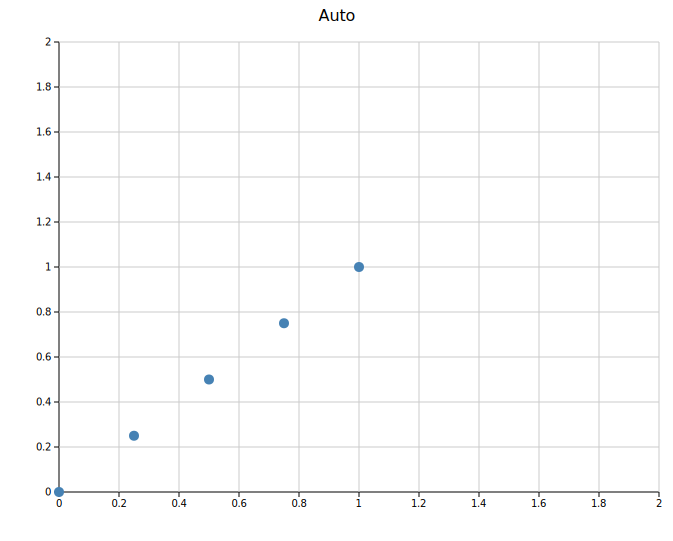
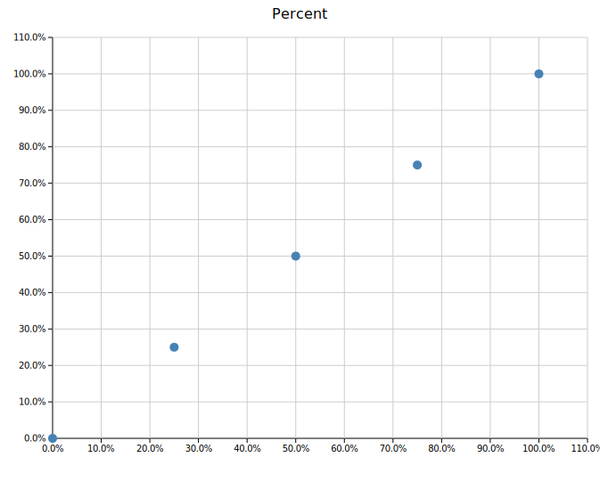
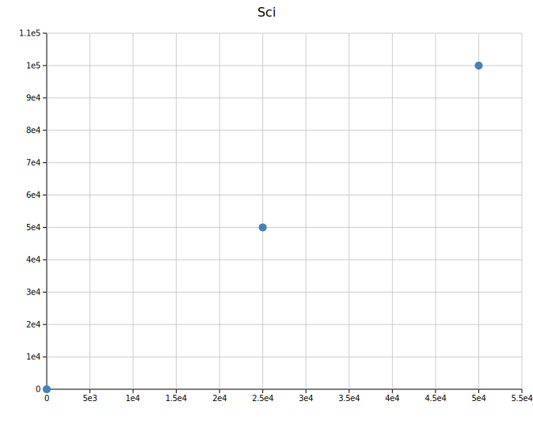
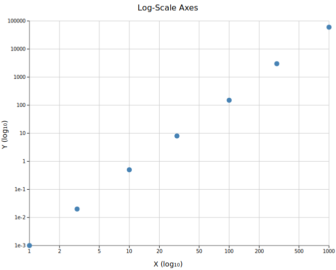
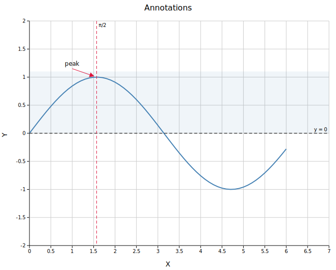

# Layout & Axes

`Layout` is the single configuration struct passed to every render function. It controls axis ranges, labels, tick marks, log scale, canvas size, annotations, and typography. Every plot type goes through a `Layout` before becoming an SVG.

**Import path:** `visus::render::layout::Layout`

---

## Constructors

### `Layout::auto_from_plots()`

The recommended starting point. Inspects the data in a `Vec<Plot>` and automatically computes axis ranges, padding, legend visibility, and colorbar presence.

```rust,no_run
# use visus::render::layout::Layout;
# use visus::render::plots::Plot;
# let plots: Vec<Plot> = vec![];
let layout = Layout::auto_from_plots(&plots)
    .with_title("My Plot")
    .with_x_label("X")
    .with_y_label("Y");
```

### `Layout::new()`

Sets explicit axis ranges. Use this when you need precise control — for example, when comparing multiple plots that must share the same scale, or when the auto-range would include unwanted padding.

```rust,no_run
# use visus::render::layout::Layout;
// x from 0 to 100, y from -1 to 1
let layout = Layout::new((0.0, 100.0), (-1.0, 1.0))
    .with_title("Fixed Range")
    .with_x_label("Time (ms)")
    .with_y_label("Amplitude");
```

---

## Labels and title

```rust,no_run
# use visus::render::layout::Layout;
# use visus::render::plots::Plot;
# let plots: Vec<Plot> = vec![];
let layout = Layout::auto_from_plots(&plots)
    .with_title("My Plot")          // text above the plot area
    .with_x_label("Concentration")  // label below the x-axis
    .with_y_label("Response (%)");  // label left of the y-axis
```

---

## Canvas size

The default canvas is `600 × 450` pixels for the plot area, with margins computed automatically from the title, tick labels, and legend. Override either dimension:

```rust,no_run
# use visus::render::layout::Layout;
# use visus::render::plots::Plot;
# let plots: Vec<Plot> = vec![];
let layout = Layout::auto_from_plots(&plots)
    .with_width(800.0)   // total SVG width in pixels
    .with_height(300.0); // total SVG height in pixels
```

---

## Ticks

The number of tick marks is chosen automatically based on the canvas size. Override it with `.with_ticks()`:

```rust,no_run
# use visus::render::layout::Layout;
# use visus::render::plots::Plot;
# let plots: Vec<Plot> = vec![];
let layout = Layout::auto_from_plots(&plots)
    .with_ticks(8);  // request approximately 8 tick intervals
```

### Tick formats

`TickFormat` controls how numeric tick labels are rendered. Import it from `visus::TickFormat`.

| Variant | Example output | Use case |
|---------|----------------|----------|
| `Auto` *(default)* | `5`, `3.14`, `1.2e5` | General purpose — integers without `.0`, minimal decimals, sci notation for extremes |
| `Fixed(n)` | `3.14` (n=2) | Fixed decimal places |
| `Integer` | `5` | Round to nearest integer |
| `Sci` | `1.23e4` | Always scientific notation |
| `Percent` | `45.0%` | Multiply by 100 and append `%` — for data in the range 0–1 |
| `Custom(fn)` | anything | Provide your own `fn(f64) -> String` |

Apply the same format to both axes, or set them independently:

```rust,no_run
use visus::TickFormat;
# use visus::render::layout::Layout;
# use visus::render::plots::Plot;
# let plots: Vec<Plot> = vec![];

// Same format on both axes
let layout = Layout::auto_from_plots(&plots)
    .with_tick_format(TickFormat::Fixed(2));

// Independent formats
let layout = Layout::auto_from_plots(&plots)
    .with_x_tick_format(TickFormat::Percent)
    .with_y_tick_format(TickFormat::Sci);

// Custom formatter — append a unit suffix
let layout = Layout::auto_from_plots(&plots)
    .with_y_tick_format(TickFormat::Custom(
        std::sync::Arc::new(|v| format!("{:.0} ms", v))
    ));
```

<table>
<tr>
<td></td>
<td></td>
</tr>
<tr>
<td align="center"><code>Auto</code></td>
<td align="center"><code>Fixed(2)</code></td>
</tr>
<tr>
<td></td>
<td></td>
</tr>
<tr>
<td align="center"><code>Percent</code></td>
<td align="center"><code>Sci</code></td>
</tr>
</table>

### Tick rotation

Rotate x-axis tick labels when category names are long:

```rust,no_run
# use visus::render::layout::Layout;
# use visus::render::plots::Plot;
# let plots: Vec<Plot> = vec![];
let layout = Layout::auto_from_plots(&plots)
    .with_x_tick_rotate(45.0);  // degrees; 45 or 90 are common
```

---

## Log scale

Enable logarithmic axes for data spanning multiple orders of magnitude. Ticks are placed at powers of 10; narrow ranges add 2× and 5× sub-ticks automatically.

```rust,no_run
# use visus::render::layout::Layout;
# use visus::render::plots::Plot;
# let plots: Vec<Plot> = vec![];
// Both axes log
let layout = Layout::auto_from_plots(&plots).with_log_scale();

// X axis only
let layout = Layout::auto_from_plots(&plots).with_log_x();

// Y axis only
let layout = Layout::auto_from_plots(&plots).with_log_y();
```



All data values must be positive when using a log axis. `auto_from_plots` uses the raw data range (before padding) to compute log-scale tick positions, so zero-inclusive ranges are handled safely.

---

## Grid

The grid is shown by default. Disable it with:

```rust,no_run
# use visus::render::layout::Layout;
# use visus::render::plots::Plot;
# let plots: Vec<Plot> = vec![];
let layout = Layout::auto_from_plots(&plots)
    .with_show_grid(false);
```

Some plot types (Manhattan, UpSet) suppress the grid automatically.

---

## Annotations

Three types of annotation are available, all added via the `Layout` builder. Any number of each can be chained.

### Text annotation

Places a text label at a data coordinate. Optionally draws an arrow pointing to a different coordinate.

```rust,no_run
use visus::render::annotations::TextAnnotation;
# use visus::render::layout::Layout;
# use visus::render::plots::Plot;
# let plots: Vec<Plot> = vec![];

let layout = Layout::auto_from_plots(&plots)
    .with_annotation(
        TextAnnotation::new("Outlier", 5.0, 7.5)   // text at (5, 7.5)
            .with_arrow(6.0, 9.0)                   // arrow points to (6, 9)
            .with_color("crimson")
            .with_font_size(12),                    // optional, default 12
    );
```

### Reference line

Draws a dashed line across the full plot area at a fixed x or y value.

```rust,no_run
use visus::render::annotations::ReferenceLine;
# use visus::render::layout::Layout;
# use visus::render::plots::Plot;
# let plots: Vec<Plot> = vec![];

let layout = Layout::auto_from_plots(&plots)
    .with_reference_line(
        ReferenceLine::horizontal(0.05)     // y = 0.05
            .with_color("crimson")
            .with_label("p = 0.05"),        // optional label at right edge
    )
    .with_reference_line(
        ReferenceLine::vertical(3.5)        // x = 3.5
            .with_color("steelblue")
            .with_label("cutoff")
            .with_stroke_width(1.5)         // optional, default 1.0
            .with_dasharray("8 4"),         // optional, default "6 4"
    );
```

### Shaded region

Fills a horizontal or vertical band across the plot area.

```rust,no_run
use visus::render::annotations::ShadedRegion;
# use visus::render::layout::Layout;
# use visus::render::plots::Plot;
# let plots: Vec<Plot> = vec![];

let layout = Layout::auto_from_plots(&plots)
    .with_shaded_region(
        ShadedRegion::horizontal(2.0, 4.0)  // y band from 2 to 4
            .with_color("gold")
            .with_opacity(0.2),
    )
    .with_shaded_region(
        ShadedRegion::vertical(10.0, 20.0)  // x band from 10 to 20
            .with_color("steelblue")
            .with_opacity(0.15),
    );
```



---

## Typography

Font family and sizes for all text elements. Sizes are in pixels.

```rust,no_run
# use visus::render::layout::Layout;
# use visus::render::plots::Plot;
# let plots: Vec<Plot> = vec![];
let layout = Layout::auto_from_plots(&plots)
    .with_font_family("Arial, sans-serif")  // default: system sans-serif
    .with_title_size(20)                    // default: 16
    .with_label_size(14)                    // default: 14  (axis labels)
    .with_tick_size(11)                     // default: 10  (tick labels)
    .with_body_size(12);                    // default: 12  (legend, annotations)
```

These can also be set via a `Theme` — see the [Themes](./themes.md) reference.

---

## Quick reference

### Layout constructors

| Method | Description |
|--------|-------------|
| `Layout::new(x_range, y_range)` | Explicit axis ranges |
| `Layout::auto_from_plots(&plots)` | Auto-compute ranges and layout from data |

### Axes and labels

| Method | Description |
|--------|-------------|
| `.with_title(s)` | Plot title |
| `.with_x_label(s)` | X-axis label |
| `.with_y_label(s)` | Y-axis label |
| `.with_ticks(n)` | Approximate number of tick intervals |
| `.with_tick_format(fmt)` | Same `TickFormat` for both axes |
| `.with_x_tick_format(fmt)` | `TickFormat` for x-axis only |
| `.with_y_tick_format(fmt)` | `TickFormat` for y-axis only |
| `.with_x_tick_rotate(deg)` | Rotate x tick labels by `deg` degrees |
| `.with_log_x()` | Logarithmic x-axis |
| `.with_log_y()` | Logarithmic y-axis |
| `.with_log_scale()` | Logarithmic on both axes |
| `.with_show_grid(bool)` | Show or hide grid lines (default `true`) |

### Canvas

| Method | Description |
|--------|-------------|
| `.with_width(px)` | Total SVG width in pixels |
| `.with_height(px)` | Total SVG height in pixels |

### Annotations

| Method | Description |
|--------|-------------|
| `.with_annotation(TextAnnotation)` | Text label with optional arrow |
| `.with_reference_line(ReferenceLine)` | Horizontal or vertical dashed line |
| `.with_shaded_region(ShadedRegion)` | Horizontal or vertical filled band |

### Typography

| Method | Default | Description |
|--------|---------|-------------|
| `.with_font_family(s)` | system sans | CSS font-family string |
| `.with_title_size(n)` | `16` | Title font size (px) |
| `.with_label_size(n)` | `14` | Axis label font size (px) |
| `.with_tick_size(n)` | `10` | Tick label font size (px) |
| `.with_body_size(n)` | `12` | Body text font size (px) |

### `TickFormat` variants

| Variant | Output example |
|---------|----------------|
| `Auto` | `5`, `3.14`, `1.2e5` |
| `Fixed(n)` | `3.14` |
| `Integer` | `5` |
| `Sci` | `1.23e4` |
| `Percent` | `45.0%` |
| `Custom(Arc<dyn Fn(f64) -> String>)` | user-defined |
