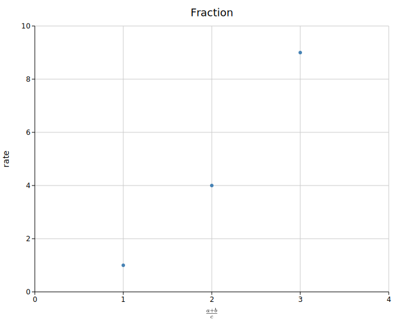
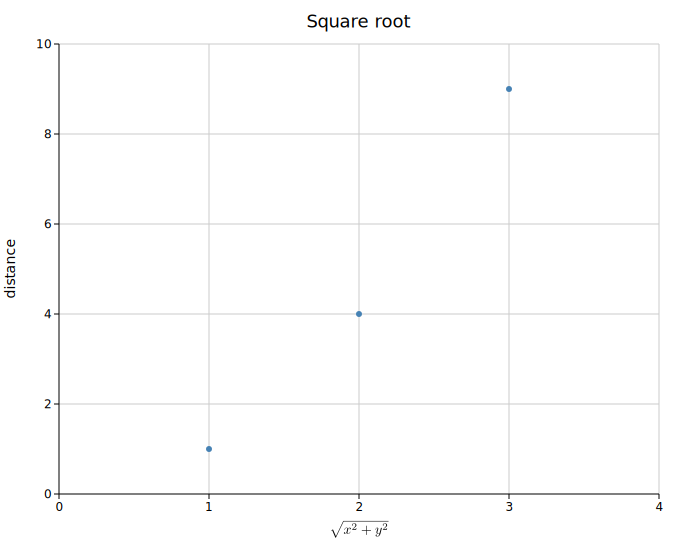
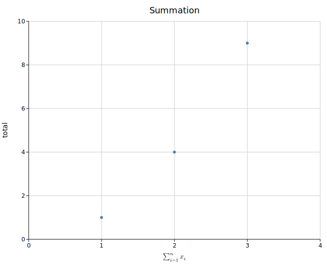
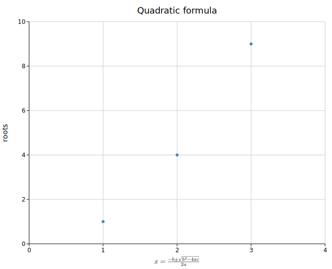
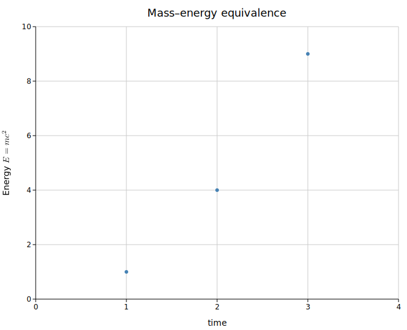
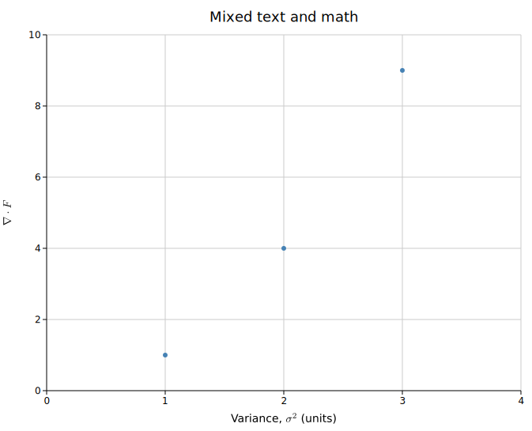

# Math in Labels

Any label — axis titles, the plot title, `TextPlot` bodies — may embed math
inside `$...$` using LaTeX-ish syntax:

```rust
Layout::new((0.0, 3.0), (0.0, 10.0))
    .with_x_label("Variance, $\\sigma^2$ (units)")
    .with_y_label("Energy $E = m c^2$");
```

kuva renders math in one of two tiers depending on the features you build with.

## Tiers

### Lookup tier (always on, zero dependencies)

With no extra features, `$...$` regions are lowered to inline **Unicode** text:

| Input | Output |
|-------|--------|
| `$\sigma^2$` | σ² |
| `$x_i$` | xᵢ |
| `$a \leq b \cdot c$` | a ≤ b · c |
| `$\frac{a}{b}$` | a/b |
| `$\frac{a+b}{c}$` | (a+b)/c |
| `$\sqrt{x^2+y^2}$` | √(x²+y²) |
| `$\sum_{i=1}^{n} x_i$` | ∑ᵢ₌₁ⁿ xᵢ |

This tier never emits a stray `\` or `$`. It is the baseline for **every**
backend and the **only** tier the terminal backend can use (a character grid
can't hold typeset math).

Supported: Greek letters, common operators/relations/arrows, `\frac`, `\sqrt`
(and `\sqrt[n]`), and super/subscripts. Superscripts and subscripts are
**all-or-nothing**: if every character in the group has a Unicode form you get
`x²ⁿ`; if any doesn't (e.g. `q`, most capitals) the whole group falls back to a
clean `x^(2q)`. Fractions and radicals are rendered **inline** (`a/b`, `√(…)`),
never stacked — for stacked 2-D math, use the typst tier.

### Typst tier (feature `math`)

Build with the `math` feature and the SVG, PNG, and PDF backends typeset the
**whole label** with the [Typst](https://typst.app) compiler (linked as a
library — no external `typst` binary needed), embedding real 2-D math:

- math italic, stacked fractions, radicals with vinculum, large operators with
  limits
- math color follows the label color
- self-contained output (fonts embedded), so it renders identically everywhere

```bash
cargo run --features math,png --example ...
```

The `math` feature pulls in the Typst compiler (~200 crates) plus a bundled
math font (~1 MB). It is **opt-in** and deliberately excluded from `full` so
ordinary builds and `cargo ci-test` stay lean. The terminal backend always
uses the lookup tier regardless.

#### Examples

Rendered with the `math` feature (`cargo run --example math --features math`):








## Typst math is not LaTeX

The `$...$` body is LaTeX-flavoured for familiarity, but the typst tier hands
it to Typst, whose math syntax differs in one notable way: a **multi-letter run
is a single identifier**. `mc` is *not* `m × c` — so `$E = mc^2$` fails to
compile (`unknown variable: mc`). Write the factors separated:

```text
$E = m c^2$      ✓
$E = mc^2$       ✗  (renders via the lookup tier + a one-time warning)
```

When a typst-tier compile fails, kuva falls back to the lookup tier for that
label and prints a one-time warning naming the expression and Typst's own hint.
