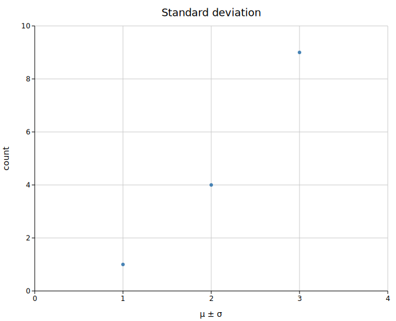
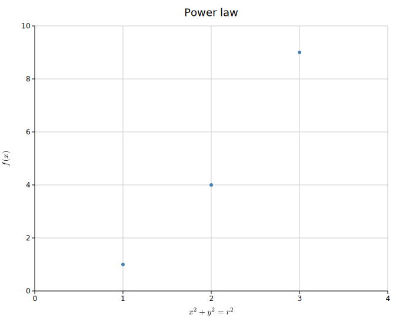

# Math in Labels

Any label — axis titles, the plot title, `TextPlot` bodies — may embed math
inside `$...$` using LaTeX-ish syntax:

```rust
Layout::new((0.0, 3.0), (0.0, 10.0))
    .with_x_label("Variance, $\\sigma^2$ (units)")
    .with_y_label("Energy $E = mc^2$");
```

Math regions are lowered to inline **Unicode** text — zero dependencies,
always on, in every backend including the terminal:

| Input | Output |
|-------|--------|
| `$\sigma^2$` | σ² |
| `$x_i$` | xᵢ |
| `$a \leq b \cdot c$` | a ≤ b · c |
| `$\frac{a}{b}$` | a/b |
| `$\frac{a+b}{c}$` | (a+b)/c |
| `$\sqrt{x^2+y^2}$` | √(x²+y²) |
| `$\sum_{i=1}^{n} x_i$` | ∑ᵢ₌₁ⁿ xᵢ |

The lowering never emits a stray `\` or `$`. A literal dollar sign is written
`\$` (e.g. `Price \$5`), and a `$` without a closing partner is left untouched.

## Supported syntax

- **Greek letters** — `\alpha`…`\Omega`, including variants like `\varepsilon`
  and `\varphi`.
- **Operators, relations, arrows** — `\pm`, `\times`, `\cdot`, `\div`,
  `\leq`, `\geq`, `\neq`, `\approx`, `\propto`, `\in`, `\partial`, `\nabla`,
  `\infty`, `\to`, `\degree`, and friends.
- **Superscripts / subscripts** — `x^2` → x², `x_i` → xᵢ, with `{...}` groups
  (`x^{2n}` → x²ⁿ). These are **all-or-nothing**: if every character in the
  group has a Unicode super/subscript form you get `x²ⁿ`; if any doesn't
  (e.g. `q`, most capitals) the whole group falls back to a clean `x^(2q)` —
  never a half-substituted mix.
- **Fractions** — `\frac{a}{b}` → `a/b`; multi-term parts are parenthesised:
  `\frac{a+b}{c}` → `(a+b)/c`.
- **Radicals** — `\sqrt{x}` → `√x`, `\sqrt{x+y}` → `√(x+y)`,
  `\sqrt[3]{x}` → `³√x`.

Fractions and radicals are rendered **inline** (`a/b`, `√(…)`), never
stacked — the output is plain text that flows anywhere a label can go,
including rotated y-axis titles and terminal character grids. Unknown
commands are dropped cleanly (the argument is kept, the backslash never
leaks into output).

## Examples

Generated by `cargo run --example math`:





## CLI

Math works in any label flag — no extra flags needed:

```bash
kuva scatter data.tsv --x x --y y \
    --x-label 'Variance, $\sigma^2$ (units)' \
    --y-label '$\sqrt{x^2 + y^2}$' \
    --title 'Rate $\frac{a + b}{c}$' \
    -o plot.svg
```

The same labels render in the terminal with `--terminal` — the lowered
Unicode lands directly on the character grid.
